---
title: CS단권화 - DataStructure
date: 2026-02-27
category: CS
tags: [cs, datsstructure]
---

## 1. Complexity Theory

### Time Complexity

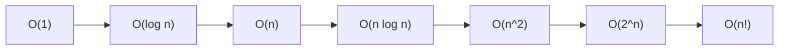


시간 복잡도는 입력 크기 `n`이 증가할 때 알고리즘 실행 시간이 어떻게 증가하는지를 나타낸다. 절대 시간(초)보다 증가율에 초점을 맞추기 때문에, 하드웨어나 언어 차이를 넘어 알고리즘 효율을 비교할 수 있다.

$O(1) < O(\log n) < O(\sqrt{n}) < O(n) < O(n \log n) < O(n^2) < O(n^3) < O(2^n) < O(n!)$

| 복잡도        | n=10⁶ 연산 수 | 1초 내 처리 가능한 n (≈10⁸ 연산/초 기준) |
| ---------- | ---------- | ---------------------------- |
| O(n)       | 10⁶        | ~10⁸                         |
| O(n log n) | ~2×10⁷     | ~5×10⁶                       |
| O(n²)      | 10¹² ❌     | ~10⁴                         |
| O(2ⁿ)      | 천문학적 ❌     | ~25                          |

같은 Big-O라도 상수 계수와 캐시 효율이 실제 성능을 좌우한다. 예를 들어 배열 순차 탐색과 연결 리스트 순차 탐색은 둘 다 O(n)이지만, 배열이 캐시 라인 프리페치 덕분에 수 배 빠를 수 있다. 알고리즘 선택 시 복잡도만이 아니라 입력 크기 범위, 데이터 분포, 하드웨어 특성을 함께 고려해야 한다.

재귀 알고리즘의 시간 복잡도는 **Master Theorem**으로 분석할 수 있다:

$T(n) = aT(n/b) + O(n^d)$
- $\log_b a < d$: $T(n) = O(n^d)$
- $\log_b a = d$: $T(n) = O(n^d \log n)$
- $\log_b a > d$: $T(n) = O(n^{\log_b a})$

예: 병합 정렬 $T(n) = 2T(n/2) + O(n)$ → $a=2, b=2, d=1$ → $\log_2 2 = 1 = d$ → $O(n \log n)$

### Space Complexity

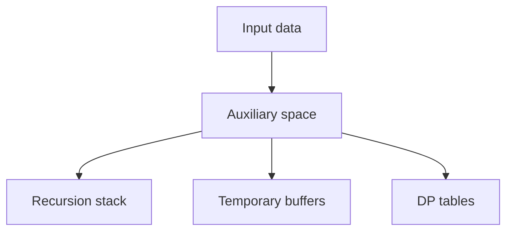


공간 복잡도는 알고리즘이 추가로 사용하는 메모리 양의 증가율이다. 입력 저장 자체를 제외하고 보조 메모리(auxiliary space)를 따로 보는 경우가 많다. 시간 최적화와 공간 최적화는 종종 트레이드오프 관계다.

공간 복잡도 분류:
- **In-place (O(1) auxiliary)**: 힙 정렬, 퀵 정렬(재귀 스택 제외). 추가 메모리 사용을 최소화
- **O(n) auxiliary**: 병합 정렬(보조 배열), DFS(재귀 스택 최악), BFS(큐)
- **O(n²)**: 인접 행렬, 동적 프로그래밍 2D 테이블

재귀 알고리즘에서 재귀 깊이 자체가 공간 복잡도에 영향을 준다. 예를 들어 불균형 BST에서 재귀 탐색은 O(n) 스택 공간을 사용할 수 있고, 극단적인 경우 스택 오버플로우를 일으킨다. 이를 방지하기 위해 반복(iterative) 변환이나 꼬리 재귀 최적화(TCO, 일부 언어만 지원)를 적용한다.

실무에서는 메모리 할당/해제 패턴도 성능에 영향을 준다. 잦은 소규모 할당은 메모리 단편화(fragmentation)를 유발하고, 할당자(allocator)에 따라 상당한 오버헤드가 발생할 수 있다. 이 때문에 아레나 할당(arena allocation)이나 오브젝트 풀(object pool) 패턴을 사용하기도 한다.

### Big-O / Theta / Omega

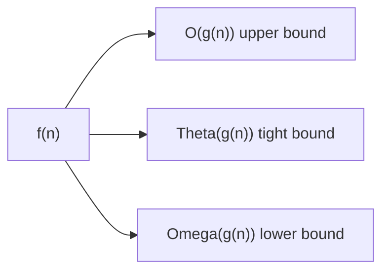


- **Big-O ($O$)**: 상한(upper bound). $f(n) = O(g(n))$이면 충분히 큰 n에 대해 $f(n) \leq c \cdot g(n)$. "이 알고리즘은 최악에도 이 정도 이하"
- **Theta ($\Theta$)**: 정확한 점근적 경계. $f(n) = \Theta(g(n))$이면 $c_1 \cdot g(n) \leq f(n) \leq c_2 \cdot g(n)$. 상한과 하한이 같은 차수
- **Omega ($\Omega$)**: 하한(lower bound). $f(n) = \Omega(g(n))$이면 $f(n) \geq c \cdot g(n)$. "최소한 이 정도는 걸린다"

실무와 면접에서는 Big-O를 가장 많이 쓰지만, 정밀한 논의에서는 구분이 중요하다:
- "배열 인덱스 접근은 $\Theta(1)$" — 항상 상수 시간
- "비교 기반 정렬의 하한은 $\Omega(n \log n)$" — 어떤 알고리즘이든 이보다 빠를 수 없음
- "퀵 정렬의 시간 복잡도는 $O(n^2)$이지만 평균은 $\Theta(n \log n)$" — 최악과 평균이 다름

소문자 표기(little-o, little-omega)도 있다: $o(g(n))$은 엄밀한 상한(=보다 작은), $\omega(g(n))$은 엄밀한 하한이다. $2n = o(n^2)$이지만 $2n \neq o(n)$.

### Amortized Analysis

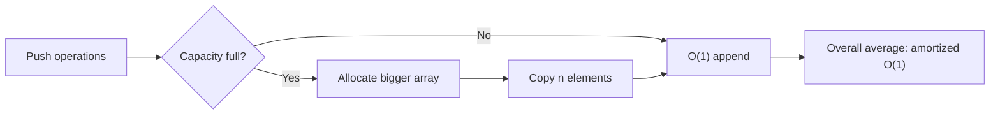


분할 상환 분석은 "평균적인 시퀀스 비용"을 다루는 기법이다. 개별 연산 중 비싼 연산이 있어도, 긴 연산열 전체로 보면 연산당 평균 비용이 낮을 수 있다. 이는 확률적 평균(average-case)과는 다른 개념으로, 최악 시퀀스에서도 보장되는 연산당 비용이다.

분석 기법:
- **Aggregate Method**: 전체 n회 연산의 총 비용 $T(n)$을 구하고, 연산당 비용 = $T(n)/n$
- **Accounting Method**: 각 연산에 "요금"을 부과. 싼 연산에 여분을 저축해두고, 비싼 연산이 발생하면 저축에서 지불
- **Potential Method**: 자료구조에 "잠재 에너지" 함수 $\Phi$를 정의. 상환 비용 = 실제 비용 + $\Delta\Phi$. 잠재 에너지가 증가하면 미래 비싼 연산에 대비하는 것

대표 사례:
- **동적 배열(vector) push_back**: 용량 초과 시 2배 확장 + 전체 복사 O(n). 하지만 n번 push에 총 비용 O(n) → 상환 O(1). 확장 비율이 2배가 아니라 1.5배면? 여전히 상환 O(1)이지만 복사 횟수와 메모리 낭비 비율이 달라진다
- **Splay Tree**: 개별 연산이 O(n)일 수 있지만, m번 연산의 총 비용은 O(m log n) → 상환 O(log n)
- **Union-Find**: 경로 압축 + 랭크 합치기 시 m번 연산의 총 비용 O(m · α(n)), α는 역 아커만 함수 (사실상 상수)

---

## 2. Linear Structures

### Array

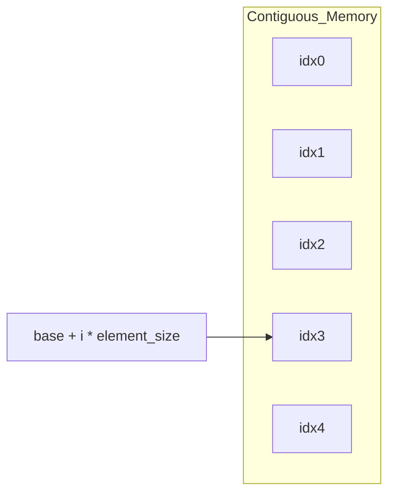


배열은 연속 메모리에 동일 타입 원소를 저장하는 구조다. 인덱스 접근은 `O(1)`로 매우 빠르지만, 중간 삽입/삭제는 원소 이동 때문에 `O(n)`이 된다.

| 연산 | 복잡도 | 비고 |
|------|--------|------|
| 인덱스 접근 | O(1) | base + index × element_size |
| 끝 삽입/삭제 | O(1) amortized | 동적 배열 기준 |
| 중간 삽입/삭제 | O(n) | 원소 shift 필요 |
| 탐색 (정렬 안됨) | O(n) | 선형 탐색 |
| 탐색 (정렬됨) | O(log n) | 이진 탐색 |

**캐시 지역성(Cache Locality)**: 배열이 연결 리스트보다 실전 성능이 좋은 핵심 이유. CPU 캐시는 메모리를 캐시 라인(보통 64B) 단위로 가져온다. 배열의 연속 원소는 같은 캐시 라인에 존재할 확률이 높아 cache hit rate가 높다. 반면 연결 리스트 노드는 메모리 전체에 흩어져 있어 노드 접근마다 cache miss가 발생할 수 있다.

동적 배열 확장 전략:
- **2배 확장**: 가장 일반적. 상환 O(1) push. 최악의 경우 50% 메모리 낭비
- **1.5배 확장**: 메모리 낭비 감소, 복사 빈도 약간 증가. MSVC의 std::vector가 채택
- **증분 확장** (고정 크기 추가): 상환 O(n). 비효율적이므로 거의 사용하지 않음

**정렬된 배열 + 이진 탐색**: 정적 데이터에 대한 효율적 검색 구조. BST보다 메모리 효율과 캐시 효율이 좋다. 삽입/삭제가 드문 조회 중심 워크로드에 최적.

### Linked List

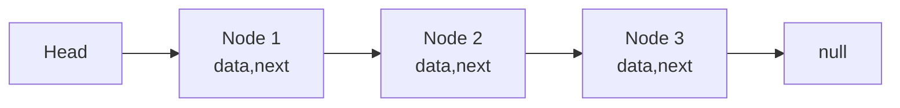


연결 리스트는 노드가 포인터로 이어진 구조다. 중간 삽입/삭제가 포인터 변경만으로 가능해 구조 변경에 유리하다(탐색 위치를 이미 알고 있을 때). 하지만 임의 접근이 `O(n)`이고 캐시 효율이 낮아 실제 성능은 배열보다 불리할 때가 많다.

연결 리스트 유형:
- **단일 연결 리스트(Singly Linked List)**: 각 노드가 next 포인터만 보유. 역방향 순회 불가
- **이중 연결 리스트(Doubly Linked List)**: prev/next 포인터. 양방향 순회 가능. LRU 캐시, OS 프로세스 리스트에 활용
- **원형 연결 리스트(Circular Linked List)**: 마지막 노드가 첫 노드를 가리킴. 라운드 로빈 스케줄링에 활용

실전 활용 패턴:
- **Sentinel Node (Dummy Head/Tail)**: 빈 리스트/경계 조건 처리를 단순화하는 기법. 삽입/삭제 코드에서 null 체크를 제거한다
- **Floyd's Cycle Detection(토끼와 거북이)**: 두 포인터(slow=1칸, fast=2칸)로 사이클 존재 여부를 O(n) 시간, O(1) 공간으로 판별. 사이클 시작점도 구할 수 있어 메모리 누수 탐지에도 응용
- **XOR 연결 리스트**: prev⊕next를 하나의 포인터에 저장해 메모리를 절약하는 기법. 실전에서는 거의 사용하지 않지만 이론적으로 흥미로움

현대 실무에서 연결 리스트 사용이 줄어드는 이유: 캐시 비효율성, 메모리 할당 오버헤드(노드마다 malloc), 포인터 크기(64비트 시스템에서 8B)로 인한 메모리 오버헤드. Bjarne Stroustrup은 "대부분의 경우 std::vector가 std::list보다 빠르다"고 강조한다.

### Stack

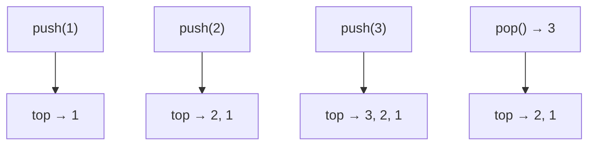


스택은 LIFO(Last-In, First-Out) 구조다. `push/pop/top`이 `O(1)`이며, 함수 호출 스택, DFS, 괄호 매칭, 되돌리기(undo) 등에 활용된다.

스택의 핵심 응용:
- **함수 호출 스택 (Call Stack)**: 함수 호출 시 반환 주소, 로컬 변수, 매개변수를 스택 프레임에 저장. 재귀가 깊으면 스택 오버플로우 발생 (기본 스레드 스택: 보통 1~8MB)
- **괄호/수식 검증**: `({[]})`같은 중첩 구조 검증. 여는 괄호를 push하고, 닫는 괄호를 만나면 pop해서 매칭 확인
- **후위 표기법(Postfix) 계산**: `3 4 + 5 *` → 피연산자를 push, 연산자를 만나면 두 개 pop해서 계산 후 결과 push
- **중위→후위 변환 (Shunting-Yard Algorithm)**: 연산자 우선순위를 고려해 중위 표기법을 후위로 변환
- **모노톤 스택(Monotonic Stack)**: 원소가 단조 증가/감소하도록 유지하는 스택. Next Greater Element, 히스토그램 최대 넓이, 주가 스팬 문제에 활용. O(n)으로 해결 가능 (각 원소가 최대 한 번 push/pop)

```java
// Monotonic Stack: 각 원소의 Next Greater Element 찾기
public static int[] nextGreater(int[] nums) {
    int[] result = new int[nums.length];
    Arrays.fill(result, -1);
    Deque<Integer> stack = new ArrayDeque<>();
    for (int i = 0; i < nums.length; i++) {
        while (!stack.isEmpty() && nums[stack.peek()] < nums[i]) {
            result[stack.pop()] = nums[i];
        }
        stack.push(i);
    }
    return result;
}
// [2, 1, 4, 3, 5] → [4, 4, 5, 5, -1]
```

### Queue

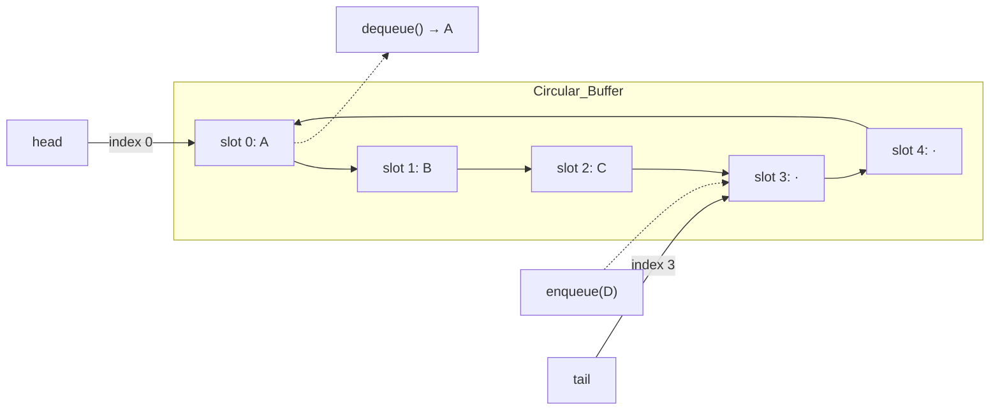


큐는 FIFO(First-In, First-Out) 구조다. `enqueue/dequeue`가 기본이며 작업 스케줄링, BFS, 버퍼링 시스템에 널리 사용된다.

큐 구현 방식:
- **배열 기반 원형 큐(Circular Buffer)**: head/tail 인덱스로 wrap-around. 메모리 효율적이고 캐시 친화적. 고정 크기
- **연결 리스트 기반**: 동적 크기. 노드 할당 오버헤드 존재
- **Lock-Free Queue (Michael-Scott Queue)**: CAS(Compare-And-Swap) 기반 동시성 큐. 뮤텍스 없이 다중 생산자/소비자 안전

큐의 변형:
- **Circular Queue**: 배열에서 앞쪽 공간 낭비를 해결. head가 끝에 도달하면 다시 앞으로
- **Priority Queue**: 단순 FIFO가 아닌 우선순위 기반. 힙으로 구현 (별도 섹션)
- **Blocking Queue**: 비어있으면 dequeue를 블로킹, 가득 차면 enqueue를 블로킹. 생산자-소비자 패턴의 핵심

고성능 환경에서는 **SPSC(Single Producer Single Consumer) Ring Buffer**가 가장 효율적이다. Disruptor(LMAX)는 CAS 없이도 고성능 메시지 전달을 달성하는 ring buffer 기반 구조로, 초당 수백만 메시지를 처리한다.

### Deque

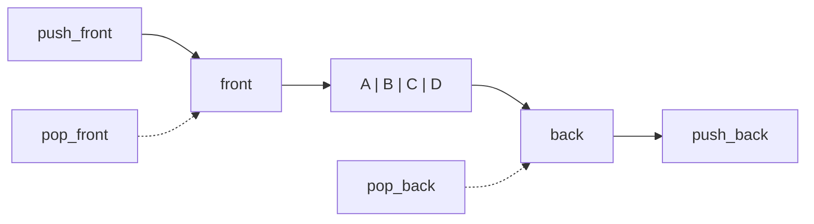


덱(deque, Double-Ended Queue)은 양끝 삽입/삭제를 모두 `O(1)`로 지원하는 구조다.

구현: C++ `std::deque`는 고정 크기 블록 배열의 배열(map of blocks)로 구현된다. 앞/뒤 확장이 모두 O(1) amortized이면서 인덱스 접근도 O(1)을 제공한다. Python의 `collections.deque`는 이중 연결 블록 리스트로 구현되며, 양끝 O(1) 보장하지만 인덱스 접근은 O(n)이다.

알고리즘 활용:
- **슬라이딩 윈도우 최댓값/최솟값**: 덱에 모노톤 순서를 유지하며 윈도우의 최댓값/최솟값을 O(1)에 조회. 전체 O(n)
```java
// 슬라이딩 윈도우 최댓값 (크기 k)
public static int[] slidingMax(int[] nums, int k) {
    Deque<Integer> dq = new ArrayDeque<>(); // 인덱스를 저장 (값은 감소 순으로 유지)
    int[] result = new int[nums.length - k + 1];
    int idx = 0;
    for (int i = 0; i < nums.length; i++) {
        while (!dq.isEmpty() && nums[dq.peekLast()] <= nums[i]) {
            dq.pollLast();       // 뒤에서 작은 값 제거
        }
        dq.addLast(i);
        if (dq.peekFirst() <= i - k) {
            dq.pollFirst();      // 윈도우 범위 밖 제거
        }
        if (i >= k - 1) {
            result[idx++] = nums[dq.peekFirst()];
        }
    }
    return result;
}
```
- **0-1 BFS**: 간선 가중치가 0 또는 1인 그래프에서 최단 경로. 가중치 0이면 앞에 push, 1이면 뒤에 push. Dijkstra 대신 O(V+E)에 해결
- **Palindrome 검사**: 양끝에서 비교하며 진행
- **Steal-Based Work Scheduling**: Java ForkJoinPool에서 각 스레드가 자신의 deque를 사용해 작업을 push/pop하고, 유휴 스레드가 다른 스레드의 deque 반대쪽에서 작업을 "steal"

---

## 3. Tree

### Binary Tree

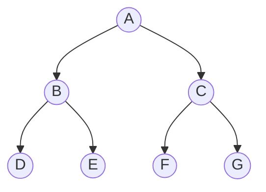


이진 트리는 각 노드가 최대 두 자식을 갖는 계층 구조다.

이진 트리의 종류:
- **Full Binary Tree**: 모든 노드가 0 또는 2개의 자식을 가짐
- **Complete Binary Tree**: 마지막 레벨을 제외한 모든 레벨이 완전히 채워지고, 마지막 레벨은 왼쪽부터 채워짐. 배열로 효율적 표현 가능 (힙에 사용)
- **Perfect Binary Tree**: 모든 내부 노드가 2개 자식을 갖고 모든 리프가 같은 깊이. 높이 h에서 노드 수 = $2^{h+1} - 1$
- **Degenerate (Skewed) Tree**: 모든 노드가 하나의 자식만 가짐. 사실상 연결 리스트. BST가 정렬된 데이터로 구성되면 발생

순회(Traversal):
- **전위(Preorder)**: 루트 → 왼쪽 → 오른쪽. 트리 직렬화/복사에 활용
- **중위(Inorder)**: 왼쪽 → 루트 → 오른쪽. BST에서 정렬된 순서 출력
- **후위(Postorder)**: 왼쪽 → 오른쪽 → 루트. 트리 삭제, 수식 트리 계산에 활용
- **레벨순(Level-order/BFS)**: 큐 기반. 같은 깊이 노드를 먼저 방문

트리 속성 공식:
- 높이 h인 이진 트리의 최대 노드 수: $2^{h+1} - 1$
- n개 노드의 이진 트리 최소 높이: $\lfloor \log_2 n \rfloor$
- n개 노드의 이진 트리 중 다른 구조 수 (Catalan 수): $C_n = \frac{1}{n+1}\binom{2n}{n}$

**Morris Traversal**: 스택/재귀 없이 O(1) 공간으로 중위 순회를 수행하는 기법. 스레디드(threaded) 포인터 개념을 활용해 우측 null 포인터를 임시로 부모를 가리키게 만든 후 복원한다. 제약이 있는 임베디드 환경에서 유용하다.

### Binary Search Tree

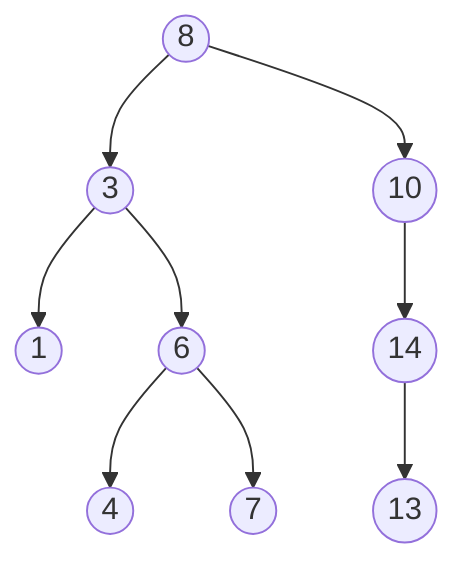


BST는 "왼쪽 < 루트 < 오른쪽" 정렬 성질을 가진 이진 트리다. 평균적으로 탐색/삽입/삭제 `O(log n)`이지만 편향되면 `O(n)`으로 악화된다.

BST 핵심 연산:
- **삽입**: 루트부터 비교하며 내려가 빈 위치에 새 노드 추가
- **삭제**: 세 가지 경우
  1. 리프 노드: 바로 제거
  2. 자식 1개: 자식으로 교체
  3. 자식 2개: 중위 후속자(inorder successor, 오른쪽 서브트리의 최솟값)로 교체 후 후속자 삭제
- **탐색**: 비교 결과에 따라 왼쪽/오른쪽으로 내려감

BST의 한계와 해결책:
- 정렬된 데이터를 순서대로 삽입하면 편향 트리(높이 = n) → O(n) 성능
- **랜덤화 BST (Treap)**: 각 노드에 랜덤 우선순위를 부여해 확률적으로 균형 유지. BST 성질(키) + Heap 성질(우선순위)
- **Splay Tree**: 접근한 노드를 회전으로 루트까지 올림(splaying). Temporal locality가 높은 워크로드에서 우수한 상환 O(log n) 성능. 캐시에 적합

### AVL Tree

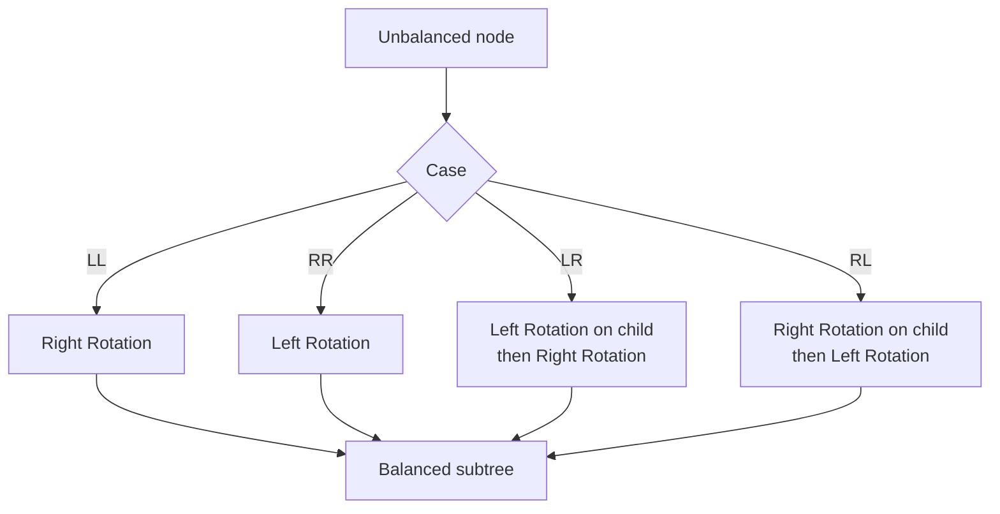


AVL 트리는 높이 균형 조건(좌우 서브트리 높이 차이 ≤ 1)을 엄격히 유지하는 자기 균형 BST다.

균형 인수(Balance Factor) = 왼쪽 서브트리 높이 - 오른쪽 서브트리 높이. |BF| ≤ 1을 항상 유지한다.

회전 연산 (불균형 복구):
- **LL (Left-Left)**: Right Rotation. 왼쪽 자식의 왼쪽에 삽입으로 불균형
- **RR (Right-Right)**: Left Rotation. 오른쪽 자식의 오른쪽에 삽입
- **LR (Left-Right)**: Left Rotation on child → Right Rotation on node. 왼쪽 자식의 오른쪽에 삽입
- **RL (Right-Left)**: Right Rotation on child → Left Rotation on node

```text
     30 (BF=2)         20
    /         →       /  \
   20             10    30
  /
 10
LL Case: Right Rotation
```

AVL 트리의 높이는 최대 $1.44 \log_2(n+2)$으로 보장된다. 이는 Red-Black Tree의 $2 \log_2(n+1)$보다 엄격한 균형을 의미한다. 따라서 탐색이 잦은 워크로드(예: 데이터베이스 인덱스 조회)에서 AVL이 유리하다. 반면 삽입/삭제가 잦으면 회전 빈도 때문에 RB Tree가 유리할 수 있다.

### Red-Black Tree

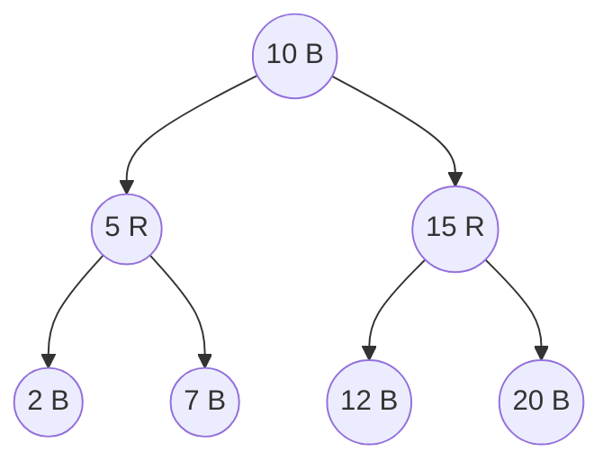


Red-Black 트리는 색상 규칙으로 균형을 완화해 유지하는 자기 균형 BST다. AVL보다 균형은 덜 엄격하지만 갱신 연산에 유리한 경우가 많다.

Red-Black Tree의 5가지 규칙:
1. 모든 노드는 빨강 또는 검정
2. 루트는 검정
3. 모든 NIL(리프)은 검정
4. **빨간 노드의 자식은 모두 검정** (Red 연속 불가)
5. **루트에서 모든 NIL까지의 경로에 있는 검정 노드 수(Black Height)가 동일**

이 규칙들에 의해 최장 경로는 최단 경로의 2배를 넘지 않는다 (최단 = 모두 검정, 최장 = 검정-빨강 교대).

삽입/삭제 후 규칙 위반 시 회전 + 색상 변경으로 복구한다:
- 삽입: 새 노드를 빨강으로 삽입 → 부모가 빨강이면 위반 → 삼촌(uncle) 색상에 따라 재색칠 또는 회전
- 삭제: 검정 노드 삭제 시 Black Height 불균형 → 형제(sibling) 색상/자식에 따라 회전 + 재색칠

실전 채택:
- **C++ `std::map`/`std::set`**: 대부분의 구현이 RB Tree
- **Java `TreeMap`/`TreeSet`**: RB Tree
- **Linux CFS 스케줄러**: 프로세스의 vruntime을 RB Tree에 저장
- **Java 8+ `HashMap`**: 버킷의 연결 리스트가 8개 이상이면 RB Tree로 변환 (O(n) → O(log n))

### Segment Tree

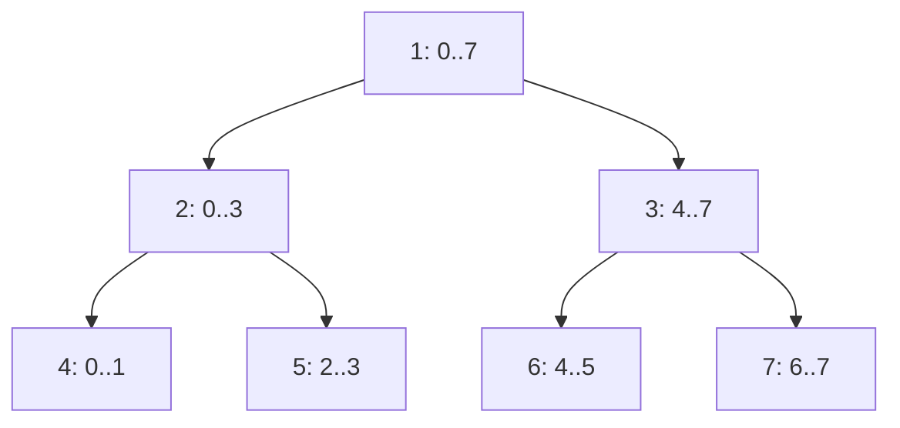


세그먼트 트리는 구간 질의(합, 최소, 최대 등)와 점/구간 업데이트를 효율적으로 처리하는 트리이다.

구조: 완전 이진 트리 형태. 리프 노드는 원본 배열의 각 원소, 내부 노드는 자식들의 합/최소/최대 등을 저장한다.

| 연산 | 복잡도 |
|------|--------|
| 빌드 | O(n) |
| 점 업데이트 | O(log n) |
| 구간 질의 | O(log n) |
| 구간 업데이트 (Lazy) | O(log n) |
| 공간 | O(n) (4n 배열) |

**Lazy Propagation**: 구간 업데이트를 즉시 전파하지 않고 "나중에 필요할 때" 전파하는 기법. "구간 [l, r]에 모두 +5"를 할 때, 해당 구간의 노드에 lazy 값을 저장해두고, 이후 해당 노드의 자식을 방문할 때 비로소 전파한다. 이를 통해 구간 업데이트가 O(n) → O(log n)이 된다.

```java
// 구간 합 세그먼트 트리 (1-indexed)
static void build(int[] arr, int[] tree, int node, int start, int end) {
    if (start == end) {
        tree[node] = arr[start];
    } else {
        int mid = (start + end) / 2;
        build(arr, tree, 2 * node, start, mid);
        build(arr, tree, 2 * node + 1, mid + 1, end);
        tree[node] = tree[2 * node] + tree[2 * node + 1];
    }
}

static int query(int[] tree, int node, int start, int end, int l, int r) {
    if (r < start || end < l) // 범위 밖
        return 0;
    if (l <= start && end <= r) // 완전히 포함
        return tree[node];
    int mid = (start + end) / 2;
    return query(tree, 2 * node, start, mid, l, r)
         + query(tree, 2 * node + 1, mid + 1, end, l, r);
}
```

변형: **Persistent Segment Tree** (이전 버전의 트리를 유지), **Merge Sort Tree** (각 노드에 정렬된 배열 저장), **2D Segment Tree** (2차원 구간 질의).

### Fenwick Tree

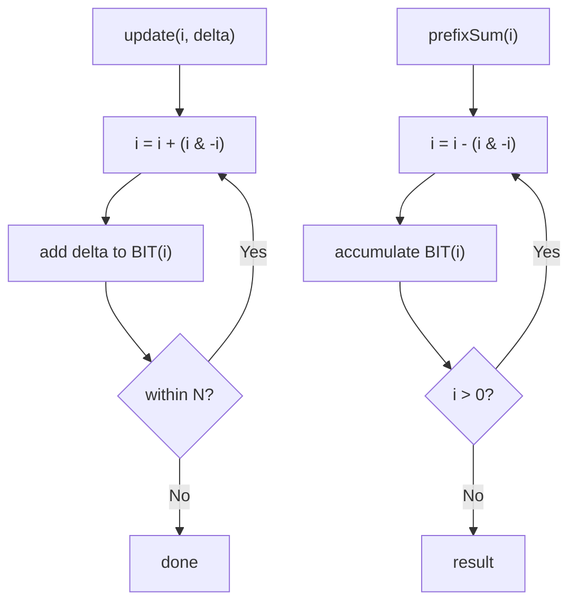


Fenwick Tree(Binary Indexed Tree, BIT)는 누적 합 기반의 점 업데이트 + prefix sum 질의를 `O(log n)`에 처리하는 구조다. 구현이 세그먼트 트리보다 간결하고 메모리 효율이 좋다.

핵심 원리: 인덱스의 이진 표현에서 최하위 비트(LSB)가 해당 노드의 관리 범위를 결정한다.
- `i & -i` (또는 `i & (~i + 1)`)로 LSB를 추출
- 업데이트: 인덱스에서 LSB를 더하며 상위로 이동
- 질의: 인덱스에서 LSB를 빼며 누적

```java
// 1-indexed Fenwick Tree
class BIT {
    int[] tree;
    int n;

    BIT(int n) {
        this.n = n;
        tree = new int[n + 1];
    }

    void update(int i, int delta) {
        for (; i <= n; i += i & -i)
            tree[i] += delta;
    }

    int query(int i) { // prefix sum [1..i]
        int sum = 0;
        for (; i > 0; i -= i & -i)
            sum += tree[i];
        return sum;
    }

    int rangeQuery(int l, int r) { // sum [l..r]
        return query(r) - query(l - 1);
    }
}
```

세그먼트 트리 vs Fenwick Tree:
- Fenwick: 코드가 짧고, 상수가 작고, 메모리가 절반. 단, 원래는 prefix sum에 최적화되어 있고, min/max 등 비가역 연산에는 직접 적용 어려움
- Segment Tree: 더 범용적. 구간 업데이트(Lazy), min/max, 좌표 압축 세그 등 확장이 자유로움

**2D Fenwick Tree**: 2차원 prefix sum을 O(log n · log m)에 질의/업데이트. 2D 격자에서 직사각형 영역 합 계산에 활용.

---

## 4. Heap

### Binary Heap

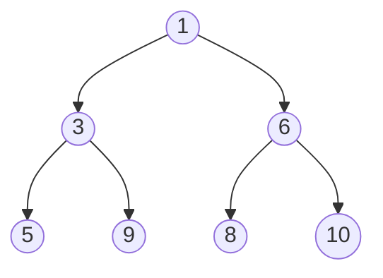


이진 힙은 완전 이진 트리 기반 우선순위 구조다. 보통 배열로 구현하며 부모/자식 인덱스 관계로 빠르게 탐색한다.

배열 인덱싱 (0-based):
- 부모: `(i - 1) / 2`
- 왼쪽 자식: `2i + 1`
- 오른쪽 자식: `2i + 2`

최소 힙 성질: 부모 ≤ 자식 (모든 노드에서). 루트가 항상 최솟값.

핵심 연산:
- **Sift-Up (Bubble Up)**: 삽입 시 배열 끝에 추가 후, 부모보다 작으면 교환하며 올라감. O(log n)
- **Sift-Down (Bubble Down)**: 최솟값 삭제(루트 제거) 후, 마지막 원소를 루트에 놓고 자식 중 작은 쪽과 교환하며 내려감. O(log n)
- **Peek**: 루트 반환. O(1)

| 힙 유형           | insert   | delete-min | decrease-key | merge    |
| -------------- | -------- | ---------- | ------------ | -------- |
| Binary Heap    | O(log n) | O(log n)   | O(log n)     | O(n)     |
| Fibonacci Heap | O(1)*    | O(log n)*  | O(1)*        | O(1)     |
| Binomial Heap  | O(log n) | O(log n)   | O(log n)     | O(log n) |
| Pairing Heap   | O(1)     | O(log n)*  | O(log n)*    | O(1)     |
(*: amortized)

**Fibonacci Heap**: decrease-key가 상환 O(1)이라 Dijkstra, Prim에서 이론적 최적. 하지만 상수가 크고 구현이 복잡해 실전에서는 이진 힙이 더 빠른 경우가 많다.

### Priority Queue

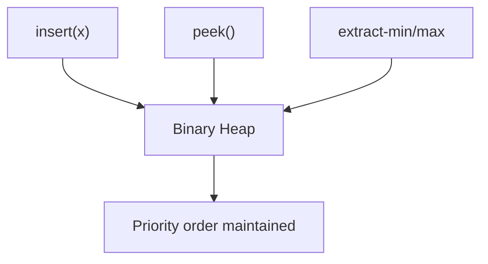


우선순위 큐는 "가장 우선순위 높은 원소"를 빠르게 꺼내는 ADT(Abstract Data Type)다. 힙 기반 구현에서 삽입/삭제가 `O(log n)`, 최상단 조회가 `O(1)`이다.

활용 사례:
- **Dijkstra 최단 경로**: 탐색할 노드를 거리 기준으로 우선순위 큐에 저장. min-heap으로 가장 가까운 노드를 먼저 확정
- **Prim MST**: 간선 가중치 기준 min-heap으로 최소 비용 간선 선택
- **Huffman Coding**: 빈도수가 낮은 노드 두 개를 반복적으로 병합. min-heap 활용
- **OS 프로세스/스레드 스케줄링**: Priority Queue 기반 우선순위 스케줄러
- **이벤트 기반 시뮬레이션**: 타임스탬프 기준 min-heap으로 다음 이벤트 결정
- **K-way Merge**: K개의 정렬된 리스트를 병합할 때, 각 리스트의 현재 원소를 min-heap에 넣고 하나씩 추출. O(N log K)
- **Top-K 문제**: max-heap(전체)보다 크기 K의 min-heap을 유지하는 것이 효율적. 새 원소가 힙의 최솟값보다 크면 교체. O(N log K)

```java
// Java의 PriorityQueue는 min-heap
// max-heap으로 사용하려면 Collections.reverseOrder() 전달
PriorityQueue<Integer> minHeap = new PriorityQueue<>();
PriorityQueue<Integer> maxHeap = new PriorityQueue<>(Collections.reverseOrder());

// K개 정렬 리스트 병합
public static List<Integer> mergeKSorted(List<List<Integer>> lists) {
    // {값, 리스트 인덱스, 원소 인덱스}
    PriorityQueue<int[]> pq = new PriorityQueue<>((a, b) -> a[0] - b[0]);
    for (int i = 0; i < lists.size(); i++) {
        if (!lists.get(i).isEmpty()) {
            pq.offer(new int[]{lists.get(i).get(0), i, 0});
        }
    }
    List<Integer> result = new ArrayList<>();
    while (!pq.isEmpty()) {
        int[] cur = pq.poll();
        int val = cur[0], listIdx = cur[1], elemIdx = cur[2];
        result.add(val);
        if (elemIdx + 1 < lists.get(listIdx).size()) {
            pq.offer(new int[]{lists.get(listIdx).get(elemIdx + 1), listIdx, elemIdx + 1});
        }
    }
    return result;
}
```

### Heapify

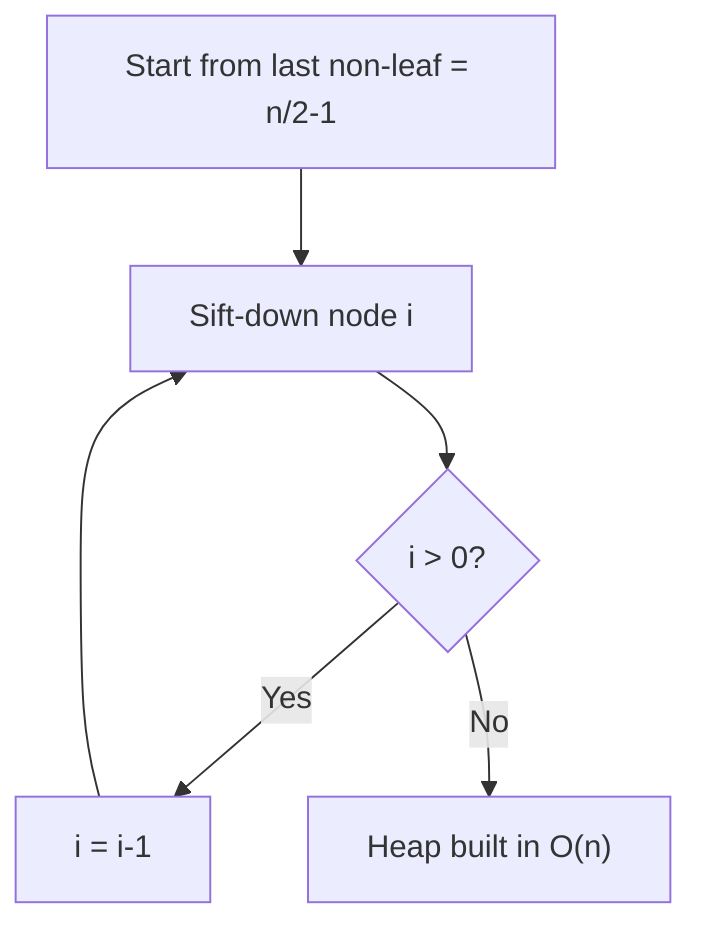


Heapify는 배열을 힙 성질로 변환하는 과정이다.

**Bottom-Up Heapify가 O(n)인 이유**:
- 높이 h에서 노드 수: ~n/2^(h+1)
- 각 노드의 sift-down 비용: O(h)
- 총 비용: $\sum_{h=0}^{\log n} \frac{n}{2^{h+1}} \cdot h = O(n)$
- 리프 노드(절반)는 sift-down 불필요, 루트 근처의 소수 노드만 많이 내려감

Top-Down 방식(n번 insert)은 O(n log n)이므로 Bottom-Up이 중요하다.

힙 정렬(Heap Sort) 과정:
1. 배열을 max-heap으로 변환: O(n) (bottom-up heapify)
2. 루트(최댓값)를 배열 끝과 교환하고 힙 크기를 줄인 후 sift-down: 반복 n-1번, 각 O(log n)
3. 총 시간: O(n log n), 공간: O(1) in-place

힙 정렬의 특성: 최악에도 O(n log n) 보장(퀵 정렬과 달리), in-place(병합 정렬과 달리). 하지만 캐시 효율이 떨어져(배열 내 비연속적 접근 패턴) 실전에서 퀵 정렬보다 느린 경우가 많다. 이 때문에 정렬 라이브러리는 보통 Introsort(퀵 정렬 + 힙 정렬 폴백)를 사용한다.

---

## 5. Hash

### Hash Table

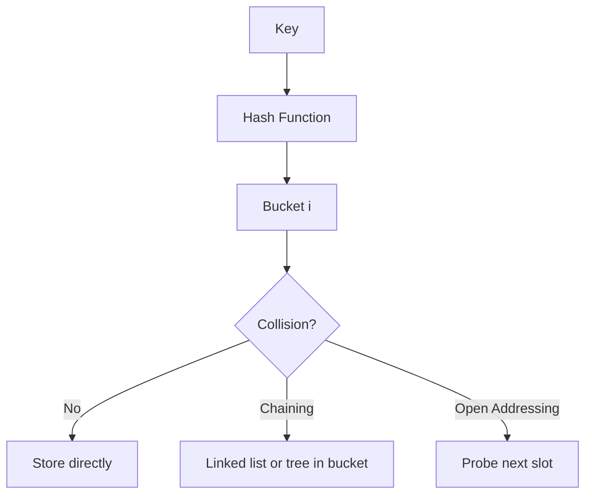


해시 테이블은 키를 해시 함수로 인덱스로 매핑해 평균 `O(1)` 조회/삽입/삭제를 제공한다.

좋은 해시 함수의 조건:
- **균일 분포(Uniform Distribution)**: 키가 모든 버킷에 고르게 매핑
- **빠른 계산**: 해시 계산 자체가 병목이 되면 안 됨
- **결정론적(Deterministic)**: 같은 입력에 항상 같은 값
- **눈사태 효과(Avalanche Effect)**: 입력이 1비트 변해도 출력이 크게 변함

실전 해시 함수:
- **정수**: `h(k) = k mod m` (m은 소수가 좋음). 또는 곱셈 해시: $h(k) = \lfloor m(kA \mod 1) \rfloor$, A ≈ 0.6180339887 (황금비의 역수)
- **문자열**: 다항식 해시 `h = s[0]·p^(n-1) + s[1]·p^(n-2) + ... + s[n-1]`. Rabin-Karp 패턴 매칭에 활용
- **범용 해시**: MurmurHash3, xxHash (비암호학적, 매우 빠름), SipHash (HashDoS 방어, Python/Rust 기본)

### Collision Resolution

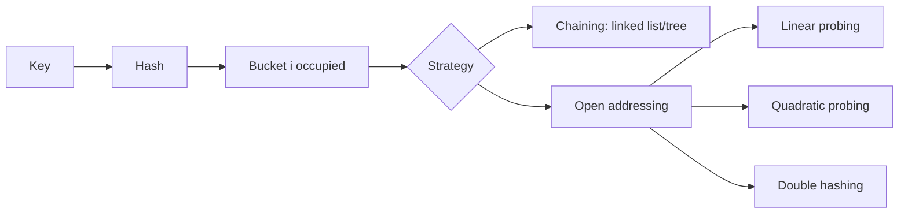


충돌 해결은 해시 품질 못지않게 중요하다. 대표 방식은 체이닝과 개방 주소법이며, 워크로드 특성(삭제 빈도, 메모리 locality, load factor)에 따라 선택이 달라진다.

#### Chaining
체이닝은 각 버킷에 연결 리스트(또는 동적 구조)를 두어 충돌 키를 저장한다.
- 장점: 구현 간단, 삭제 용이, load factor > 1 허용
- 단점: 포인터 오버헤드, 캐시 비효율
- 최적화: Java 8 HashMap은 체인 길이가 8 이상이면 Red-Black Tree로 변환 (O(n) → O(log n))

#### Open Addressing
개방 주소법은 충돌 시 테이블 내부의 다른 빈 슬롯을 탐사한다.
- **Linear Probing**: $h(k, i) = (h(k) + i) \mod m$. 캐시 효율 최고. 단, **Primary Clustering** 문제 (연속된 점유 구간이 커져 탐사 길이 증가)
- **Quadratic Probing**: $h(k, i) = (h(k) + c_1 i + c_2 i^2) \mod m$. Primary Clustering 완화. 단, **Secondary Clustering** (같은 해시값은 같은 탐사 서열)
- **Double Hashing**: $h(k, i) = (h_1(k) + i \cdot h_2(k)) \mod m$. 두 번째 해시로 탐사 간격 결정. 클러스터링 최소화

**삭제 문제**: Open Addressing에서 단순 삭제하면 탐사 체인이 끊어진다. 해결책: Tombstone(삭제 표시)을 남기고, 탐사 시 건너뛰며 진행. 하지만 tombstone이 많아지면 성능 저하 → 주기적 rehashing 필요.

**Robin Hood Hashing**: 탐사 거리가 긴 키가 짧은 키의 자리를 "빼앗는" 방식. 탐사 거리의 분산을 줄여 최악 케이스를 개선한다. Rust의 HashMap이 이 방식을 사용했다 (이후 SwissTable로 변경).

**Cuckoo Hashing**: 두 개의 해시 함수와 두 개의 테이블을 사용. 삽입 시 충돌하면 기존 키를 다른 테이블로 이동시킴. 최악 O(1) 조회를 보장하지만, 삽입이 실패할 수 있어 rehashing이 필요할 수 있다.

### Load Factor

```mermaid
flowchart LR
  N[Stored entries n] --> LF["alpha = n / bucket_count"]
  B[Bucket count m] --> LF
  LF --> PERF["Collision probability/performance"]
```


로드 팩터(`α = n/m`, n=원소 수, m=버킷 수)는 성능의 핵심 지표다.

Chaining: 평균 탐사 길이 = 1 + α/2 (성공), 1 + α (실패). α > 1도 동작하지만 성능 저하
Open Addressing: 1/(1-α)에 비례. α가 1에 가까워질수록 급격히 악화

| α | Linear Probing 평균 탐사 (성공) | Chaining 평균 탐사 (성공) |
|---|------------------------------|-------------------------|
| 0.5 | ~1.5 | ~1.25 |
| 0.75 | ~2.5 | ~1.375 |
| 0.9 | ~5.5 | ~1.45 |

일반적인 리사이즈 임계치: Open Addressing 0.5~0.75, Chaining 0.75~1.0. Google의 Swiss Table(Abseil)은 load factor 0.875에서도 효율적으로 동작하도록 SIMD 기반 그룹 탐사를 사용한다.

### Rehashing

```mermaid
flowchart TD
  A[Insert causes high load factor] --> B[Allocate bigger table]
  B --> C[Recompute hash for each key]
  C --> D[Move entries to new buckets]
  D --> E[Swap new table]
```


리해싱은 테이블 크기를 확장하고 기존 원소를 새 해시 정책에 따라 재배치하는 과정이다.

리해싱 전략:
- **전체 리해싱**: 새 테이블 할당 → 모든 원소를 새 해시로 재삽입. O(n) 비용이지만 상환 O(1). 동적 배열 확장과 유사한 분석
- **점진적 리해싱(Incremental Rehashing)**: Redis가 사용하는 방식. 기존/새 테이블을 동시에 유지하며, 연산마다 조금씩 이주(migration). 스파이크를 방지해 지연 민감 시스템에 적합
  - 장점: 한 번에 긴 정지(stop-the-world)가 없음
  - 단점: 이중 메모리 사용, 조회 시 두 테이블 모두 확인 필요

테이블 크기 선택: 소수(prime) 크기가 모듈러 해시의 분포를 개선하지만, 나눗셈이 필요해 속도가 느리다. 2의 거듭제곱 크기는 비트 마스킹(`h & (m-1)`)으로 빨리 인덱싱하지만, 해시 함수 품질이 나쁘면 분포가 편향된다. 현대 구현은 2의 거듭제곱 + 좋은 해시 함수 조합을 선호한다.

---

## 6. Graph

### Representation (Adjacency List / Matrix)

```mermaid
flowchart LR
  G[Graph]
  G --> L["Adjacency List<br/>space O(V+E)"]
  G --> M["Adjacency Matrix<br/>space O(V^2)"]
  L --> L1[sparse graph friendly]
  M --> M1["edge lookup O(1)"]
```


| 비교 | 인접 리스트 | 인접 행렬 |
|------|-----------|----------|
| 공간 | O(V + E) | O(V²) |
| 간선 존재 확인 | O(degree) | O(1) |
| 모든 이웃 순회 | O(degree) | O(V) |
| 간선 추가 | O(1) | O(1) |
| 희소 그래프 | 적합 ✅ | 비효율 |
| 밀집 그래프 | 가능 | 적합 ✅ |

인접 리스트 구현:
```java
// 가중 그래프 (인접 리스트)
List<List<int[]>> graph = new ArrayList<>();
for (int i = 0; i < V; i++) graph.add(new ArrayList<>());
graph.get(u).add(new int[]{v, weight});

// 또는 간선 리스트 (Bellman-Ford, Kruskal에 적합)
int[][] edges = {{u, v, weight}, ...};
```

실전 고려사항:
- **CSR (Compressed Sparse Row)**: 대규모 정적 그래프에서 메모리/캐시 효율이 좋은 표현. 두 배열(indptr, indices)로 인접 관계를 인코딩. 수정이 어렵지만 순회가 매우 빠름
- **행렬 곱셈과 경로**: 인접 행렬 $A$의 $k$제곱 $A^k[i][j]$는 i에서 j로 가는 길이 k인 경로의 수. Floyd-Warshall도 행렬 관점에서 이해할 수 있음

### BFS / DFS

```mermaid
flowchart LR
  BFS[BFS] --> Q[Queue]
  BFS --> BL["Level-order traversal"]
  DFS[DFS] --> ST["Stack/Recursion"]
  DFS --> DP[Deep exploration]
```


**BFS (Breadth-First Search)**:
- 자료구조: 큐
- 최단 경로: 무가중치 그래프에서 **최소 간선 수** 경로를 보장
- 시간: O(V + E)
- 활용: 최단 거리, 연결 요소, 이분 그래프 판별, 레벨 순회

```java
public static int[] bfs(List<List<Integer>> graph, int start, int V) {
    boolean[] visited = new boolean[V];
    int[] dist = new int[V];
    Arrays.fill(dist, -1);
    Queue<Integer> queue = new LinkedList<>();
    visited[start] = true;
    dist[start] = 0;
    queue.offer(start);
    while (!queue.isEmpty()) {
        int u = queue.poll();
        for (int v : graph.get(u)) {
            if (!visited[v]) {
                visited[v] = true;
                dist[v] = dist[u] + 1;
                queue.offer(v);
            }
        }
    }
    return dist;
}
```

**DFS (Depth-First Search)**:
- 자료구조: 스택 (또는 재귀 호출 스택)
- 시간: O(V + E)
- 활용: 사이클 검출, 위상 정렬, 강연결 요소(SCC), 관절점/다리, 백트래킹

DFS 간선 분류 (방향 그래프):
- **Tree Edge**: DFS 트리에 포함되는 간선
- **Back Edge**: 조상으로 향하는 간선 → **사이클이 존재함을 의미**
- **Forward Edge**: 자손으로 향하는 간선 (트리 간선이 아닌)
- **Cross Edge**: 형제 서브트리 간 간선

**이분 그래프(Bipartite) 판별**: BFS/DFS로 2-색칠 시도. 인접한 노드가 같은 색이면 이분 그래프가 아님.

**강연결 요소(SCC)**: 방향 그래프에서 모든 정점 쌍이 서로 도달 가능한 최대 집합. Tarjan's Algorithm (단일 DFS, O(V+E)) 또는 Kosaraju's Algorithm (DFS 2회)으로 구함.

### Dijkstra

```mermaid
flowchart TD
  A["init dist(source)=0, others=INF"] --> B["push source to min-heap"]
  B --> C{Heap empty?}
  C -->|Yes| H[Done]
  C -->|No| D[Pop node with min distance]
  D --> E[Relax all outgoing edges]
  E --> F{Distance improved?}
  F -->|Yes| G["Update dist + push heap"]
  F -->|No| C
  G --> C
```


다익스트라는 음수 간선이 없는 그래프에서 단일 시작점 최단 경로를 구한다.

```java
public static int[] dijkstra(List<List<int[]>> graph, int start, int V) {
    int[] dist = new int[V];
    Arrays.fill(dist, Integer.MAX_VALUE);
    dist[start] = 0;
    // {거리, 노드}
    PriorityQueue<int[]> pq = new PriorityQueue<>((a, b) -> a[0] - b[0]);
    pq.offer(new int[]{0, start});
    while (!pq.isEmpty()) {
        int[] cur = pq.poll();
        int d = cur[0], u = cur[1];
        if (d > dist[u]) continue; // 이미 더 짧은 경로를 찾은 경우 스킵
        for (int[] edge : graph.get(u)) {
            int v = edge[0], w = edge[1];
            int nd = d + w;
            if (nd < dist[v]) {
                dist[v] = nd;
                pq.offer(new int[]{nd, v});
            }
        }
    }
    return dist;
}
```

복잡도:
- 이진 힙: O((V + E) log V)
- 피보나치 힙: O(V log V + E) — decrease-key가 O(1)
- 밀집 그래프(E ≈ V²)에서 배열 기반: O(V²) — 힙 없이 선형 탐색이 더 빠를 수 있음

**음수 간선 불가 이유**: Dijkstra는 확정한 노드의 거리가 최단임을 가정하고 다시 방문하지 않는 그리디 전략을 사용한다. 음수 간선이 있으면 확정 후에도 더 짧은 경로가 나타날 수 있어 정확성이 깨진다.

**A* Algorithm**: Dijkstra에 휴리스틱 $h(v)$(목표까지의 추정 거리)를 추가. 우선순위 = $g(v) + h(v)$로 목표에 가까운 방향을 우선 탐색한다. 휴리스틱이 admissible(절대 과대평가하지 않음)이면 최적해를 보장한다. 맵 내비게이션, 게임 AI 경로탐색에 활용. Manhattan/Euclidean distance가 일반적인 휴리스틱이다.

### Bellman-Ford

```mermaid
flowchart TD
  I["initialize dist(source)=0"] --> R["repeat V-1 times: relax all edges"]
  R --> C[One more pass]
  C --> N{Any edge still relaxes?}
  N -->|Yes| NEG[Negative cycle exists]
  N -->|No| DONE[Shortest paths confirmed]
```


벨만-포드는 음수 간선이 있어도 최단 경로를 계산할 수 있고, 음수 사이클 탐지도 가능하다.

알고리즘:
1. 모든 거리를 ∞로 초기화, 출발점 = 0
2. V-1번 반복: 모든 간선 (u, v, w)에 대해 `dist[v] = min(dist[v], dist[u] + w)` (완화)
3. 한 번 더 반복해 거리가 줄어드는 간선이 있으면 → 음수 사이클 존재

복잡도: O(VE). Early termination 최적화: 한 라운드에서 업데이트가 없으면 즉시 종료.

**SPFA (Shortest Path Faster Algorithm)**: Bellman-Ford의 큐 기반 최적화. 완화에 성공한 노드만 큐에 넣어 불필요한 완화를 줄인다. 평균적으로 빠르지만 최악은 여전히 O(VE). 알고리즘 대회에서 자주 사용되지만, 최악 케이스가 쉽게 구성될 수 있어 실전에서는 주의가 필요하다.

### Floyd-Warshall

```mermaid
flowchart TD
  A[Init dist matrix] --> K[for k in 1..V]
  K --> I[for i in 1..V]
  I --> J[for j in 1..V]
  J --> U["dist(i,j) = min(dist(i,j), dist(i,k) + dist(k,j))"]
  U --> O["All-pairs shortest paths"]
```


플로이드-워셜은 모든 정점 쌍 최단 경로를 `O(V³)`로 계산한다.

핵심 아이디어 (DP): 중간 노드를 1부터 k까지만 사용했을 때의 최단 거리를 점진적으로 확장한다:
$$dp[k][i][j] = \min(dp[k-1][i][j], \; dp[k-1][i][k] + dp[k-1][k][j])$$

실전에서는 2D 배열 하나로 in-place 업데이트한다:
```java
// dist[i][j] = 간선 가중치 (없으면 INF, dist[i][i] = 0)
for (int k = 0; k < V; k++) {
    for (int i = 0; i < V; i++) {
        for (int j = 0; j < V; j++) {
            if (dist[i][k] != INF && dist[k][j] != INF) {
                dist[i][j] = Math.min(dist[i][j], dist[i][k] + dist[k][j]);
            }
        }
    }
}
```

음수 사이클 검출: 알고리즘 종료 후 `dist[i][i] < 0`인 노드가 있으면 음수 사이클에 포함됨.

적용 조건: V ≤ ~500 정도에서 실용적. V가 크면 Dijkstra를 V번 실행하는 것이 더 효율적일 수 있다 (E가 희소할 때). 경로 복원 시 별도의 `next[i][j]` 행렬을 유지한다.

### Topological Sort

```mermaid
flowchart TD
  A[Compute indegree] --> B[Push indegree 0 nodes]
  B --> C[Pop node and output]
  C --> D[Decrease indegree of neighbors]
  D --> E{new indegree 0?}
  E -->|Yes| B
  E -->|No| C
```


위상 정렬은 DAG(Directed Acyclic Graph)에서 선행 제약을 만족하는 노드 순서를 구한다.

두 가지 알고리즘:
1. **Kahn's Algorithm (BFS 기반)**: 진입차수(in-degree) 0인 노드를 큐에 넣고 처리하며, 인접 노드의 진입차수를 감소. O(V + E). 사이클 감지도 가능 (처리된 노드 수 < V이면 사이클 존재)
2. **DFS 기반**: DFS 후위 순서를 역순으로 나열. O(V + E)

```java
// Kahn's Algorithm
public static List<Integer> topologicalSort(List<List<Integer>> graph, int[] inDegree, int V) {
    Queue<Integer> queue = new LinkedList<>();
    for (int v = 0; v < V; v++) {
        if (inDegree[v] == 0) queue.offer(v);
    }
    List<Integer> order = new ArrayList<>();
    while (!queue.isEmpty()) {
        int u = queue.poll();
        order.add(u);
        for (int v : graph.get(u)) {
            inDegree[v]--;
            if (inDegree[v] == 0) queue.offer(v);
        }
    }
    return order.size() == V ? order : null; // null = 사이클 존재
}
```

활용: 빌드 시스템(Make, Gradle), 패키지 의존성 해결, 데이터 파이프라인 스케줄링, 선수 과목 체계, 스프레드시트 셀 계산 순서.

**사전순 위상 정렬**: 여러 유효한 위상 정렬 중 사전순으로 가장 앞서는 것을 구하려면, 큐 대신 min-heap을 사용한다.

### Union-Find

```mermaid
flowchart LR
  U["union(a,b)"] --> FA["find(a)"]
  U --> FB["find(b)"]
  FA --> C{rootA != rootB?}
  FB --> C
  C -->|Yes| M["merge by rank/size"]
  C -->|No| N[already connected]
  P[path compression in find] --> FA
  P --> FB
```


Union-Find(Disjoint Set Union, DSU)는 원소 집합 분리/병합을 효율적으로 관리한다.

핵심 최적화:
1. **경로 압축(Path Compression)**: `find(x)` 시 경로의 모든 노드를 직접 루트에 연결. 트리 높이를 사실상 1로 만듦
2. **Union by Rank/Size**: 작은 트리를 큰 트리 아래에 붙임. 편향 방지

```java
class UnionFind {
    int[] parent, rank;

    UnionFind(int n) {
        parent = new int[n];
        rank = new int[n];
        for (int i = 0; i < n; i++) parent[i] = i;
    }

    int find(int x) {
        if (parent[x] != x)
            parent[x] = find(parent[x]); // Path Compression
        return parent[x];
    }

    boolean union(int x, int y) {
        int px = find(x), py = find(y);
        if (px == py) return false;
        if (rank[px] < rank[py]) { int tmp = px; px = py; py = tmp; }
        parent[py] = px; // Union by Rank
        if (rank[px] == rank[py]) rank[px]++;
        return true;
    }
}
```

복잡도: 두 최적화 모두 적용 시, m번의 union/find 연산 총 비용 O(m · α(n)). α(n)은 역 아커만 함수로, 실용적인 모든 입력에서 ≤ 4. 사실상 상수 시간.

활용: Kruskal MST, 동적 연결성(connected components), 네트워크 장비 그룹핑, 최소 공통 조상(Offline LCA), 등가 클래스 분류.

**Weighted Union-Find**: 각 원소에 루트까지의 상대적 가중치를 저장. "A와 B의 차이가 d"라는 관계형 정보를 관리할 수 있다. 조건부 관계/차이 제약 문제(ACM/ICPC 빈출)에 활용.

### MST (Kruskal / Prim)

```mermaid
flowchart LR
  K1["Kruskal: sort edges by weight"] --> K2["Add edge if no cycle (Union-Find)"]
  P1["Prim: grow tree from a start node"] --> P2["Pick min crossing edge (PQ)"]
  K2 --> MST[Minimum Spanning Tree]
  P2 --> MST
```


최소 신장 트리(MST)는 모든 정점을 최소 비용으로 연결하는 V-1개의 간선 집합이다.

**Kruskal's Algorithm**:
1. 모든 간선을 가중치 순 정렬: O(E log E)
2. 작은 간선부터, 사이클을 만들지 않으면(Union-Find 확인) MST에 추가
3. V-1개 간선 선택되면 종료
- 복잡도: O(E log E + E · α(V)) ≈ O(E log E)
- 적합: 희소 그래프 (E ≪ V²)

**Prim's Algorithm**:
1. 임의 정점에서 시작
2. MST에 인접한 간선 중 가중치 최소인 것을 선택 (Priority Queue)
3. V-1개 간선 선택될 때까지 반복
- 복잡도: 이진 힙 O((V + E) log V), 피보나치 힙 O(E + V log V)
- 적합: 밀집 그래프

**Cut Property (절단 성질)**: MST의 이론적 기반. 그래프의 임의 절단(cut)에서 가중치가 최소인 간선은 반드시 MST에 포함된다. Kruskal과 Prim 모두 이 성질을 활용한다.

MST의 유일성: 모든 간선 가중치가 서로 다르면 MST는 유일하다. 같은 가중치가 있으면 여러 MST가 존재할 수 있다.

**Borůvka's Algorithm**: 각 컴포넌트에서 최소 외부 간선을 동시에 선택. 병렬화에 유리. O(E log V). 분산 환경에서 활용. 각 라운드에서 컴포넌트 수가 최소 절반으로 줄어 O(log V) 라운드만 필요하다.

---

## 7. Advanced Structures

### Trie

```mermaid
graph TD
  R((root)) --> A((a))
  A --> AP((p))
  AP --> APP((p*))
  AP --> APL((l))
  APL --> APLE((e*))
  R --> B((b))
  B --> BA((a))
  BA --> BAT((t*))
```


Trie(Prefix Tree)는 문자열 집합을 문자 단위 경로로 저장하는 트리다. 접두사 검색(prefix query)과 자동완성에 매우 강하다.

```java
class TrieNode {
    Map<Character, TrieNode> children = new HashMap<>();
    boolean isEnd = false;
    int count = 0; // 이 접두사를 가진 단어 수 (선택)
}

class Trie {
    TrieNode root = new TrieNode();

    void insert(String word) {
        TrieNode node = root;
        for (char ch : word.toCharArray()) {
            node.children.putIfAbsent(ch, new TrieNode());
            node = node.children.get(ch);
            node.count++;
        }
        node.isEnd = true;
    }

    boolean search(String word) { // 정확히 존재하는지
        TrieNode node = find(word);
        return node != null && node.isEnd;
    }

    boolean startsWith(String prefix) { // 접두사로 시작하는 단어 존재?
        return find(prefix) != null;
    }

    private TrieNode find(String prefix) {
        TrieNode node = root;
        for (char ch : prefix.toCharArray()) {
            if (!node.children.containsKey(ch)) return null;
            node = node.children.get(ch);
        }
        return node;
    }
}
```

복잡도: 삽입/검색 O(L), L=문자열 길이. 해시 테이블 O(L)과 같지만, Trie는 **접두사 기반 연산**에서 압도적으로 유리하다.

메모리 최적화:
- **배열 기반 자식**: 알파벳 크기가 고정(26)이면 `children[26]` 배열. 해시 맵보다 빠르지만 메모리 낭비 가능
- **Compressed Trie (Patricia Tree / Radix Tree)**: 자식이 하나뿐인 노드를 합쳐 간선에 문자열을 저장. 노드 수를 크게 줄임. Linux 커널 라우팅 테이블에서 사용
- **Double-Array Trie**: 두 개의 배열(base, check)로 Trie를 인코딩. 매우 메모리 효율적. 형태소 분석기(MeCab), 입력기(librime)에서 활용

활용: 자동완성, IP 라우팅(Longest Prefix Match), 사전 검색, XOR 최대값 쿼리 (bitwise trie), 문자열 패턴 매칭.

### Suffix Array

```mermaid
flowchart TD
  S[String S] --> SUF[Generate all suffixes]
  SUF --> SORT[Sort suffixes lexicographically]
  SORT --> SA["Store starting indices = Suffix Array"]
  SA --> LCP[LCP array for fast queries]
```


Suffix Array는 문자열의 모든 접미사를 사전순 정렬한 인덱스 배열이다.

예: `s = "banana"`
접미사: banana(0), anana(1), nana(2), ana(3), na(4), a(5)
정렬: a(5), ana(3), anana(1), banana(0), na(4), nana(2)
SA = [5, 3, 1, 0, 4, 2]

구성 알고리즘:
- **단순 정렬**: O(n² log n). 모든 접미사를 문자열 비교 기반 정렬
- **Prefix Doubling**: O(n log² n). 길이 1, 2, 4, ... 접두사 기준으로 반복 정렬
- **SA-IS (Induced Sorting)**: O(n). 선형 시간 구성. 실전에서 가장 효율적

**LCP Array (Longest Common Prefix)**: SA에서 인접한 접미사들의 최장 공통 접두사 길이를 저장한 배열. **Kasai's Algorithm**으로 O(n)에 구성 가능.

SA + LCP Array 활용:
- **패턴 검색**: 이진 탐색으로 O(m log n), m=패턴 길이
- **최장 반복 부분 문자열**: LCP 배열의 최댓값
- **서로 다른 부분 문자열의 수**: $n(n+1)/2 - \sum LCP[i]$
- **최장 공통 부분 문자열** (두 문자열): 두 문자열을 연결하고 SA/LCP 구성 후, 서로 다른 문자열에서 온 인접 접미사의 최대 LCP

### Suffix Tree

```mermaid
graph TD
  R((root)) --> A[a...]
  R --> B[b...]
  A --> A1[na$]
  A --> A2[pple$]
  B --> B1[anana$]
  B --> B2[and$]
```


Suffix Tree는 모든 접미사를 압축 트리 형태로 표현해 다양한 문자열 질의를 선형 시간에 지원한다.

**Ukkonen's Algorithm**: O(n) 온라인 구성 알고리즘. 핵심 트릭:
1. 암묵적 확장(implicit extension): 리프 끝을 전역 포인터로 관리해 O(1) 확장
2. Suffix link: 활성 지점(active point)을 빠르게 이동
3. Rule 3 (이미 존재하는 확장 중단): 더 이상의 확장이 불필요

Suffix Tree 응용:
- O(m) 패턴 매칭 (m=패턴 길이)
- 최장 반복 부분 문자열: 가장 깊은 분기 노드
- 최장 회문, 최장 공통 부분 문자열
- 문자열 압축 (Lempel-Ziv)

실전에서는 Suffix Array + LCP Array 조합이 메모리 면에서 더 효율적이어서, Suffix Tree를 직접 구성하기보다 SA를 사용하는 경우가 많다.

### LRU Cache (Hash + Doubly Linked List)

```mermaid
flowchart LR
  M["HashMap key->node"] --> N1[Node A]
  M --> N2[Node B]
  M --> N3[Node C]
  H[Head MRU] <--> N1
  N1 <--> N2
  N2 <--> N3
  N3 <--> T[Tail LRU]
```


LRU(Least Recently Used) 캐시는 "가장 오래 사용되지 않은" 항목을 우선 제거한다.

자료구조: `HashMap<key, Node>` + Doubly Linked List
- **get(key)**: HashMap으로 O(1) 조회 → 해당 노드를 리스트 앞(most recent)으로 이동
- **put(key, value)**: 이미 존재하면 업데이트 + 앞으로 이동. 새 키면 앞에 삽입. 용량 초과 시 리스트 꼬리(least recent) 삭제 + HashMap에서도 삭제
- 모든 연산 O(1)

```java
class LRUCache extends LinkedHashMap<Integer, Integer> {
    private final int capacity;

    public LRUCache(int capacity) {
        super(capacity, 0.75f, true); // accessOrder = true
        this.capacity = capacity;
    }

    public int get(int key) {
        return super.getOrDefault(key, -1);
    }

    public void put(int key, int value) {
        super.put(key, value);
    }

    @Override
    protected boolean removeEldestEntry(Map.Entry<Integer, Integer> eldest) {
        return size() > capacity; // 용량 초과 시 가장 오래된 항목 자동 제거
    }
}
```

캐시 교체 정책 비교:
- **LRU**: 가장 최근에 사용되지 않은 항목 제거. 시간 지역성 활용. 단, 한 번만 접근된 대량 데이터가 캐시를 오염시킬 수 있음
- **LFU (Least Frequently Used)**: 가장 적게 사용된 항목 제거. 빈도 기반. 새 항목이 불리(cold start)
- **ARC (Adaptive Replacement Cache)**: LRU + LFU를 동적으로 조합. 워크로드에 적응. ZFS에서 사용
- **CLOCK**: LRU의 근사. 원형 버퍼 + 참조 비트로 구현. OS 페이지 교체에서 사용 (정확한 LRU보다 오버헤드 작음)

O(1) LFU: HashMap + 빈도별 Doubly Linked List의 HashMap 구조로 삽입/삭제/조회 모두 O(1)에 구현 가능.

### Skip List

```mermaid
flowchart TD
  L3["Level 3: sparse express lane"] --> L2[Level 2]
  L2 --> L1[Level 1]
  L1 --> L0["Level 0: full ordered list"]
  L3 --> S[Search drops down when next key is too large]
```


스킵 리스트는 다층 연결 리스트로 평균 `O(log n)` 탐색/삽입/삭제를 제공한다.

구조: 최하위 레벨은 모든 원소를 정렬 순서로 포함하는 연결 리스트. 상위 레벨은 하위 레벨의 일부 원소를 포함하며, 각 원소가 레벨 i에 나타날 확률은 p^i (보통 p = 0.5 또는 0.25).

탐색 과정: 최상위 레벨에서 시작해 오른쪽→아래로 이동하며 목표를 찾는다. "고속도로 → 국도 → 골목길"과 유사하다.

기대 높이: $O(\log_{1/p} n)$. p=0.5이면 ~$\log_2 n$.

```text
Level 3: 1 ────────────────────── 9
Level 2: 1 ──── 4 ────────────── 9
Level 1: 1 ── 3 ── 4 ── 6 ── 7 ── 9
Level 0: 1  2  3  4  5  6  7  8  9
```

균형 트리 대비 장점:
- **구현 단순**: 회전 연산 불필요. 확률적 균형 유지
- **동시성 친화**: 락 없이 또는 세밀한 락으로 concurrent 구현이 용이. ConcurrentSkipListMap(Java)
- **범위 질의 효율**: 최하위 레벨이 연결 리스트이므로 범위 스캔이 자연스러움

실전 사용:
- **Redis Sorted Set**: Skip List + Hash Table 조합. 점수 기반 정렬 + O(1) 조회를 동시 지원
- **LevelDB/RocksDB MemTable**: Concurrent Skip List로 in-memory 쓰기 버퍼 구현
- **Java `ConcurrentSkipListMap`**: 락-프리 동시성 정렬 맵

확률적 구조의 장점: 최악 O(n)이 가능하지만, 충분히 많은 연산에서 확률적으로 O(log n)이 보장된다. 결정론적 균형 트리보다 구현과 동시성 측면에서 실용적인 장점이 있다.

---

## 8. Dynamic Programming

### DP 기본 원리

```mermaid
flowchart TD
  P[Problem] --> S[Define state]
  S --> R[Recurrence relation]
  R --> B[Base cases]
  B --> O["Compute order (top-down/bottom-up)"]
  O --> A[Answer from DP table]
```


동적 프로그래밍(DP)은 문제를 **최적 부분 구조(Optimal Substructure)** 와 **겹치는 부분 문제(Overlapping Subproblems)** 를 가질 때, 부분 문제의 답을 저장(memoization/tabulation)해 중복 계산을 제거하는 기법이다.

두 가지 접근법:
- **Top-Down (Memoization)**: 재귀 + 캐시. 필요한 부분 문제만 계산 (lazy). 호출 스택 사용
- **Bottom-Up (Tabulation)**: 반복문으로 작은 문제부터 순서대로 채움. 스택 오버플로우 없음. 공간 최적화(rolling array) 용이

DP 설계 5단계:
1. **상태(State) 정의**: dp[i], dp[i][j] 등 무엇을 의미하는지 명확히 정의
2. **점화식(Recurrence Relation)**: 큰 문제를 작은 문제로 표현
3. **초기값(Base Case)**: 재귀의 종료 조건 / 테이블의 시작 값
4. **계산 순서**: 의존성에 따라 채우는 방향 결정
5. **최종 답 위치**: dp[n], dp[0][n-1] 등

### 배낭 문제 (Knapsack)

```mermaid
flowchart LR
  S["state dp(i,w)"] --> A1["skip item i<br/>dp(i-1,w)"]
  S --> A2["take item i<br/>dp(i-1,w-wi) + vi"]
  A1 --> M[max]
  A2 --> M
  M --> N["dp(i,w)"]
```


DP의 대표 문제 군이며, 변형이 다양하게 출제된다.

#### 0/1 Knapsack

각 아이템을 선택(1)하거나 안 하거나(0). 중복 선택 불가.

상태: `dp[i][w]` = 처음 i개 아이템으로 무게 w 이하에서 달성 가능한 최대 가치
점화식: $dp[i][w] = \max(dp[i-1][w], \; dp[i-1][w - w_i] + v_i)$

```java
// 0/1 Knapsack (1D 공간 최적화)
public static int knapsack01(int[] weights, int[] values, int W) {
    int n = weights.length;
    int[] dp = new int[W + 1];
    for (int i = 0; i < n; i++) {
        for (int w = W; w >= weights[i]; w--) { // 역순 순회 (중복 방지)
            dp[w] = Math.max(dp[w], dp[w - weights[i]] + values[i]);
        }
    }
    return dp[W];
}
```

핵심 포인트: 1D 최적화 시 **역순 순회**가 필수. 정순이면 같은 아이템을 여러 번 사용하게 된다.

#### Unbounded Knapsack (완전 배낭)

각 아이템을 **무한히** 선택 가능.
점화식: $dp[w] = \max_{i}(dp[w], \; dp[w - w_i] + v_i)$

```java
// Unbounded Knapsack
public static int knapsackUnbounded(int[] weights, int[] values, int W) {
    int[] dp = new int[W + 1];
    for (int w = 1; w <= W; w++) {
        for (int i = 0; i < weights.length; i++) {
            if (weights[i] <= w) {
                dp[w] = Math.max(dp[w], dp[w - weights[i]] + values[i]);
            }
        }
    }
    return dp[W];
}
```

#### 배낭 문제 변형 패턴

| 변형 | 핵심 차이 | 순회 순서 |
|------|----------|----------|
| 0/1 Knapsack | 각 아이템 1번 | 무게 역순 |
| Unbounded Knapsack | 각 아이템 무제한 | 무게 정순 |
| Bounded Knapsack | 각 아이템 k개 제한 | 이진 분해 → 0/1로 환원 |
| Subset Sum | 가치 = 무게, 목표 합 존재 여부 | boolean dp |
| Coin Change (최소 개수) | 동전 무제한, 최소 동전 수 | `dp[w] = min(dp[w], dp[w-coin]+1)` |
| Coin Change (경우의 수) | 조합 수 | 동전 외부 루프 = 조합, 무게 외부 루프 = 순열 |

### LIS (Longest Increasing Subsequence)

```mermaid
flowchart LR
  N[Input sequence] --> T[tails array]
  T --> BS[Binary search insertion position]
  BS --> REP[Replace or append]
  REP --> LEN["Length of tails = LIS length"]
```


최장 증가 부분 수열은 면접에서 매우 빈출되는 DP 주제다.

#### O(n²) DP

`dp[i]` = nums[i]를 마지막 원소로 하는 LIS 길이

```java
public static int lisDP(int[] nums) {
    int n = nums.length;
    int[] dp = new int[n];
    Arrays.fill(dp, 1);
    int maxLen = 1;
    for (int i = 1; i < n; i++) {
        for (int j = 0; j < i; j++) {
            if (nums[j] < nums[i]) {
                dp[i] = Math.max(dp[i], dp[j] + 1);
            }
        }
        maxLen = Math.max(maxLen, dp[i]);
    }
    return maxLen;
}
```

#### O(n log n) 이진 탐색

`tails[i]` = 길이 (i+1)인 증가 부분 수열의 마지막 원소 중 최솟값. tails는 항상 정렬 상태를 유지한다.

```java
public static int lisBinarySearch(int[] nums) {
    List<Integer> tails = new ArrayList<>();
    for (int num : nums) {
        int pos = Collections.binarySearch(tails, num);
        if (pos < 0) pos = -(pos + 1);
        if (pos == tails.size()) {
            tails.add(num);
        } else {
            tails.set(pos, num);
        }
    }
    return tails.size();
}
```

직관: 각 숫자가 들어올 때, tails에서 해당 값이 들어갈 위치를 이진 탐색으로 찾아 교체. tails의 길이가 LIS 길이. (단, tails 자체가 실제 LIS는 아님)

LIS 변형:
- **최장 비감소 부분 수열**: `<`를 `<=`로 변경 (이진 탐색에서 upper_bound 사용)
- **실제 수열 복원**: 별도의 parent 배열로 역추적
- **가장 긴 증가 부분 수열의 개수**: DP + Fenwick Tree로 O(n log n)

### Interval DP

```mermaid
flowchart TD
  I["Interval (l,r)"] --> K[Try split point k]
  K --> L["dp(l,k)"]
  K --> R["dp(k+1,r)"]
  L --> M["Combine with cost(l,k,r)"]
  R --> M
  M --> ANS["best value for dp(l,r)"]
```


구간 DP는 구간 `[i, j]`를 상태로 두고, 구간을 분할하는 모든 경계점 `k`를 시도하는 패턴이다.

일반 형태: $dp[i][j] = \min_{i \leq k < j}(dp[i][k] + dp[k+1][j] + cost(i, j))$

순회 순서: 구간 길이가 짧은 것부터 긴 것 순서로 채움.

#### 행렬 곱셈 순서 (Matrix Chain Multiplication)

N개의 행렬을 곱할 때, 곱셈 순서에 따라 스칼라 곱셈 횟수가 달라진다. 최적 순서를 찾는 문제.

```java
// Matrix Chain Multiplication
// dims[i] = i번째 행렬의 행 수, dims[n] = 마지막 행렬의 열 수
// 행렬 i는 dims[i] × dims[i+1]
public static int matrixChain(int[] dims) {
    int n = dims.length - 1; // 행렬 개수
    int[][] dp = new int[n][n];
    // len: 구간 길이
    for (int len = 2; len <= n; len++) {
        for (int i = 0; i <= n - len; i++) {
            int j = i + len - 1;
            dp[i][j] = Integer.MAX_VALUE;
            for (int k = i; k < j; k++) {
                int cost = dp[i][k] + dp[k + 1][j] + dims[i] * dims[k + 1] * dims[j + 1];
                dp[i][j] = Math.min(dp[i][j], cost);
            }
        }
    }
    return dp[0][n - 1];
}
```

#### 대표적인 Interval DP 문제들

| 문제 | 상태 | 점화식 핵심 |
|------|------|-----------|
| 행렬 곱셈 순서 | dp[i][j] = 최소 곱셈 수 | 분할점 k로 두 부분의 합 + 결합 비용 |
| 최장 팰린드롬 부분 수열 | dp[i][j] = 길이 | s[i]==s[j]이면 dp[i+1][j-1]+2 |
| 풍선 터뜨리기 (Burst Balloons) | dp[i][j] = 최대 코인 | 마지막에 터뜨릴 풍선 k를 선택 |
| 최적 BST | dp[i][j] = 최소 탐색 비용 | 루트 k 선택, 좌우 서브트리 + 깊이 비용 |
| 괄호 칠하기 | dp[i][j] = 최소 비용 | 매칭 구조를 분석해 분할 |

### 기타 DP 패턴

```mermaid
flowchart LR
  DP[Dynamic Programming Patterns] --> BIT[Bitmask DP]
  DP --> TREE[Tree DP]
  DP --> DIGIT[Digit DP]
  DP --> KNUTH[Optimization tricks]
```


#### 비트마스크 DP

집합을 비트마스크로 표현하는 DP. 원소 수가 작을 때(보통 ≤ 20) 사용한다.

대표: **외판원 문제 (TSP)**
- 상태: `dp[mask][i]` = 방문 집합이 mask이고 현재 위치가 i일 때의 최소 비용
- 복잡도: $O(2^n \cdot n^2)$ — 완전 탐색 $O(n!)$보다 훨씬 효율적
- `mask & (1 << j)`: j번 도시 방문 여부 확인
- `mask | (1 << j)`: j번 도시를 방문 집합에 추가

#### 트리 DP

트리 구조에서 DFS를 수행하며 자식→부모 방향으로 DP 값을 합산한다.
- **트리의 지름**: 각 노드에서 아래로 가는 최장 경로 2개의 합. DFS로 O(n)
- **트리에서의 독립 집합**: `dp[v][0/1]` (선택 안 함/함). 선택하면 자식은 선택 불가

#### 자릿수 DP (Digit DP)

0~N 범위에서 특정 조건을 만족하는 수의 개수를 구할 때 사용한다.
- 상태: `dp[pos][tight][상태]` — pos는 현재 자릿수, tight는 상한 제약 여부
- 활용: "1~N에서 특정 숫자가 포함된 수의 개수", "자릿수 합이 k인 수의 개수"

---

## 9. String Algorithms

### KMP (Knuth-Morris-Pratt)

```mermaid
flowchart TD
  A["compare text(i) and pattern(j)"] --> B{Match?}
  B -->|Yes| C["i++, j++"]
  C --> D{j == m?}
  D -->|Yes| E["record match<br/>j = lps(j-1)"]
  D -->|No| A
  B -->|No and j > 0| F["j = lps(j-1)"]
  F --> A
  B -->|No and j == 0| G["i++"]
  G --> A
```


KMP는 텍스트 T에서 패턴 P를 O(n + m)에 검색하는 알고리즘이다. 불일치(mismatch) 시 불필요한 비교를 건너뛰는 **실패 함수(Failure Function, LPS 배열)** 가 핵심이다.

#### LPS (Longest Proper Prefix which is also Suffix) 배열

`lps[i]` = 패턴 P[0..i]의 접두사이면서 접미사인 최장 길이 (자기 자신 제외)

예: P = "ABACABAB"
```text
인덱스: 0 1 2 3 4 5 6 7
패턴 : A B A C A B A B
LPS  : 0 0 1 0 1 2 3 2
```

`lps[6] = 3`: P[0..6] = "ABACABA"에서 접두사 "ABA"와 접미사 "ABA"가 일치 (길이 3)

#### KMP 구현

```java
// LPS 배열 구성
public static int[] buildLPS(String pattern) {
    int m = pattern.length();
    int[] lps = new int[m];
    int len = 0; // 이전까지의 최장 접두사=접미사 길이
    int i = 1;
    while (i < m) {
        if (pattern.charAt(i) == pattern.charAt(len)) {
            lps[i++] = ++len;
        } else if (len > 0) {
            len = lps[len - 1]; // 핵심: 처음으로 돌아가지 않고 lps를 활용
        } else {
            lps[i++] = 0;
        }
    }
    return lps;
}

// KMP 검색
public static List<Integer> kmpSearch(String text, String pattern) {
    int[] lps = buildLPS(pattern);
    List<Integer> result = new ArrayList<>();
    int i = 0, j = 0; // i: 텍스트 인덱스, j: 패턴 인덱스
    while (i < text.length()) {
        if (text.charAt(i) == pattern.charAt(j)) {
            i++; j++;
        }
        if (j == pattern.length()) {
            result.add(i - j); // 매칭 위치
            j = lps[j - 1];
        } else if (i < text.length() && text.charAt(i) != pattern.charAt(j)) {
            if (j > 0) {
                j = lps[j - 1]; // 패턴 내에서 점프
            } else {
                i++;
            }
        }
    }
    return result;
}
```

KMP의 핵심 직관: 불일치 시 패턴의 이미 일치한 부분에서 "접두사=접미사"를 이용해 비교 위치를 최대한 건너뛴다. 텍스트의 인덱스 i는 절대 뒤로 가지 않으므로 O(n + m)이 보장된다.

#### 나이브 알고리즘과 비교

| 알고리즘 | 시간 복잡도 | 공간 복잡도 | 패턴 전처리 |
|---------|-----------|-----------|-----------|
| Naive | O(nm) | O(1) | 없음 |
| KMP | O(n + m) | O(m) | LPS 배열 |
| Rabin-Karp | O(n + m) 평균, O(nm) 최악 | O(1) | 해시 계산 |
| Boyer-Moore | O(n/m) 최선, O(nm) 최악 | O(m + σ) | Bad Character + Good Suffix |

**Boyer-Moore**: 패턴을 **뒤에서 앞으로** 비교하며, Bad Character Rule과 Good Suffix Rule로 대폭 건너뛴다. 실전에서 가장 빠른 단일 패턴 매칭 (텍스트 에디터의 Ctrl+F 등). 알파벳이 클수록 효율적.

### Aho-Corasick

```mermaid
flowchart TD
  T1[Build trie from patterns] --> T2[Build failure links by BFS]
  T2 --> T3[Scan text character by character]
  T3 --> T4["Follow goto/fail transitions"]
  T4 --> T5[Emit matched patterns]
```


Aho-Corasick은 **여러 패턴을 동시에** 텍스트에서 검색하는 알고리즘이다. Trie + KMP의 실패 함수를 결합한 오토마톤(automaton)을 구성한다.

#### 구성 3단계

1. **Trie 구축**: 모든 패턴을 Trie에 삽입
2. **Failure Link (실패 링크)**: BFS로 구성. 각 노드의 실패 링크는 **현재 노드의 접미사 중 Trie에 존재하는 최장 접두사 노드**를 가리킴 (KMP의 LPS와 동일 개념)
3. **Output Link (사전 링크)**: 실패 링크를 따라가며 추가로 매칭되는 패턴을 연결

```java
class AhoCorasick {
    int[][] go;          // go[node][char] = 다음 노드
    int[] fail;          // 실패 링크
    List<List<Integer>> output; // 각 노드에서 매칭되는 패턴 인덱스
    int size;

    AhoCorasick(int maxNodes, int alphabet) {
        go = new int[maxNodes][alphabet];
        fail = new int[maxNodes];
        output = new ArrayList<>();
        for (int i = 0; i < maxNodes; i++) {
            Arrays.fill(go[i], -1);
            output.add(new ArrayList<>());
        }
        size = 1; // root = 0
    }

    void insert(String pattern, int idx) {
        int cur = 0;
        for (char ch : pattern.toCharArray()) {
            int c = ch - 'a';
            if (go[cur][c] == -1) go[cur][c] = size++;
            cur = go[cur][c];
        }
        output.get(cur).add(idx);
    }

    void build() {
        Queue<Integer> queue = new LinkedList<>();
        // 루트의 직접 자식 초기화
        for (int c = 0; c < go[0].length; c++) {
            if (go[0][c] == -1) {
                go[0][c] = 0; // 루트로 되돌림
            } else {
                fail[go[0][c]] = 0;
                queue.offer(go[0][c]);
            }
        }
        // BFS로 실패 링크 구성
        while (!queue.isEmpty()) {
            int u = queue.poll();
            for (int c = 0; c < go[0].length; c++) {
                if (go[u][c] == -1) {
                    go[u][c] = go[fail[u]][c]; // goto 함수 완성
                } else {
                    fail[go[u][c]] = go[fail[u]][c];
                    output.get(go[u][c]).addAll(output.get(fail[go[u][c]])); // output link
                    queue.offer(go[u][c]);
                }
            }
        }
    }

    // 텍스트에서 모든 패턴 검색
    List<int[]> search(String text) { // [위치, 패턴 인덱스]
        List<int[]> results = new ArrayList<>();
        int cur = 0;
        for (int i = 0; i < text.length(); i++) {
            cur = go[cur][text.charAt(i) - 'a'];
            for (int idx : output.get(cur)) {
                results.add(new int[]{i, idx});
            }
        }
        return results;
    }
}
```

복잡도:
- Trie 구축: O(Σ|P_i|) (패턴 길이 총합)
- 실패 링크 구성: O(Σ|P_i| × σ) (σ = 알파벳 크기)
- 검색: O(n + 매칭 수), n = 텍스트 길이

#### 활용 사례

| 사용처 | 설명 |
|--------|------|
| **네트워크 침입 탐지 (IDS/IPS)** | Snort 등에서 패킷 페이로드에 수천 개 시그니처를 동시 매칭 |
| **바이러스 스캐너** | ClamAV 등에서 악성코드 패턴 DB를 한 번에 검색 |
| **텍스트 필터링** | 금칙어/욕설 필터. 다수의 금칙어를 O(n)에 모두 탐지 |
| **DNA 서열 분석** | 여러 유전자 패턴을 게놈에서 동시 검색 |
| **검색 엔진** | 키워드 하이라이팅, 다중 키워드 검색 |

### 문자열 해싱 (Rabin-Karp)

```mermaid
flowchart TD
  A[Compute pattern hash] --> B[Compute first window hash]
  B --> C{hash matches?}
  C -->|Yes| D[Verify substring]
  C -->|No| E[Roll hash to next window]
  D --> E
  E --> F[Repeat until end]
```


Rabin-Karp는 롤링 해시를 사용해 패턴 매칭을 수행한다. 단일 패턴에서는 KMP보다 느릴 수 있지만, **다중 패턴**, **부분 문자열 중복 검사** 등에서 강력하다.

롤링 해시: 윈도우를 한 칸 이동할 때 O(1)에 해시를 갱신:
$$H(s[i+1..i+m]) = (H(s[i..i+m-1]) - s[i] \cdot p^{m-1}) \cdot p + s[i+m]$$

```java
// Rabin-Karp 패턴 매칭
public static List<Integer> rabinKarp(String text, String pattern) {
    int n = text.length(), m = pattern.length();
    long MOD = 1_000_000_007, BASE = 31;
    List<Integer> result = new ArrayList<>();

    // 패턴 해시 & base^(m-1) 계산
    long patHash = 0, txtHash = 0, power = 1;
    for (int i = 0; i < m; i++) {
        patHash = (patHash * BASE + pattern.charAt(i)) % MOD;
        txtHash = (txtHash * BASE + text.charAt(i)) % MOD;
        if (i > 0) power = power * BASE % MOD;
    }

    for (int i = 0; i <= n - m; i++) {
        if (patHash == txtHash && text.substring(i, i + m).equals(pattern)) {
            result.add(i); // 해시 일치 + 실제 문자열 비교 (spurious hit 방지)
        }
        if (i < n - m) {
            txtHash = ((txtHash - text.charAt(i) * power % MOD + MOD) * BASE
                       + text.charAt(i + m)) % MOD;
        }
    }
    return result;
}
```

이중 해시(Double Hashing): 서로 다른 MOD/BASE로 두 개의 해시를 동시에 사용하면 충돌 확률이 $1/MOD^2$로 급감한다. 해시 기반 비교가 안전해져 실제 문자열 비교를 생략할 수 있다.

활용:
- **최장 공통 부분 문자열**: 이진 탐색 + 롤링 해시로 O(n log n)
- **최장 반복 부분 문자열**: 이진 탐색 + 해시 집합
- **Plagiarism Detection**: 문서의 k-gram 해시 비교 (Moss 알고리즘)
