---
title: CS단권화 - Database
date: 2026-02-27
category: CS
tags: [cs, database]
---


## 1. Introduction

### 데이터베이스의 역사

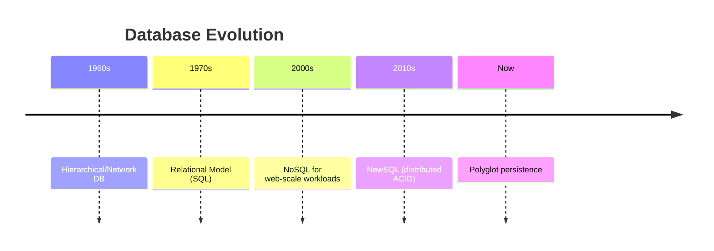


초기 컴퓨팅 환경에서는 데이터를 파일 단위로 관리하는 방식이 일반적이었다. 하지만 데이터 규모가 커지고 동시 사용자 수가 증가하면서, 중복과 불일치 문제를 체계적으로 해결할 필요가 생겼다.

데이터 모델의 진화:
- **1960s 계층형(Hierarchical) 모델**: IBM IMS. 부모-자식 트리 구조. 경로가 고정되어 유연한 질의가 어렵다
- **1960s 네트워크형(Network) 모델**: CODASYL. 그래프 구조로 다대다 관계 표현 가능. 하지만 프로그래머가 물리적 접근 경로를 직접 관리해야 해 복잡하다
- **1970 관계형(Relational) 모델**: Edgar Codd의 논문. 수학적 기반(집합, 관계 대수)으로 물리/논리 독립성 확보. 선언적 질의(SQL)로 생산성 혁신. 이후 Oracle, PostgreSQL, MySQL 등이 주류
- **2000s NoSQL/분산 DB**: 웹/모바일 시대의 대용량 분산 처리 필요. Google Bigtable(2006), Amazon Dynamo(2007) 논문이 촉발. MongoDB, Cassandra, Redis 등
- **2010s NewSQL**: 관계형의 ACID + 분산 확장성. Google Spanner(2012), CockroachDB, TiDB
- **현재 Polyglot Persistence**: RDB와 NoSQL을 목적에 맞게 조합. 캐시(Redis) + 주 DB(PostgreSQL) + 검색(Elasticsearch) + 분석(ClickHouse)

### File system vs DBMS

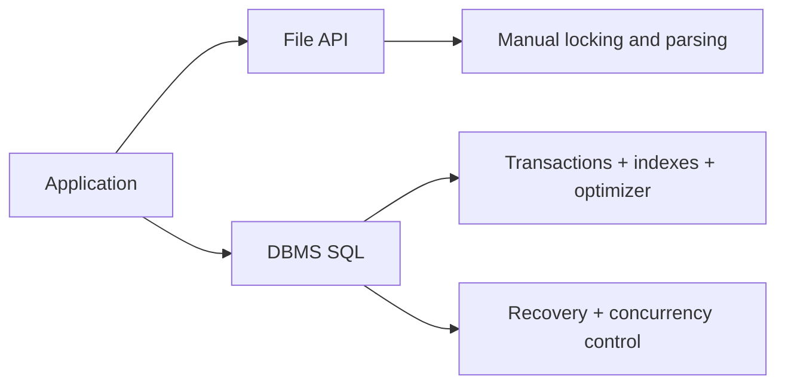


파일 시스템은 단순 저장에 강점이 있지만, 동시성 제어, 트랜잭션, 인덱싱, 질의 최적화, 복구 같은 고급 기능은 제한적이다. 반면 DBMS는 데이터 일관성과 접근 성능을 체계적으로 보장한다.

| 비교 항목 | 파일 시스템 | DBMS |
|-----------|-----------|------|
| 동시 접근 | 파일 락(coarse-grained) | 행/페이지 수준 잠금, MVCC |
| 데이터 무결성 | 애플리케이션이 직접 보장 | 제약조건, 트랜잭션으로 보장 |
| 질의 | 전체 파일 순차 읽기 | 인덱스 + 옵티마이저 |
| 장애 복구 | 파일 손상 시 수동 복구 | WAL + 자동 crash recovery |
| 중복 제어 | 중복 발생 시 수동 관리 | 정규화, 제약조건으로 제어 |
| 백업/복제 | 파일 복사 | 온라인 백업, 스트리밍 복제 |

예를 들어 파일 기반 구현에서는 "주문 생성 + 재고 차감" 같은 다중 단계 작업의 원자성을 직접 구현해야 한다(파일 잠금, 임시 파일 쓰기, 원자적 rename 등). DBMS는 `BEGIN; INSERT INTO orders ...; UPDATE inventory ...; COMMIT;`으로 원자성을 기본 제공한다.

그러나 모든 상황에서 DBMS가 최선은 아니다. 로그 수집(append-only), 설정 파일, 정적 데이터는 파일 시스템이 더 단순하고 효율적이다. SQLite는 이 경계에서 "파일 기반 DBMS"로 임베디드 용도에 널리 사용된다.

### DBMS의 역할

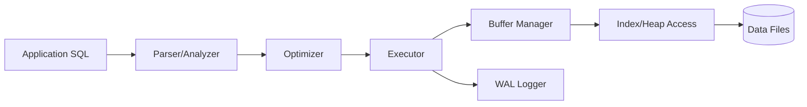


DBMS는 단순 저장소가 아니라 데이터 운영 플랫폼이다. 핵심 역할:

1. **스키마 관리**: DDL로 테이블/인덱스/뷰 정의. 스키마 변경(ALTER)의 온라인/오프라인 처리가 운영 이슈
2. **질의 처리/최적화**: 파싱 → 의미 분석 → 논리 최적화(규칙 기반 변환) → 물리 최적화(비용 기반 계획 선택) → 실행
3. **동시성 제어**: 다중 트랜잭션이 데이터 정합성을 위반하지 않도록 조율 (락, MVCC, OCC)
4. **장애 복구**: WAL + 체크포인트로 crash 후 데이터를 일관된 상태로 복원 (ARIES 알고리즘)
5. **보안/권한 관리**: 사용자/역할 기반 접근 제어(RBAC). Row Level Security(RLS)로 행 수준 접근 제한
6. **백업/복제**: 물리 백업(basebackup), 논리 백업(pg_dump), 증분 백업, 스트리밍 복제, 논리 복제

**메모리 관리**: DBMS는 자체 버퍼 풀을 운영해 OS 페이지 캐시와 별도로 메모리를 관리한다. 이는 OS보다 데이터 접근 패턴을 잘 알기 때문이다. InnoDB의 버퍼 풀, PostgreSQL의 shared_buffers가 대표적.

### OLTP vs OLAP

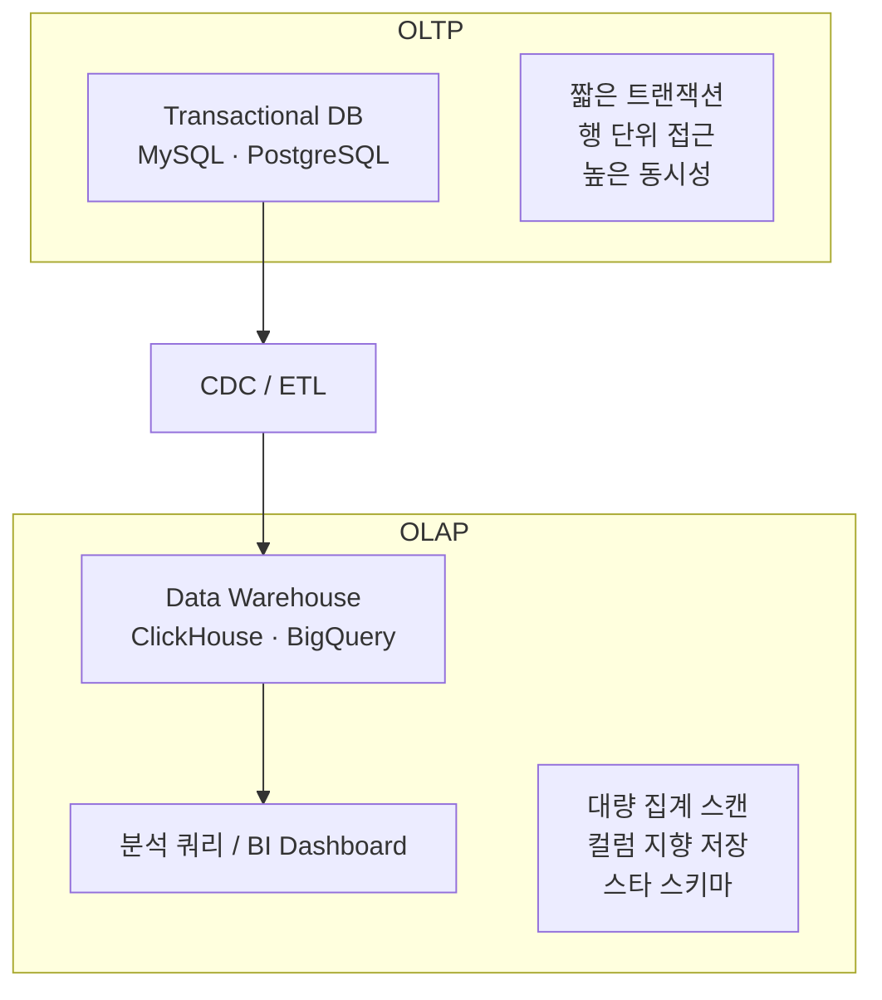


| 비교 | OLTP | OLAP |
|------|------|------|
| 목적 | 트랜잭션 처리 | 분석/리포팅 |
| 쿼리 패턴 | 단순, 소량 행 접근 | 복잡 집계, 대량 스캔 |
| 지연 목표 | 밀리초 수준 | 초~분 허용 |
| 동시성 | 높은 동시 사용자 | 소수 분석가/배치 |
| 데이터 모델 | 정규화 (중복 최소) | 비정규화/스타 스키마 |
| 쓰기 패턴 | 대량 짧은 트랜잭션 | 대량 배치 적재 (ETL) |
| 대표 시스템 | PostgreSQL, MySQL | ClickHouse, Redshift, BigQuery |

**HTAP (Hybrid Transactional/Analytical Processing)**: OLTP + OLAP을 단일 시스템에서 처리하려는 시도. TiDB, AlloyDB, SingleStoreDB 등이 추구하는 방향. 실시간 분석 요구가 증가하면서 주목받고 있다.

**스타 스키마 / 스노우플레이크 스키마**: OLAP용 데이터 모델링. 중앙의 팩트 테이블(예: 주문)에 디멘전 테이블(사용자, 상품, 시간)이 연결되는 구조. 스타 스키마는 디멘전이 비정규화되어 조인이 적고, 스노우플레이크 스키마는 디멘전이 정규화되어 공간 효율적이다.

### CAP Theorem

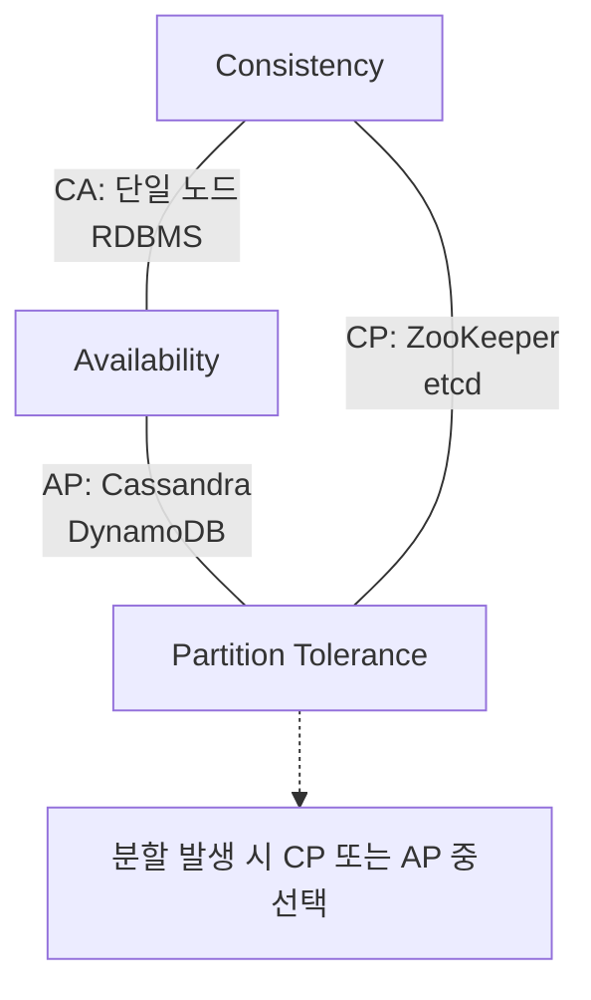


CAP 정리는 분산 시스템에서 일관성(Consistency), 가용성(Availability), 분할 내성(Partition tolerance)을 동시에 완벽히 만족하기 어렵다는 원칙이다.

정확한 정의:
- **Consistency**: 모든 노드가 동일 시점에 같은 데이터를 반환 (linearizability)
- **Availability**: 장애 없는 노드는 합리적 시간 내에 응답을 반환
- **Partition Tolerance**: 노드 간 네트워크 메시지 손실/지연이 있어도 시스템이 동작

네트워크 분할(P)은 분산 시스템에서 불가피하므로, 실질적 선택은 CP vs AP:
- **CP 시스템**: 분할 시 일관성 우선. 일부 요청을 거부할 수 있다. 예: ZooKeeper, etcd, HBase
- **AP 시스템**: 분할 시 가용성 우선. 일시적 불일치를 허용한다. 예: Cassandra, DynamoDB, CouchDB

**PACELC 확장**: 분할(P) 시 A vs C 선택, 정상(E) 시 Latency vs Consistency 선택. CAP만으로는 정상 상태의 트레이드오프를 표현하지 못하는 한계를 보완한다. 예: DynamoDB는 PA/EL (분할 시 가용성, 정상 시 낮은 지연), Spanner는 PC/EC (분할 시 일관성, 정상 시에도 일관성).

---

## 2. Data Modeling

### Entity-Relationship Model

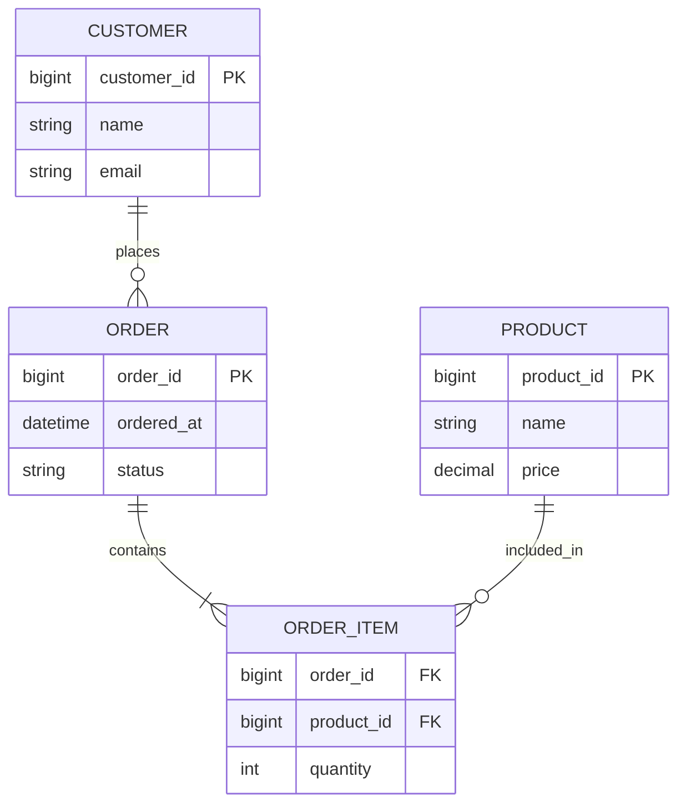


ER 모델은 현실 세계의 객체(Entity), 속성(Attribute), 관계(Relationship)를 추상화해 데이터 구조를 설계하는 방법이다.

ER 모델 구성 요소:
- **Entity**: 독립적으로 식별 가능한 객체. 강 엔티티(자체 PK), 약 엔티티(부분키 + 다른 엔티티에 의존)
- **Attribute**: 엔티티의 특성. 단순/복합(주소 = 시+구+동), 단일값/다중값(전화번호), 유도(derived, 나이 = 현재 - 생년)
- **Relationship**: 엔티티 간 연관. 차수(1:1, 1:N, M:N), 참여도(필수/선택), 자기참조(직원-상사)

설계 시 주의점:
- 엔티티와 속성의 구분: "주소"가 단순 문자열인지, 별도 엔티티로 관리해야 하는지는 비즈니스 요구에 따라 다르다
- N:M 관계는 구현 시 연결(junction) 테이블로 분해한다. 이 테이블에 관계 속성(예: 수강 학점, 참여 역할)을 추가할 수 있다
- 이력 관리: 현재 값만 저장할 것인지, 변경 이력을 추적할 것인지 설계 초기에 결정해야 한다

### ERD 설계

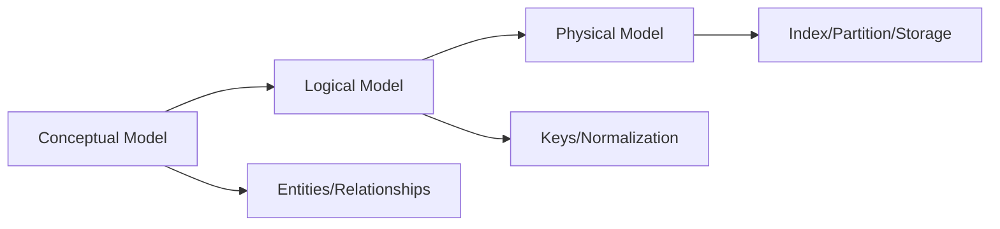


ERD는 엔티티 간 관계(1:1, 1:N, N:M)와 키 구조를 시각적으로 표현한다.

표기법:
- **Chen 표기법**: 다이아몬드(관계), 직사각형(엔티티), 타원(속성). 학술적
- **Crow's Foot (IE) 표기법**: 까마귀 발 모양으로 다수성(cardinality) 표현. 실무에서 가장 널리 사용
- **UML 클래스 다이어그램**: 소프트웨어 설계와 통합 표현 가능

설계 반복 과정:
1. **개념 모델(Conceptual)**: 핵심 엔티티와 관계만 식별. 비즈니스 이해관계자와 소통용
2. **논리 모델(Logical)**: 속성, 키, 정규화 적용. DBMS 독립적
3. **물리 모델(Physical)**: 특정 DBMS 타입, 인덱스, 파티션, 테이블스페이스 결정

Anti-pattern: "일단 만들고 나중에 수정" → 서비스 성장 후 테이블 구조 변경은 마이그레이션 비용이 매우 크다. 초기 설계에 시간을 투자하는 것이 전체 비용을 줄인다.

### Normalization

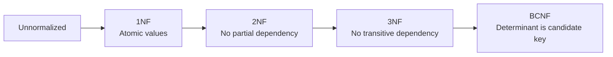


정규화는 데이터 중복과 갱신 이상(anomaly)을 줄이기 위한 설계 원칙이다. 테이블을 적절히 분해해 데이터 무결성을 높인다.

갱신 이상의 종류:
- **삽입 이상**: 불필요한 정보 없이는 데이터를 삽입할 수 없음 (예: 학과 정보를 넣으려면 학생이 있어야 함)
- **삭제 이상**: 정보 삭제 시 의도하지 않은 데이터까지 사라짐
- **갱신 이상**: 중복 데이터 중 일부만 수정되어 불일치 발생

#### 1NF, 2NF, 3NF

**1NF (First Normal Form)**: 
- 모든 속성이 원자값(atomic value)이어야 한다
- 반복 그룹, 다중값 속성 제거
- 위반 예: 전화번호 컬럼에 "010-1234-5678, 010-8765-4321" → 별도 테이블로 분리

**2NF (Second Normal Form)**:
- 1NF + 부분 함수 종속 제거
- 복합 기본키의 일부에만 종속된 속성을 별도 테이블로 분리
- 예: (학생ID, 과목ID) → 학생이름. 학생이름은 학생ID만으로 결정 → 학생 테이블로 분리

**3NF (Third Normal Form)**:
- 2NF + 이행 함수 종속 제거
- 키가 아닌 속성이 다른 키가 아닌 속성을 결정하면 분리
- 예: 학생ID → 학과코드 → 학과명. 학과코드 → 학과명이 이행 종속 → 학과 테이블로 분리

정규화의 실전 판단: 보통 3NF까지를 목표로 하되, 조회 성능이 중요한 경우 의도적으로 비정규화한다. 핵심은 "어디서 중복이 생기는지 알고 있으면서" 비정규화하는 것과, "모르고 중복된 채로 설계하는 것"의 차이다.

#### BCNF

BCNF(Boyce-Codd Normal Form)는 3NF보다 더 엄격한 형태로, **모든 결정자(determinant)가 후보키(candidate key)**가 되도록 요구한다.

3NF vs BCNF의 차이가 나타나는 경우:
```text
학생 | 과목 | 교수
──────────────────
복합키: (학생, 과목)
종속: 교수 → 과목 (교수가 한 과목만 강의)
```
3NF는 만족하지만 BCNF는 위반 (교수가 결정자이지만 후보키가 아님). BCNF로 분해: (교수, 과목) + (학생, 교수).

BCNF 분해의 트레이드오프: 함수 종속 보존(dependency preservation)이 보장되지 않을 수 있다. 일부 제약을 조인 후에만 검증할 수 있게 되어 실용성이 떨어질 수 있다.

### Denormalization

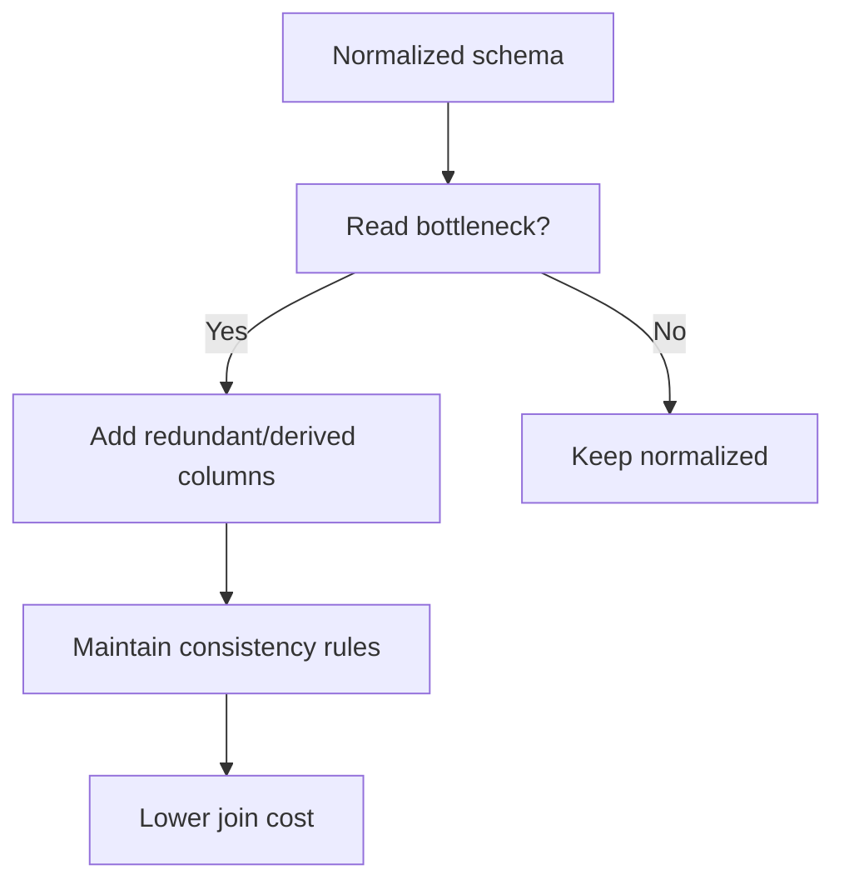


비정규화는 읽기 성능 향상을 위해 일부 중복을 의도적으로 허용하는 전략이다.

비정규화 기법:
- **파생 컬럼 추가**: 주문 합계를 주문 테이블에 저장 (원래는 주문항목에서 SUM으로 계산). 주문항목 변경 시 합계도 갱신해야 함
- **테이블 병합(Pre-join)**: 자주 조인하는 테이블을 하나로 합침. 읽기 빈도 >> 쓰기 빈도일 때 효과적
- **요약 테이블**: 집계 결과를 별도 테이블에 저장. 일별/월별 통계를 미리 계산
- **중복 컬럼 추가**: FK 대신 자주 조회하는 값을 직접 저장. 예: 주문에 고객명을 중복 저장

비정규화 적용 원칙:
1. 먼저 정규화된 설계에서 성능 병목을 측정한다
2. 병목이 조인 비용이라면 비정규화를 검토한다
3. 중복 데이터의 동기화 전략(트리거, 애플리케이션 로직, 이벤트 기반)을 명확히 정의한다
4. 데이터 불일치 발생 시 영향과 복구 방법을 문서화한다

---

## 3. Relational Model

### Relational Algebra

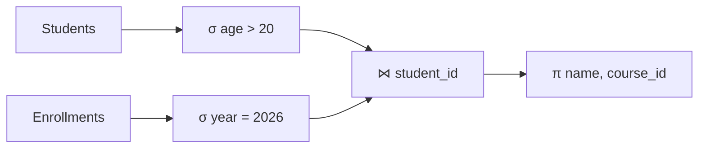


관계 대수는 관계형 질의의 이론적 기반이다. SQL 최적화기는 내부적으로 이런 연산 트리 형태로 실행 계획을 구성한다.

기본 연산:
- **Selection ($\sigma$)**: 조건을 만족하는 튜플 선택. $\sigma_{age > 20}(Students)$ → WHERE 절
- **Projection ($\pi$)**: 특정 속성만 추출. $\pi_{name, age}(Students)$ → SELECT 절
- **Cartesian Product ($\times$)**: 두 관계의 모든 조합. $R \times S$ → FROM R, S (WHERE 없이)
- **Union ($\cup$)**: 합집합. 스키마가 호환되어야 함. → UNION
- **Difference ($-$)**: 차집합. → EXCEPT
- **Rename ($\rho$)**: 관계/속성 이름 변경. → AS

유도 연산:
- **Natural Join ($\bowtie$)**: 공통 속성 기준 조인. → NATURAL JOIN
- **Theta Join ($\bowtie_\theta$)**: 조건(θ) 기반 조인. → JOIN ... ON ...
- **Semi Join**: 조인 결과에서 한쪽 관계의 튜플만 반환. → EXISTS 서브쿼리
- **Division**: "모든 것과 관련된 튜플" 찾기. 예: "모든 과목을 수강한 학생"

쿼리 최적화에서 관계 대수의 동치 변환이 핵심이다. 예: $\sigma_{condition}(R \bowtie S) \equiv \sigma_{condition}(R) \bowtie S$ (selection push-down). 조인 전에 필터링하면 중간 결과 크기가 줄어 성능이 향상된다.

### Tuple / Domain

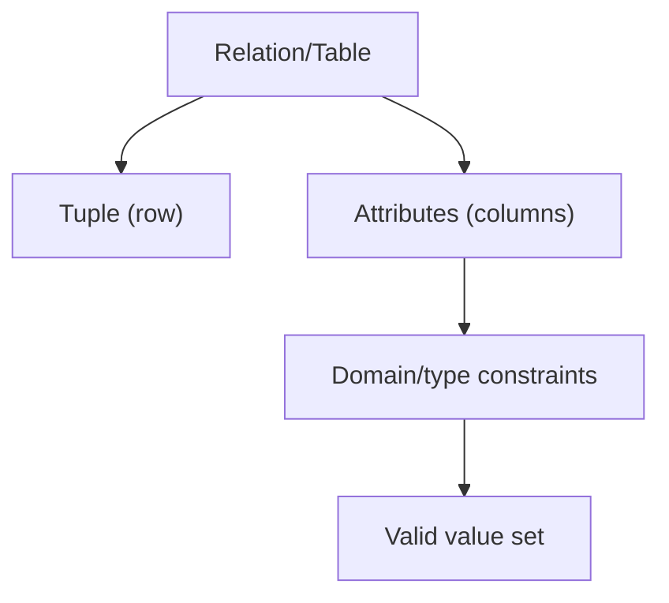


Tuple은 테이블의 한 행(row)으로, 관계형 모델에서 하나의 사실(fact)을 표현한다. Domain은 속성이 가질 수 있는 값의 집합(타입/제약)을 의미한다.

Domain 설계의 실전 중요성:
- **적절한 타입 선택**: `VARCHAR(255)` vs `TEXT`, `INT` vs `BIGINT`, `DECIMAL` vs `FLOAT`. 예: 금액에 FLOAT를 사용하면 부동소수점 오류로 1원 차이가 발생할 수 있다 → DECIMAL 사용
- **NULL 의미론**: NULL은 "알 수 없음/적용 불가"를 의미하지 "0/빈문자열"이 아니다. 3-valued logic(TRUE/FALSE/UNKNOWN)으로 인해 `WHERE x != 5`가 NULL 행을 제외하는 점을 주의
- **Enum/Check 제약**: 유효한 값 범위를 도메인 수준에서 강제. 예: 상태 코드가 'ACTIVE', 'INACTIVE', 'SUSPENDED'만 허용

### Keys (PK, FK, Composite, Candidate)

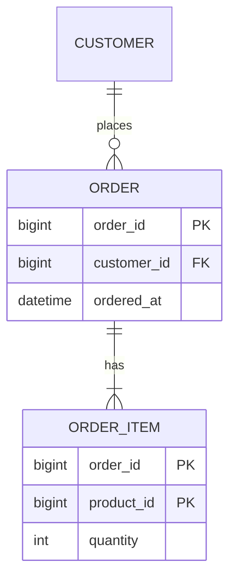


- **Candidate Key**: 튜플을 유일하게 식별할 수 있는 최소 속성 집합. 하나의 테이블에 여러 후보키가 존재할 수 있다
- **Primary Key (PK)**: 후보키 중 선택된 대표 식별자. NOT NULL + UNIQUE
- **Foreign Key (FK)**: 다른 테이블의 PK를 참조. 참조 무결성(Referential Integrity) 보장
- **Composite Key**: 두 개 이상의 컬럼을 결합한 키. N:M 연결 테이블에서 흔히 사용
- **Surrogate Key vs Natural Key**: 
  - Surrogate(대리키): 자동 증가 정수, UUID. 비즈니스 의미 없음. 변경 불요. 조인 성능 좋음
  - Natural(자연키): 주민번호, 이메일 등 비즈니스 속성. 의미 있지만 변경 가능성이 있고 크기가 클 수 있음

FK 참조 액션:
- **ON DELETE CASCADE**: 부모 삭제 시 자식도 삭제. 게시글 → 댓글에 적합
- **ON DELETE SET NULL**: 부모 삭제 시 FK를 NULL로. 담당자 → 작업에 적합
- **ON DELETE RESTRICT**: 참조하는 자식이 있으면 부모 삭제를 거부 (기본값)

Auto Increment vs UUID:
- **Auto Increment**: 삽입 순서대로 증가. B+ Tree 리프의 끝에만 삽입 → 페이지 분할 최소화. 단, 분산 환경에서 충돌 가능, 갱신량 예측 가능
- **UUID v4**: 128비트 랜덤. 전역 유일하지만 B+ Tree에서 랜덤 삽입 → 페이지 분할 빈번, 캐시 효율 저하, 인덱스 크기 증가
- **UUID v7 / ULID**: 시간 기반 정렬 가능한 UUID. 랜덤 삽입 문제를 완화하면서 전역 유일성 유지

### Constraints

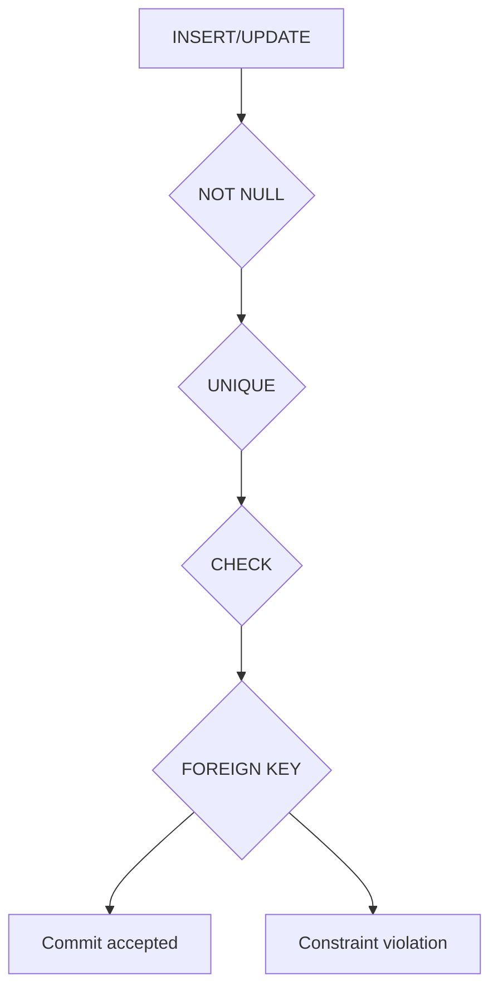


제약 조건은 데이터 무결성의 마지막 방어선이다.

주요 제약:
- **NOT NULL**: 값이 반드시 존재해야 함
- **UNIQUE**: 중복값 불가. NULL은 복수 허용 (DBMS마다 다름)
- **PRIMARY KEY**: NOT NULL + UNIQUE
- **FOREIGN KEY**: 참조 무결성. 참조 대상이 존재해야 함
- **CHECK**: 조건식 만족 요구. 예: `CHECK (age >= 0 AND age <= 200)`
- **DEFAULT**: 삽입 시 값이 없으면 기본값 사용
- **EXCLUSION** (PostgreSQL): 범위/공간 겹침 방지. 예: 회의실 예약 시간 겹침 방지

제약은 "방어적 프로그래밍"의 데이터 계층 버전이다. 애플리케이션 레이어의 validation은 우회될 수 있지만(직접 SQL 실행, 다른 서비스 경로), DB 제약은 경로에 상관없이 강제된다.

---

## 4. SQL Deep Dive

### Query Execution Order

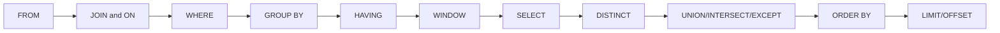


논리적 실행 순서:
```text
FROM             ← 기본 테이블(들) 확정
  ↓
JOIN + ON        ← 조인 결합과 조인 조건 평가
  ↓
WHERE            ← 행 필터링 (집계 전)
  ↓
GROUP BY         ← 그룹화
  ↓
HAVING           ← 그룹 필터링 (집계 후)
  ↓
WINDOW           ← 윈도우 함수 평가 (OVER)
  ↓
SELECT           ← 컬럼 선택, 표현식 계산
  ↓
DISTINCT         ← 중복 제거
  ↓
UNION/INTERSECT/EXCEPT ← 집합 연산
  ↓
ORDER BY         ← 정렬 (SELECT 별칭 사용 가능)
  ↓
LIMIT/OFFSET     ← 결과 행 수 제한
```

이 순서를 아는 것이 중요한 이유:
- WHERE 절에서 집계 함수를 사용할 수 없다 (GROUP BY 전이므로). 집계 조건은 HAVING에 작성
- WHERE에서 SELECT의 별칭을 사용할 수 없다 (SELECT 전이므로). 단, MySQL은 예외적으로 일부 허용
- ORDER BY에서는 SELECT의 별칭을 사용할 수 있다 (SELECT 후이므로)

실무에서 자주 헷갈리는 포인트:
- **LEFT JOIN + WHERE 필터 함정**: RIGHT 테이블 컬럼 조건을 WHERE에 두면 NULL 행이 제거되어 INNER JOIN처럼 동작할 수 있다
- **WINDOW 함수 위치**: 윈도우 함수(`ROW_NUMBER`, `SUM() OVER`)는 GROUP BY/HAVING 이후, ORDER BY 이전 단계에서 평가된다
- **논리 순서 vs 물리 계획**: 문법상 순서와 달리 옵티마이저는 조인 순서/접근 방법을 재배치한다. 결과는 같아야 하지만 실행 비용은 크게 달라진다

```sql
-- 의도: 주문이 없어도 사용자를 유지하고 싶다
-- 잘못된 예: WHERE에서 필터하면 LEFT JOIN 의미가 깨질 수 있음
SELECT u.id, o.status
FROM users u
LEFT JOIN orders o ON o.user_id = u.id
WHERE o.status = 'PAID';

-- 권장: 조인 조건으로 이동해 OUTER 특성 유지
SELECT u.id, o.status
FROM users u
LEFT JOIN orders o
  ON o.user_id = u.id
 AND o.status = 'PAID';
```

### Join 종류 (Nested Loop / Hash Join / Merge Join)

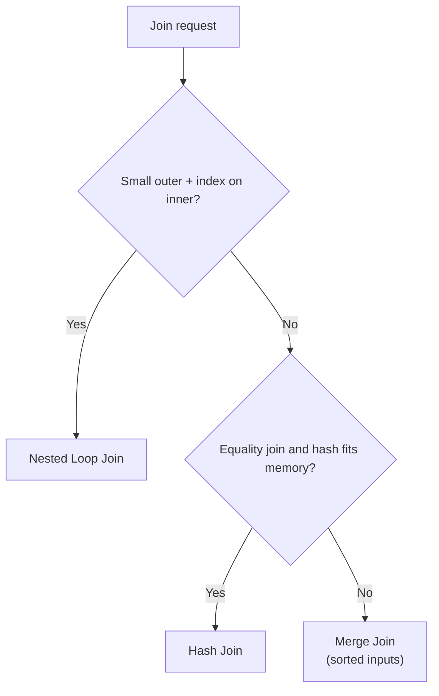


조인은 실행 엔진이 데이터 크기/인덱스/정렬 상태를 고려해 전략을 선택한다.

**Nested Loop Join**:
```text
for each row r in R (outer):
    for each row s in S (inner):
        if r.key == s.key: emit (r, s)
```
- 복잡도: O(|R| × |S|). inner에 인덱스가 있으면 O(|R| × log|S|)
- 적합: outer가 작고, inner에 인덱스가 있을 때. OLTP 소량 조인의 기본 전략
- **Index Nested Loop**: inner의 조인 키에 인덱스를 사용해 탐색. 가장 흔한 OLTP 조인 패턴
- **Block Nested Loop**: outer를 블록 단위로 읽어 inner 스캔 횟수를 줄임

**Hash Join**:
```text
Phase 1 (Build): R의 조인 키로 해시 테이블 구성
Phase 2 (Probe): S의 각 행에서 해시 테이블을 조회해 매칭
```
- 복잡도: O(|R| + |S|). 메모리에 해시 테이블이 들어가야 최적
- 적합: 대규모 비정렬 조인. 등치 조인(=)만 지원
- **Grace Hash Join**: 메모리 부족 시 양쪽을 파티셔닝한 후 파티션별로 조인

**Merge Join (Sort-Merge Join)**:
```text
R과 S를 조인 키로 정렬 (이미 정렬되어 있으면 생략)
두 포인터를 동시에 이동하며 매칭
```
- 복잡도: O(|R|log|R| + |S|log|S|). 이미 정렬되어 있으면 O(|R| + |S|)
- 적합: 양측이 조인 키로 이미 정렬되어 있을 때. 범위 조인에도 사용 가능

### Subquery

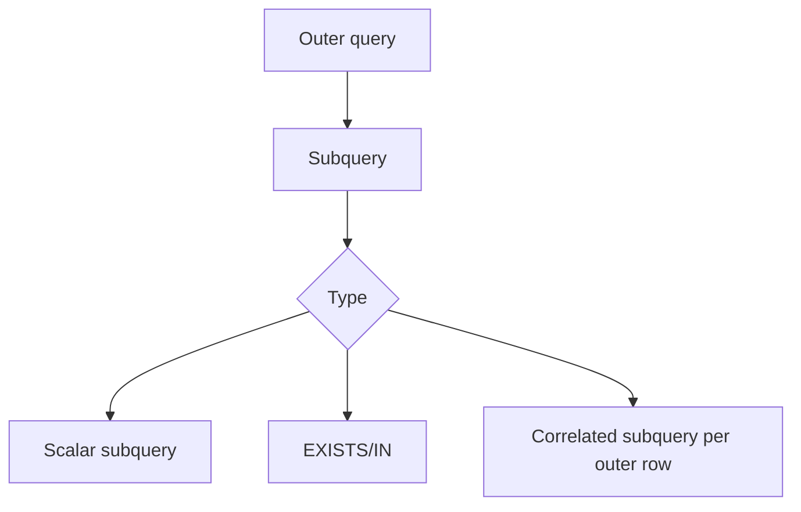


서브쿼리는 질의 내부에 포함된 질의다.

서브쿼리 유형:
- **스칼라 서브쿼리**: 단일 값 반환. SELECT/WHERE에서 사용. `(SELECT MAX(salary) FROM employees)`
- **인라인 뷰**: FROM 절의 서브쿼리. 임시 테이블처럼 동작
- **상관 서브쿼리(Correlated)**: 외부 쿼리의 각 행에 대해 실행. 성능 이슈의 주요 원인

```sql
-- 상관 서브쿼리 (외부 행마다 실행될 수 있음)
SELECT * FROM employees e
WHERE salary > (SELECT AVG(salary) FROM employees WHERE dept_id = e.dept_id);

-- 조인으로 재작성 (한 번만 실행)
SELECT e.* 
FROM employees e
JOIN (SELECT dept_id, AVG(salary) AS avg_sal FROM employees GROUP BY dept_id) d
  ON e.dept_id = d.dept_id
WHERE e.salary > d.avg_sal;
```

현대 옵티마이저는 상관 서브쿼리를 자동으로 조인으로 변환(decorrelation)하기도 하지만, 모든 경우에 성공하지는 않는다. EXISTS는 IN보다 상관 서브쿼리에서 효율적인 경우가 많다 (첫 번째 매칭에서 멈출 수 있으므로).

**CTE (Common Table Expression)**:
```sql
WITH dept_avg AS (
    SELECT dept_id, AVG(salary) AS avg_sal 
    FROM employees 
    GROUP BY dept_id
)
SELECT e.* FROM employees e
JOIN dept_avg d ON e.dept_id = d.dept_id
WHERE e.salary > d.avg_sal;
```
가독성을 높이고, 재귀 쿼리(WITH RECURSIVE)로 계층 구조(조직도, 카테고리 트리)를 탐색할 수 있다.

### Window Function

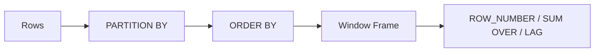


윈도우 함수는 행을 그룹화하되 결과 행 수를 유지한 채 순위/누적/이전값 비교를 수행한다.

구문: `function() OVER (PARTITION BY ... ORDER BY ... ROWS/RANGE BETWEEN ... AND ...)`

주요 함수:
- **순위**: `ROW_NUMBER()` (고유 번호), `RANK()` (동률 시 같은 순위, 다음 건너뜀), `DENSE_RANK()` (동률 시 같은 순위, 다음 연속)
- **집계**: `SUM()`, `AVG()`, `COUNT()`, `MIN()`, `MAX()` — OVER 절과 함께 사용하면 누적/이동 집계
- **탐색**: `LAG(col, n)` (n행 이전 값), `LEAD(col, n)` (n행 이후 값), `FIRST_VALUE()`, `LAST_VALUE()`
- **분포**: `NTILE(n)` (n등분), `PERCENT_RANK()`, `CUME_DIST()`

```sql
-- 부서별 급여 순위 + 부서 내 급여 비중
SELECT 
  emp_id, dept_id, salary,
  RANK() OVER (PARTITION BY dept_id ORDER BY salary DESC) AS dept_rank,
  salary::decimal / SUM(salary) OVER (PARTITION BY dept_id) AS salary_ratio,
  salary - LAG(salary) OVER (PARTITION BY dept_id ORDER BY salary DESC) AS diff_from_prev
FROM employees;

-- 누적 합계 (running total)
SELECT 
  order_date, amount,
  SUM(amount) OVER (ORDER BY order_date ROWS BETWEEN UNBOUNDED PRECEDING AND CURRENT ROW) AS running_total
FROM orders;
```

**프레임 지정**: `ROWS BETWEEN 2 PRECEDING AND CURRENT ROW` (현재 행 + 이전 2행), `RANGE BETWEEN INTERVAL '7 days' PRECEDING AND CURRENT ROW` (지난 7일). 이동 평균, 이동 합계에 활용.

### Index Hint

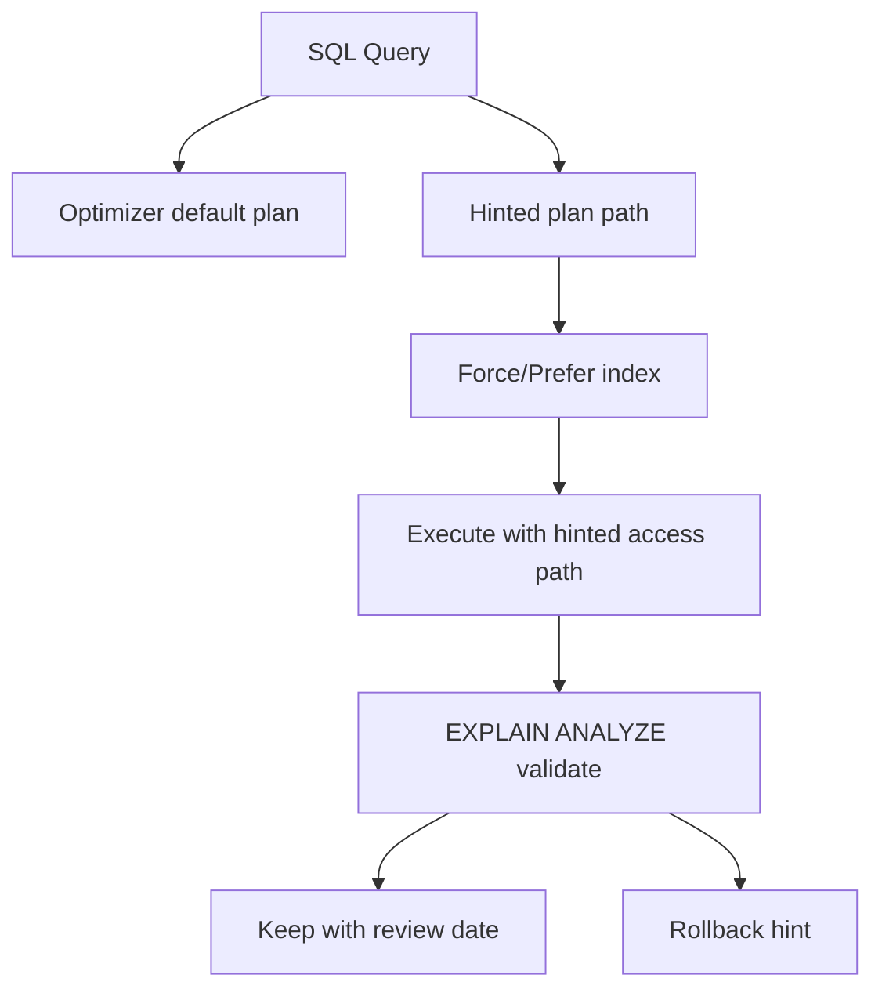


인덱스 힌트는 옵티마이저 선택을 보조하거나 강제하는 장치다.

```sql
-- MySQL: 인덱스 강제/제안/무시
SELECT * FROM orders FORCE INDEX (idx_user_date)
WHERE user_id = 123 AND order_date > '2024-01-01';

-- PostgreSQL: pg_hint_plan 확장
/*+ IndexScan(orders idx_user_date) */ 
SELECT * FROM orders WHERE user_id = 123;
```

힌트가 필요한 상황:
- 통계가 오래되어 옵티마이저가 잘못된 계획을 선택할 때 (긴급 대응)
- 특정 인덱스가 더 효율적이라는 것을 알고 있을 때
- 옵티마이저가 잡지 못하는 데이터 분포 특성이 있을 때

장기 해법: `ANALYZE` 명령으로 통계 갱신, 인덱스 구조 재설계, 쿼리 패턴 변경이 근본적이다. 힌트는 "응급 처치"로만 사용해야 한다.

힌트가 오히려 독이 되는 경우:
- **데이터 분포 변화**: 월말/이벤트 트래픽처럼 분포가 바뀌면 예전 힌트가 최악 경로가 될 수 있다
- **DB 버전 업그레이드**: 옵티마이저가 개선되었는데 힌트가 이를 막아 성능이 역행할 수 있다
- **쿼리 파라미터 편향**: 특정 값에서만 빠른 힌트를 전체 요청에 강제하면 평균 지연이 증가한다

운영 규칙(권장):
1. 힌트 적용 전/후를 `EXPLAIN ANALYZE`와 p95/p99 지연으로 비교해 근거를 남긴다
2. 힌트 SQL에 티켓 번호와 적용 이유를 주석으로 기록한다
3. 통계 재수집/인덱스 재설계가 완료되면 힌트를 제거하는 만료 조건을 함께 정의한다

---

## 5. Storage Engine

### Page 구조

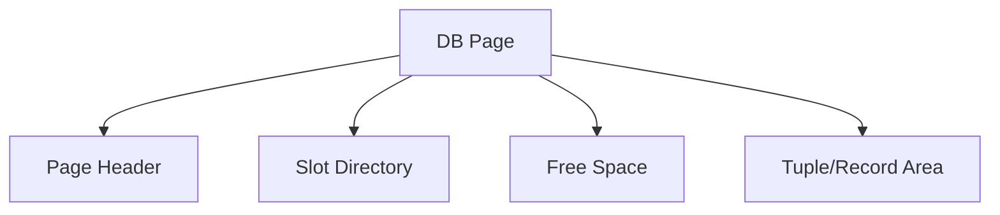


스토리지 엔진은 디스크 I/O의 기본 단위로 **페이지(page)**를 사용한다. InnoDB 기본 16KB, PostgreSQL 8KB.

페이지 구조 (일반적):
```text
┌─────────────────────────────┐
│ Page Header                 │ ← 페이지 번호, LSN, 체크섬, 여유 공간 포인터
├─────────────────────────────┤
│ Slot Directory              │ ← 각 레코드의 오프셋 포인터 (아래→위 방향)
├─────────────────────────────┤
│                             │
│ Free Space                  │
│                             │
├─────────────────────────────┤
│ Record/Tuple Data           │ ← 실제 데이터 (위→아래 방향으로 채워짐)
├─────────────────────────────┤
│ Page Footer                 │ ← 체크섬 (무결성 확인)
└─────────────────────────────┘
```

핵심 개념:
- **페이지 읽기**: 단 1바이트를 읽어도 전체 페이지(8~16KB)를 디스크에서 읽어야 한다. 따라서 "행 수"뿐 아니라 "페이지 수"가 실제 I/O 비용을 결정
- **버퍼 풀(Buffer Pool)**: 자주 접근하는 페이지를 메모리에 캐싱. LRU 변형으로 관리. InnoDB는 전체 메모리의 70~80%를 버퍼 풀에 할당하는 것이 일반적
- **Dirty Page**: 메모리에서 수정되었지만 아직 디스크에 기록되지 않은 페이지. 체크포인트 시 디스크에 flush

### Heap File

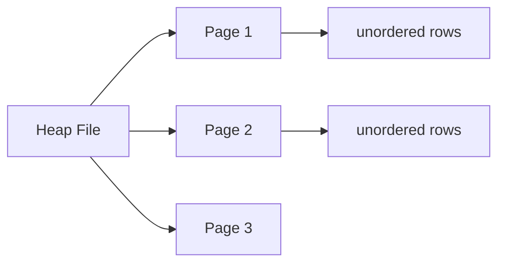


Heap file은 레코드를 특정 정렬 없이 저장하는 방식이다. 새 레코드는 여유 공간이 있는 아무 페이지에 삽입된다.

장점: 삽입이 빠르다 (정렬 유지 불필요). 순차 스캔(전체 읽기)에 적합
단점: 범위 조회/특정 키 탐색은 인덱스 없이는 전체 스캔 필요

**Free Space Map (FSM)**: 각 페이지의 여유 공간을 추적하는 메타데이터. 삽입 시 적절한 페이지를 빠르게 찾는 데 사용. PostgreSQL은 FSM을 별도 파일로 관리한다.

PostgreSQL은 기본적으로 Heap 구조를 사용하고, 인덱스는 별도 B-Tree로 관리한다(Non-clustered 기본). InnoDB는 PK B+ Tree에 데이터를 직접 저장하는 Clustered 구조가 기본이다.

### Clustered vs Non-clustered

```mermaid
flowchart LR
  CI[Clustered Index] --> C1[Data rows stored in key order]
  NCI["Non-clustered Index"] --> N1[Index leaf points to row locator]
  N1 --> N2[Extra lookup may be required]
```


**Clustered Index (클러스터드 인덱스)**:
- 테이블 데이터 자체를 인덱스 키 순서로 물리/논리적으로 정렬 저장
- 테이블당 하나만 존재 (InnoDB에서는 PK가 자동으로 클러스터드 인덱스)
- 범위 스캔(BETWEEN, ORDER BY)에 매우 효율적: 연속된 페이지를 순차 읽기
- 랜덤 삽입(UUID PK) 시 페이지 분할이 빈번해 성능 저하

**Non-clustered Index (비클러스터드 인덱스, Secondary Index)**:
- 별도 구조에 (인덱스 키 → 레코드 위치) 매핑을 저장
- 테이블당 여러 개 생성 가능
- **Bookmark Lookup**: 인덱스에서 위치를 찾은 후, 실제 데이터 페이지를 다시 읽어야 함 (InnoDB에서는 PK로 다시 B+ Tree를 탐색 → "이중 탐색")

InnoDB의 구조:
```text
Clustered Index (PK B+ Tree):
  [PK Key] → [Full Row Data]

Secondary Index (B+ Tree):
  [Secondary Key] → [PK Value]
  → PK로 Clustered Index를 다시 탐색해 실제 데이터 접근
```

클러스터드 키 선택의 영향:
- **증가하는 정수 PK**: 항상 리프 끝에 삽입. 페이지 분할 최소화. 가장 효율적
- **UUID v4 PK**: 랜덤 삽입. 캐시 미활용, 페이지 분할 빈번. 성능 2~5배 저하 가능
- **타임스탬프 PK**: 시간순 삽입. 증가 정수와 유사한 효과

### Slotted Page

```mermaid
flowchart TD
  H[Header] --> SP[Slot Pointer Array]
  SP --> R1[Record A]
  SP --> R2[Record B]
  SP --> R3[Record C]
  R1 --> MOVE["Records can move, slot id stays stable"]
```


Slotted page는 가변 길이 레코드를 효율적으로 관리하는 페이지 내부 구조다.

구조: 페이지 헤더 + 슬롯 디렉터리(고정 크기 배열) + 빈 공간 + 데이터 영역

슬롯 디렉터리의 역할:
- 각 슬롯은 (오프셋, 길이) 쌍으로 레코드 위치를 가리킨다
- 레코드가 페이지 내에서 이동(compaction)되더라도 슬롯 번호(Record ID의 일부)가 변하지 않으므로, 외부 참조가 안정적으로 유지된다
- RID(Record ID) = (Page Number, Slot Number). 인덱스가 저장하는 "포인터"

레코드 삭제: 슬롯을 "삭제 표시"로 만들고, 공간은 나중에 재사용. 페이지 내 단편화가 심해지면 compaction(레코드 재배치)을 수행한다.

### WAL (Write Ahead Logging)

```mermaid
sequenceDiagram
  participant Tx as Transaction
  participant WAL as WAL File
  participant DB as Data Page
  Tx->>WAL: append redo/undo log
  WAL-->>Tx: fsync complete
  Tx->>DB: write dirty page (later)
  Note over WAL,DB: On crash: redo committed, undo incomplete
```


WAL은 데이터 페이지를 디스크에 쓰기 전에 변경 로그를 먼저 기록하는 원칙이다.

WAL 규칙:
1. **Write-Ahead**: 데이터 페이지를 디스크에 flush하기 전에, 해당 변경을 기술하는 로그 레코드가 먼저 디스크에 기록되어야 한다
2. **Force-at-Commit**: 트랜잭션 커밋 시 해당 트랜잭션의 모든 로그 레코드가 디스크에 기록되어야 한다 (Durability 보장)

WAL이 효율적인 이유:
- 로그는 **순차 쓰기(sequential write)**다. 디스크의 순차 쓰기는 랜덤 쓰기보다 수십~수백 배 빠르다
- 데이터 페이지의 랜덤 쓰기를 지연시키고, 로그의 순차 쓰기로 내구성을 먼저 확보한다
- 체크포인트(checkpoint)가 주기적으로 dirty 페이지를 디스크에 flush하면, 그 이전 로그는 더 이상 필요 없다

**ARIES (Algorithm for Recovery and Isolation Exploiting Semantics)**: 가장 유명한 WAL 기반 복구 알고리즘. 세 단계로 복구:
1. **Analysis**: 로그를 스캔해 crash 시점의 dirty page 목록과 활성 트랜잭션 파악
2. **Redo**: 체크포인트 이후의 모든 로그를 재실행해 crash 직전 상태 복원 (커밋된 것과 안 된 것 모두)
3. **Undo**: 커밋되지 않은 트랜잭션의 변경을 역순으로 되돌림

**LSN (Log Sequence Number)**: 각 로그 레코드의 고유 식별자(단조 증가). 페이지 헤더에 마지막으로 적용된 LSN을 기록해, 복구 시 어디까지 적용했는지 판단한다.

---

## 6. Index

### B-Tree

```mermaid
graph TD
  R(("30 | 60")) --> N1(("10 | 20"))
  R --> N2(("40 | 50"))
  R --> N3(("70 | 80"))
  N1 --> L1["1 · 5 · 9"]
  N1 --> L2["11 · 15 · 19"]
  N1 --> L3["21 · 25 · 29"]
  N2 --> L4["31 · 35 · 39"]
  N2 --> L5["41 · 45 · 49"]
  N2 --> L6["51 · 55 · 59"]
  N3 --> L7["61 · 65 · 69"]
  N3 --> L8["71 · 75 · 79"]
  N3 --> L9["81 · 85 · 89"]
  L1 ~~~ L2 ~~~ L3 ~~~ L4 ~~~ L5 ~~~ L6 ~~~ L7 ~~~ L8 ~~~ L9
```


B-Tree는 균형 다진 트리(balanced multi-way tree) 구조로 탐색/삽입/삭제를 `O(log n)`에 처리한다.

B-Tree 성질 (차수 m):
- 루트 제외 모든 노드는 최소 ⌈m/2⌉개의 자식을 가진다
- 모든 리프는 같은 깊이에 존재 (완전 균형)
- 노드 내 키는 정렬되어 있다

왜 디스크에 최적인가:
- 팬아웃(fan-out)이 크다. 노드 하나에 수백 개의 키를 저장할 수 있어 트리 높이가 매우 낮다
- 예: 페이지 16KB, 키+포인터 16B → 노드당 ~1000개 자식 → 높이 3에서 10⁹개 키 저장 가능
- 높이 3 = 루트(캐시됨) + 2번의 디스크 I/O로 수십억 레코드에서 키를 찾을 수 있다

삽입/삭제 시 노드 분할(split)/병합(merge)으로 균형을 유지한다. 분할이 루트까지 전파되면 트리 높이가 1 증가한다.

### B+ Tree

```mermaid
graph TD
  R((Root))
  I1((Internal))
  I2((Internal))
  L1[Leaf 1]
  L2[Leaf 2]
  L3[Leaf 3]
  L4[Leaf 4]
  R --> I1
  R --> I2
  I1 --> L1
  I1 --> L2
  I2 --> L3
  I2 --> L4
  L1 --- L2
  L2 --- L3
  L3 --- L4
```


B+ Tree는 B-Tree의 변형으로, 실제 DBMS 인덱스의 사실상 표준이다.

B-Tree와의 차이:
- **내부 노드**: 키만 저장 (데이터/포인터 없음) → 노드당 더 많은 키 → 팬아웃 더 큼 → 트리 더 낮음
- **리프 노드**: 실제 데이터(또는 레코드 포인터)를 저장. **리프를 링크드 리스트로 연결** → 범위 스캔이 리프 수준에서 순차적으로 진행

```text
Internal: [10 | 20 | 30]
          /    |    |    \
Leaf:  [1,5,7]->[10,12,15]->[20,22,25]->[30,35,40]
       ←────── 양방향 연결 리스트 ──────→
```

범위 스캔 성능: `WHERE price BETWEEN 20 AND 35` 쿼리 시, B+ Tree는 루트에서 key=20을 찾은 후 리프 링크를 따라 key≤35까지 순차 스캔한다. B-Tree에서는 이 연결이 없어 매번 루트에서 다시 탐색해야 할 수 있다.

**Buffer Tree**: 배치 삽입 최적화. 내부 노드에 버퍼를 두어 삽입을 모았다가 한 번에 하위로 전파. LSM 트리의 아이디어와 유사.

### Hash Index

```mermaid
flowchart LR
  K[Search key] --> H[Hash function]
  H --> BKT[Bucket]
  BKT --> E1[Entry]
  BKT --> E2[Overflow chain]
```


해시 인덱스는 동등 비교(=)에 매우 빠르지만 범위 질의(`<`, `>`, `BETWEEN`, `ORDER BY`)에는 부적합하다.

구조: 해시 함수로 키를 버킷 번호에 매핑. 버킷에 레코드 포인터를 저장.

사용 예:
- MySQL Memory 엔진의 기본 인덱스
- PostgreSQL의 Hash Index (CREATE INDEX ... USING HASH)
- InnoDB Adaptive Hash Index: 자주 접근하는 B+ Tree 리프 페이지에 대해 자동으로 해시 인덱스를 메모리에 구성

**확장 가능 해싱(Extensible Hashing)**: 데이터 증가 시 전체 리빌드 없이 점진적으로 버킷을 분할하는 기법. 디렉터리(해시 비트 수)를 확장하며, 분할이 필요한 버킷만 분할한다.

**Linear Hashing**: 라운드 로빈 방식으로 순서대로 버킷을 분할. 디렉터리 불필요.

### Covering Index

```mermaid
flowchart TD
  Q["SELECT name FROM users WHERE email = ?"] --> I["Index on (email, name)"]
  I --> C{All needed columns in index?}
  C -->|Yes| O["Index-only scan"]
  C -->|No| T["Lookup table/heap row"]
```


커버링 인덱스는 쿼리에 필요한 모든 컬럼을 인덱스만으로 제공해 테이블 본문(heap/clustered index) 접근을 없애는 전략이다.

```sql
-- 비커버링: 인덱스에서 PK를 찾고, 다시 테이블에서 name을 읽어야 함
CREATE INDEX idx_user_age ON users(age);
SELECT name, age FROM users WHERE age > 25;

-- 커버링: 인덱스만으로 name, age 모두 제공 (Index Only Scan)
CREATE INDEX idx_user_age_name ON users(age, name);
SELECT name, age FROM users WHERE age > 25;
```

EXPLAIN에서 "Using index" (MySQL) 또는 "Index Only Scan" (PostgreSQL)이 표시되면 커버링 인덱스가 적용된 것이다.

**INCLUDE 절** (PostgreSQL 11+, SQL Server): 인덱스 키에 포함하지 않지만 리프에 같이 저장할 컬럼을 지정. 정렬/중복 판단에는 사용하지 않으면서 커버링 효과를 얻는다.
```sql
CREATE INDEX idx_user_age ON users(age) INCLUDE (name, email);
```

PostgreSQL 주의점: `Index Only Scan`이 보이더라도 모든 경우에 heap 접근이 0은 아니다. 가시성(visibility) 확인을 위해 Visibility Map의 all-visible 비트가 꺼진 페이지는 heap 확인이 필요하다. 즉, 갱신이 잦은 테이블에서는 index-only 이점이 줄어들 수 있다.

설계 체크리스트:
- WHERE/JOIN/ORDER BY에 쓰는 컬럼을 먼저 키 컬럼으로 배치한다
- SELECT에만 필요한 컬럼은 가능하면 `INCLUDE`로 넣어 키 팽창을 줄인다
- 커버링 인덱스 추가 전, 쓰기 비용(INSERT/UPDATE/DELETE) 증가와 인덱스 크기 증가를 반드시 같이 평가한다

실무 트레이드오프:
- 장점: 랜덤 I/O 감소, 지연 단축, CPU 캐시 효율 개선
- 단점: 인덱스 저장공간 증가, DML write amplification, 버퍼 캐시 압박

### Composite Index

```mermaid
flowchart LR
  IDX["Index (A,B,C)"] --> P1[Supports A]
  IDX --> P2["Supports A,B"]
  IDX --> P3["Supports A,B,C"]
  IDX --> X["Does not directly support only B,C"]
```


복합 인덱스는 여러 컬럼을 순서대로 결합한다. 순서가 성능을 결정한다.

**Leftmost Prefix Rule (선두 컬럼 규칙)**: 복합 인덱스 (A, B, C)에서:
- A 조건 → 인덱스 사용 ✅
- A, B 조건 → 인덱스 사용 ✅
- A, B, C 조건 → 인덱스 완전 사용 ✅
- B, C 조건 (A 없음) → 인덱스 비사용 ❌ (Index Skip Scan 예외 가능)
- A, C 조건 (B 없음) → A까지만 인덱스 사용, C는 필터링

컬럼 순서 설계 원칙:
1. **동등 조건(=) 컬럼을 앞에**, **범위 조건(<, >, BETWEEN) 컬럼을 뒤에**: 범위 조건 이후의 컬럼은 인덱스 탐색에 활용되지 않음
2. **카디널리티가 높은 컬럼을 선행**: 선택도가 높아야 탐색 범위가 좁아짐 (항상 그런 것은 아님, 쿼리 패턴 의존)
3. **정렬(ORDER BY) 컬럼 포함**: 인덱스 순서와 정렬 순서가 일치하면 추가 정렬 불필요 (filesort 회피)

### Index Scan vs Full Scan

```mermaid
flowchart TD
  Q[Query predicate] --> SEL{Selective enough?}
  SEL -->|Yes| IS[Index Scan]
  SEL -->|No| FS[Full Table Scan]
  IS --> COST["lower random I/O if selective"]
  FS --> COST
```


인덱스 스캔이 항상 빠른 것은 아니다.

인덱스 스캔이 유리한 경우:
- **높은 선택도**: 전체 행 중 소수만 조건에 매칭 (보통 5~15% 이하)
- 정렬된 결과가 필요할 때 (인덱스 정렬 순서 활용)
- 커버링 인덱스가 존재할 때

풀 스캔이 유리한 경우:
- **낮은 선택도**: 전체의 20~30% 이상을 읽어야 할 때. 순차 I/O(전체 페이지 읽기)가 랜덤 I/O(인덱스 + 테이블 접근)보다 빠를 수 있다
- 작은 테이블: 전체가 버퍼 풀에 있을 때
- 인덱스가 없을 때 (당연)

옵티마이저의 판단: 통계(히스토그램, distinct 값 수, null 비율)를 기반으로 인덱스 스캔의 I/O 비용 vs 풀 스캔의 I/O 비용을 비교해 결정한다. 통계가 부정확하면 잘못된 결정이 내려질 수 있다 → `ANALYZE` 명령으로 갱신.

**Bitmap Index Scan** (PostgreSQL): 여러 인덱스의 결과를 비트맵으로 결합한 후 테이블을 스캔하는 전략. 선택도가 중간(5~20%)일 때 인덱스 스캔과 시퀀셜 스캔의 중간 효율을 제공한다.

---

## 7. Transaction

### ACID

```mermaid
mindmap
  root((ACID))
    Atomicity
    Consistency
    Isolation
    Durability
```


- **Atomicity (원자성)**: 트랜잭션의 모든 연산이 성공하거나, 모두 실패한 것처럼 되돌아간다. 구현: WAL의 Undo 로그. ROLLBACK 시 변경을 역순으로 되돌림
- **Consistency (일관성)**: 트랜잭션 전후 모든 제약조건(PK, FK, CHECK 등)이 만족된다. DB 제약과 애플리케이션 로직이 함께 보장
- **Isolation (격리성)**: 동시 실행되는 트랜잭션이 서로 간섭하지 않는 것처럼 보인다. 격리 수준에 따라 정도가 다름. 구현: 락, MVCC
- **Durability (지속성)**: 커밋된 트랜잭션의 결과는 시스템 장애 후에도 보존된다. 구현: WAL의 Redo 로그. fsync/fdatasync로 디스크에 확실히 기록

ACID에서 가장 미묘한 것은 Isolation이다. 완전한 격리(Serializable)는 성능 비용이 크므로, 대부분의 시스템은 더 약한 격리 수준을 기본으로 사용한다.

### Isolation Level

```mermaid
flowchart LR
  R0[Read Uncommitted] --> R1[Read Committed]
  R1 --> R2[Repeatable Read]
  R2 --> R3[Serializable]
  R0 -. dirty read possible .-> X1[Anomalies]
  R1 -. non-repeatable read possible .-> X1
  R2 -. write skew/phantom depending engine .-> X1
```


| 격리 수준 | Dirty Read | Non-repeatable Read | Phantom Read | 성능 |
|-----------|-----------|-------------------|-------------|------|
| Read Uncommitted | 가능 | 가능 | 가능 | 최고 |
| Read Committed | 차단 | 가능 | 가능 | 높음 |
| Repeatable Read | 차단 | 차단 | 가능(구현 의존)* | 중간 |
| Serializable | 차단 | 차단 | 차단 | 낮음 |

이상 현상(Anomaly):
- **Dirty Read**: 다른 트랜잭션이 아직 커밋하지 않은 데이터를 읽음 → 롤백되면 읽은 데이터가 무효
- **Non-repeatable Read**: 같은 트랜잭션 내에서 같은 행을 두 번 읽었는데 결과가 다름 (다른 트랜잭션이 수정/커밋)
- **Phantom Read**: 같은 조건으로 두 번 쿼리했는데 행의 수가 달라짐 (다른 트랜잭션이 INSERT/DELETE)

*Repeatable Read에서 phantom 처리 방식은 DBMS 구현에 따라 다르다. InnoDB는 일관 읽기(MVCC)와 잠금 읽기(Next-Key/Gap Lock)의 조합으로 많은 케이스를 방지하지만, SERIALIZABLE과 동일 의미는 아니다.

**기본 격리 수준**:
- PostgreSQL: Read Committed
- MySQL InnoDB: Repeatable Read
- Oracle: Read Committed
- SQL Server: Read Committed

**Write Skew**: Repeatable Read에서도 발생 가능한 이상 현상. 두 트랜잭션이 각각 다른 행을 수정하지만, 논리적 제약(예: "최소 1명은 당직")이 위반되는 경우. Serializable 격리 수준이나 명시적 잠금(SELECT FOR UPDATE)으로만 방지 가능.

### MVCC

```mermaid
sequenceDiagram
  participant T1 as Tx1
  participant T2 as Tx2
  participant DB as DB (MVCC)
  T1->>DB: BEGIN (snapshot S1)
  T2->>DB: BEGIN (snapshot S2)
  T1->>DB: UPDATE row -> new version v2
  T2->>DB: SELECT row
  DB-->>T2: returns version visible in S2
  T1->>DB: COMMIT
  T2->>DB: COMMIT or retry on conflict
```


MVCC(Multi-Version Concurrency Control)는 다중 버전 데이터를 통해 읽기와 쓰기 충돌을 줄이는 방식이다. 읽기가 쓰기를 블로킹하지 않고, 쓰기가 읽기를 블로킹하지 않는다.

**PostgreSQL MVCC 구현**:
- 각 행에 `xmin`(생성 트랜잭션 ID), `xmax`(삭제 트랜잭션 ID)를 저장
- UPDATE = 기존 행의 xmax 설정 + 새 버전 INSERT. DELETE = xmax만 설정
- 트랜잭션은 자신의 스냅샷(active 트랜잭션 목록) 기준으로 보이는 버전만 읽음
- **VACUUM**: 더 이상 어떤 트랜잭션도 참조하지 않는 오래된 버전(dead tuples)을 정리. VACUUM을 안 하면 테이블이 계속 커지고(table bloat) 성능 저하

**InnoDB MVCC 구현**:
- Undo Log에 이전 버전을 저장. 행에서 Undo 포인터로 이전 버전을 찾아감 (버전 체인)
- Read View: 트랜잭션 시작 시점의 활성 트랜잭션 목록을 기준으로 가시성 판단
- Purge Thread: 더 이상 필요 없는 Undo 레코드를 정리

MVCC의 장점: 읽기-쓰기 간 블로킹 없음 → OLTP 환경에서 매우 높은 동시성
MVCC의 비용: 오래된 버전 관리(VACUUM/Purge), 스냅샷 관리 메모리, 긴 트랜잭션이 있으면 오래된 버전을 정리하지 못해 bloat 발생

### Lock (Shared / Exclusive)

```mermaid
graph TD
  S1["Tx A: S lock"] --> R[Row X]
  S2["Tx B: S lock"] --> R
  X1["Tx C: X lock request"] -. blocked until S released .-> R
```


- **Shared Lock (S-lock, 공유 잠금)**: 읽기 목적. 여러 트랜잭션이 동시에 S-lock을 획득 가능. S-lock이 걸린 자원에 X-lock은 불가
- **Exclusive Lock (X-lock, 배타 잠금)**: 쓰기 목적. X-lock이 걸린 자원에 다른 어떤 잠금도 불가

| | S-lock 보유 | X-lock 보유 |
|---|---|---|
| S-lock 요청 | 허용 ✅ | 대기 ❌ |
| X-lock 요청 | 대기 ❌ | 대기 ❌ |

잠금 단위(Lock Granularity):
- **행(Row) 잠금**: 동시성 최고. 잠금 관리 오버헤드 큼. InnoDB 기본
- **페이지(Page) 잠금**: 중간
- **테이블(Table) 잠금**: 동시성 최저. 오버헤드 최소. MyISAM, DDL 연산

**Intention Lock (의향 잠금)**: 계층적 잠금에서 상위 노드에 "하위 어딘가에 S/X 잠금이 있음"을 표시. IS(Intention Shared), IX(Intention Exclusive). 테이블 전체 잠금 시 모든 행을 확인하지 않고 의향 잠금만 확인하면 된다.

**Gap Lock / Next-Key Lock (InnoDB)**: 인덱스 레코드 사이의 "간격"을 잠그는 것. Phantom Read 방지 목적. 예: 인덱스에 10, 20이 있을 때 "10-20 사이 간격"을 잠가 다른 트랜잭션의 INSERT를 차단한다.

### Deadlock

```mermaid
graph LR
  T1((Tx1)) -->|waits for| L2["Lock B"]
  L2 -->|held by| T2((Tx2))
  T2 -->|waits for| L1["Lock A"]
  L1 -->|held by| T1
```


데드락은 서로가 상대 락 해제를 기다리며 진행이 멈춘 상태다.

```text
TX1: Lock(A) → Lock(B) 대기
TX2: Lock(B) → Lock(A) 대기
→ 서로 상대방의 락을 기다리며 무한 대기
```

데드락 대응 전략:
1. **데드락 탐지 (Detection)**: Wait-For 그래프에서 사이클을 감지하고, 사이클의 한 트랜잭션을 롤백(victim 선택). InnoDB는 주기적으로 탐지하며, 비용이 낮은 트랜잭션을 victim으로 선택
2. **데드락 예방 (Prevention)**: 모든 트랜잭션이 동일한 순서로 자원을 잠그도록 강제. Wait-Die/Wound-Wait 프로토콜
   - **Wait-Die**: 오래된 TX가 기다리고, 새 TX가 기다려야 하면 롤백(die)
   - **Wound-Wait**: 오래된 TX가 새 TX를 롤백시키고(wound) 진행
3. **데드락 회피 (Avoidance)**: 타임아웃 기반. 일정 시간 대기 후 자동 롤백. 단순하지만 정확하지 않음

애플리케이션 수준 대응:
- 트랜잭션 범위(시간)를 최소화
- 자원 접근 순서를 일관되게 유지 (예: PK 오름차순으로 UPDATE)
- 재시도 로직 필수 (롤백된 트랜잭션은 재실행 가능)
- `NOWAIT` / `SKIP LOCKED`: 잠금 대기 없이 즉시 실패하거나, 잠긴 행을 건너뜀

---

## 8. Query Optimization

### Cost Based Optimizer

```mermaid
flowchart TD
  SQL[SQL Query] --> R1[Rewrite rules]
  R1 --> P1[Generate candidate plans]
  P1 --> C1["Estimate cardinality + I/O/CPU cost"]
  C1 --> P2[Choose lowest cost plan]
  P2 --> EX[Execute]
```


CBO(Cost-Based Optimizer)는 후보 실행 계획들의 비용을 추정해 최적 계획을 선택한다.

옵티마이저 동작 과정:
1. **파싱(Parsing)**: SQL → AST(Abstract Syntax Tree)
2. **의미 분석**: 테이블/컬럼 존재 확인, 타입 호환성 체크
3. **논리 최적화 (Rule-based transformations)**:
   - Selection Pushdown: WHERE 조건을 조인 전으로 이동
   - Projection Pushdown: 필요한 컬럼만 일찍 선택
   - Predicate Simplification: 항상 참인 조건 제거
   - View Merging: 뷰/서브쿼리를 풀어 최적화 기회 확대
4. **물리 최적화 (Cost-based plan selection)**:
   - 동일 결과를 생성하는 여러 물리 계획(조인 순서, 조인 방식, 인덱스 선택, 정렬 방식) 열거
   - 각 계획의 비용(CPU 연산 수, 디스크 I/O 페이지 수, 메모리 사용량) 추정
   - 최저 비용 계획 선택

조인 순서 탐색: N개 테이블의 가능한 조인 순서는 N!개. N이 클 때는 동적 프로그래밍(최적) 또는 유전 알고리즘/탐욕법(근사)으로 탐색 공간을 줄인다. PostgreSQL은 12개 이상 테이블 조인 시 유전 알고리즘(GEQO)을 사용한다.

### Execution Plan 분석

```mermaid
flowchart TD
  EX["EXPLAIN/ANALYZE"] --> N1["Access method (scan type)"]
  EX --> N2[Join order & join type]
  EX --> N3[Estimated vs actual rows]
  N3 --> ACT["Tune indexes/statistics/query"]
```


실행 계획(EXPLAIN/EXPLAIN ANALYZE)은 쿼리 성능 문제 진단의 출발점이다.

PostgreSQL EXPLAIN ANALYZE 읽기:
```sql
EXPLAIN (ANALYZE, BUFFERS, FORMAT TEXT)
SELECT * FROM orders o JOIN users u ON o.user_id = u.id
WHERE o.status = 'pending';
```

```shell
Hash Join (cost=10.50..100.00 rows=50 width=120) (actual time=0.5..2.0 rows=42 loops=1)
  Hash Cond: (o.user_id = u.id)
  -> Seq Scan on orders o (cost=0.00..80.00 rows=50 width=80) (actual time=0.01..1.0 rows=42 loops=1)
       Filter: (status = 'pending')
       Rows Removed by Filter: 958
       Buffers: shared hit=50
  -> Hash (cost=8.00..8.00 rows=200 width=40) (actual time=0.4..0.4 rows=200 loops=1)
       -> Seq Scan on users u
```

핵심 지표:
- **estimated vs actual rows**: 차이가 크면 통계 부정확 → `ANALYZE` 실행
- **Buffers: shared hit vs read**: read가 많으면 버퍼 풀 부족 또는 워킹셋 초과
- **Seq Scan + Filter + Rows Removed**: 많은 행을 스캔 후 버리는 것 → 인덱스 추가 검토
- **Sort Method: external merge**: 메모리 부족으로 디스크 정렬 → work_mem 증가 검토

### Cardinality Estimation

```mermaid
flowchart TD
  PRED[Predicate] --> STAT["Histograms/NDV/correlation stats"]
  STAT --> EST[Estimated row count]
  EST --> PLAN[Join order and operator choice]
```


카디널리티 추정은 각 연산 단계에서 출력되는 행 수를 예측하는 과정이다.

추정 기법:
- **균일 분포 가정**: `WHERE age = 25` → estimated rows = total_rows / NDV(age). 실제 데이터가 편향되어 있으면 크게 틀림
- **히스토그램**: 데이터 분포를 버킷으로 나누어, 각 범위의 빈도를 근사. 편향된 데이터에서 정확도를 크게 높임
- **MCV (Most Common Values)**: 가장 빈번한 값들의 빈도를 별도로 기록. `WHERE status = 'active'`에서 95%가 active이면, 균일 분포 가정은 크게 틀리지만 MCV가 정확한 추정을 제공
- **독립성 가정**: 다중 조건 `WHERE A=1 AND B=2` → $P(A=1) \times P(B=2) \times total$. 실제 A와 B가 상관되어 있으면 오추정. PostgreSQL의 create_statistics로 다중 컬럼 통계를 수집할 수 있다

카디널리티 오추정이 미치는 영향:
- 예상 10행 → 실제 100만 행: Nested Loop Join(10행에 최적)이 선택되었지만, 실제로는 Hash Join이 필요
- 잘못된 조인 순서: 큰 결과가 먼저 나오면 메모리/디스크 비용 폭발
- 잘못된 메모리 할당: Sort/Hash에 할당량이 부족해 디스크 스필(spill) 발생

### Statistics

```mermaid
flowchart LR
  DATA[Table data distribution] --> ANALYZE[Collect statistics]
  ANALYZE --> CATALOG[System catalog stats]
  CATALOG --> OPT[Optimizer cost model]
```


통계 정보는 옵티마이저의 핵심 입력이다.

수집되는 통계 (PostgreSQL `pg_stats`):
- **n_distinct**: 고유값 수 (음수면 행 수 대비 비율)
- **most_common_vals / most_common_freqs**: MCV와 그 빈도
- **histogram_bounds**: 균등 깊이 히스토그램의 경계값
- **null_frac**: NULL 비율
- **avg_width**: 평균 행 너비 (바이트)
- **correlation**: 물리적 순서와 논리적 순서의 상관관계 (-1~1). 높으면 인덱스 스캔 시 순차 I/O에 가까워 효율적

통계 갱신:
```sql
ANALYZE table_name;           -- 특정 테이블 통계 수집
ANALYZE table_name(column);   -- 특정 컬럼만
ALTER TABLE t ALTER COLUMN c SET STATISTICS 1000;  -- 히스토그램 버킷 수 증가 (기본 100)
```

자동 분석(autovacuum/auto-analyze)이 있지만, 대량 데이터 적재 후에는 수동 ANALYZE가 필요할 수 있다. 통계가 오래되면 옵티마이저가 잘못된 계획을 선택하는 주요 원인이 된다.

---

## 9. Concurrency Control

### 2PL (Two Phase Locking)

```mermaid
flowchart LR
  G[Growing phase<br/>acquire locks] --> P[Lock point]
  P --> S[Shrinking phase<br/>release locks]
  S --> E[No new lock allowed]
```


2PL은 직렬화 가능성(Serializability)을 보장하는 고전적 동시성 제어 기법이다.

두 단계:
1. **Growing Phase (확장 단계)**: 잠금을 획득만 할 수 있고, 해제는 불가
2. **Shrinking Phase (축소 단계)**: 잠금을 해제만 할 수 있고, 새 획득은 불가

2PL 변형:
- **Basic 2PL**: 위 규칙 그대로. cascading rollback(연쇄 롤백) 가능
- **Strict 2PL (S2PL)**: 쓰기 잠금(X-lock)을 커밋/롤백까지 유지. 연쇄 롤백 방지
- **Strong Strict 2PL (SS2PL)**: 모든 잠금을 커밋/롤백까지 유지. 가장 단순하고 안전하지만 동시성이 가장 낮다. 대부분의 DBMS가 SS2PL에 가까운 방식을 사용

2PL과 데드락: 2PL은 교착 상태를 방지하지 않는다. 잠금 그래프에서 사이클이 형성될 수 있다. 별도의 데드락 탐지/예방이 필요하다.

### Optimistic Lock

```mermaid
sequenceDiagram
  participant T1 as Tx1
  participant T2 as Tx2
  participant DB
  T1->>DB: read row (version=5)
  T2->>DB: read row (version=5)
  T1->>DB: update ... where version=5
  DB-->>T1: success (version=6)
  T2->>DB: update ... where version=5
  DB-->>T2: 0 rows -> conflict/retry
```


낙관적 잠금(OCC, Optimistic Concurrency Control)은 충돌이 드물다는 가정 하에, 읽기 시 잠금 없이 진행하고 커밋 시 충돌을 검증한다.

3단계:
1. **Read Phase**: 트랜잭션이 데이터를 읽고 로컬에서 작업. 잠금 없이 진행
2. **Validation Phase**: 커밋 전에 다른 트랜잭션과 충돌이 없었는지 검증
3. **Write Phase**: 검증 통과 시 변경 사항을 DB에 적용

애플리케이션 수준 낙관적 잠금 (가장 흔한 형태):
```sql
-- 1. 버전과 함께 읽기
SELECT id, name, version FROM users WHERE id = 1;
-- 결과: id=1, name='Alice', version=5

-- 2. 수정 시 버전 조건 포함
UPDATE users SET name = 'Bob', version = 6
WHERE id = 1 AND version = 5;

-- rows_affected = 0 이면 → 다른 트랜잭션이 이미 수정 → 재시도
```

적합한 상황: 읽기 빈도 >> 쓰기 빈도, 충돌이 드문 환경. 부적합: 경합이 심한 환경 (재시도가 빈번해 오히려 성능 저하)

### Timestamp Ordering

```mermaid
flowchart TD
  OP["Read/Write operation"] --> TS["Compare with readTS/writeTS"]
  TS --> OK{Order valid?}
  OK -->|Yes| APPLY[Apply operation]
  OK -->|No| ABORT["Abort/restart transaction"]
```


타임스탬프 기반 순서 제어(T/O)는 각 트랜잭션에 시작 시 타임스탬프를 부여하고, 타임스탬프 순서대로 실행된 것과 동일한 결과를 보장한다.

규칙:
- 데이터 항목 X에 대해 마지막 읽기 타임스탬프 `R-TS(X)`와 쓰기 타임스탬프 `W-TS(X)`를 유지
- 트랜잭션 Ti (타임스탬프 = TS(Ti))가 X를 읽을 때: `TS(Ti) < W-TS(X)`이면 거부 (자기보다 나중 트랜잭션이 이미 쓴 값 → 읽으면 비일관)
- 트랜잭션 Ti가 X를 쓸 때: `TS(Ti) < R-TS(X)` 또는 `TS(Ti) < W-TS(X)`이면 거부

**Thomas Write Rule**: `TS(Ti) < W-TS(X)`인 쓰기를 거부하는 대신 무시(skip)하는 최적화. 어차피 나중 트랜잭션의 쓰기가 덮어쓸 것이므로.

실전 시스템에서 순수 T/O는 드물고, MVCC와 결합된 형태(Snapshot Isolation, Serializable Snapshot Isolation)가 일반적이다.

### SSI (Serializable Snapshot Isolation)

```mermaid
graph LR
  T1((Tx1)) -->|rw-antidependency| T2((Tx2))
  T2 -->|rw-antidependency| T3((Tx3))
  T3 -->|potential dangerous structure| T1
```


SSI는 Snapshot Isolation의 성능을 유지하면서 직렬화 가능성을 보장하는 현대적 동시성 제어 기법이다. SI의 약점인 **Write Skew** 이상 현상을 추가 검증으로 방지한다.

#### SI(Snapshot Isolation)의 한계: Write Skew

SI는 각 트랜잭션이 일관된 스냅샷을 읽고 쓰기 충돌(같은 행 동시 수정)만 막지만, **서로 다른 행**을 읽고 조건 기반으로 쓸 때 발생하는 Write Skew를 허용한다:
```text
의사 당직 예시 (최소 1명 항상 유지):
T1: SELECT count(*) FROM on_call → 2명 (자기 포함)
T2: SELECT count(*) FROM on_call → 2명 (자기 포함)
T1: UPDATE SET on_call=false WHERE id=1  -- 2명이니 빠져도 됨
T2: UPDATE SET on_call=false WHERE id=2  -- 2명이니 빠져도 됨
결과: 둘 다 빠짐 → 0명 → 제약조건 위반
```

#### SSI의 동작 원리

SSI는 MVCC 기반 SI에 **직렬화 가능성 검증 레이어**를 추가한다:

1. **Read Tracking**: 각 트랜잭션이 읽은 데이터(predicate reads 포함)를 추적
2. **Conflict Detection**: 커밋 시 "rw-antidependency" 사이클을 검사. T1이 읽은 데이터를 T2가 수정했고, T2가 읽은 데이터를 T1이 수정했다면 위험한 구조
3. **Abort**: 사이클이 탐지되면 트랜잭션 중 하나를 abort. 나머지는 진행

SSI는 **낙관적(optimistic)** 기법이다:
- 잠금 없이 진행하고, 커밋 시점에만 검증
- 충돌이 적은 워크로드에서 2PL보다 훨씬 높은 처리량
- False positive abort가 발생할 수 있지만(실제로는 안전한 트랜잭션도 보수적으로 abort), 안전성은 항상 보장

#### PostgreSQL의 SSI 구현 (9.1+)

PostgreSQL은 `SERIALIZABLE` 격리 수준에서 SSI를 사용한다:

```sql
-- PostgreSQL에서 SSI 활성화
SET TRANSACTION ISOLATION LEVEL SERIALIZABLE;

BEGIN;
SELECT * FROM accounts WHERE balance > 100;  -- predicate read 추적
UPDATE accounts SET balance = balance - 50 WHERE id = 1;
COMMIT;  -- 커밋 시 rw-conflict 검사, 위반 시 serialization failure
```

내부 구현:
- **SIREAD Lock**: 읽기에 대한 "잠금"이지만 블로킹하지 않음. 어떤 데이터가 읽혔는지를 기록만 함
- **rw-conflict 그래프**: T1→T2 (T1이 읽은 데이터를 T2가 수정)와 T2→T1을 동시에 감지
- **두 개의 연속된 rw-conflict 간선(dangerous structure)** 이 감지되면 트랜잭션 abort
- 메모리 관리: SIREAD Lock은 Summary 구조로 압축 (페이지 → 릴레이션 수준으로 escalation)

에러 처리: `ERROR: could not serialize access due to read/write dependencies among transactions` → 재시도 루프 필수

### DB별 동시성 제어 비교

```mermaid
flowchart LR
  DB[DB Engine] --> PG["PostgreSQL: MVCC + SSI"]
  DB --> MY["InnoDB: MVCC + next-key lock"]
  PG --> P1["Snapshot tuples + VACUUM"]
  MY --> M1["Undo log + purge"]
```


#### PostgreSQL 동시성 모델

| 격리 수준 | 내부 구현 | 특징 |
|----------|----------|------|
| READ COMMITTED | 문장별 새 스냅샷 | 기본값, Non-repeatable Read 허용 |
| REPEATABLE READ | 트랜잭션 시작 시 스냅샷 고정 | Phantom 방지, Write Skew 허용 |
| SERIALIZABLE | SSI (SIREAD Lock + conflict detection) | 완전한 직렬화, abort 재시도 필요 |

PostgreSQL MVCC 특이점:
- **xmin/xmax 방식**: 튜플 헤더에 생성/삭제 트랜잭션 ID를 직접 기록. 인덱스 업데이트도 필요 (HOT 최적화 제외)
- **VACUUM 필수**: 죽은 튜플(dead tuple)을 물리적으로 회수. VACUUM 지연 시 테이블 팽창(bloat)
- **Predicate Lock 아님**: SSI에서 인덱스 범위 잠금이 아닌 SIREAD Lock을 사용해 블로킹 없이 추적

#### InnoDB (MySQL) 동시성 모델

| 격리 수준 | 내부 구현 | 특징 |
|----------|----------|------|
| READ COMMITTED | 문장별 ReadView 생성 | Oracle 기본과 유사 |
| REPEATABLE READ | 트랜잭션 시작 시 ReadView 고정 + Gap Lock | 기본값, Phantom을 Gap Lock으로 방지 |
| SERIALIZABLE | REPEATABLE READ + 모든 SELECT를 LOCK IN SHARE MODE | 사실상 비관적 잠금 |

InnoDB MVCC 특이점:
- **Undo Log 기반**: 수정 전 버전을 Undo Log에 보관. 원본 페이지는 항상 최신 버전
- **ReadView**: 활성 트랜잭션 ID 목록의 스냅샷. 각 버전의 가시성을 trx_id 비교로 판단
- **Clustered Index 직접 수정**: 기본 키 인덱스의 리프에 데이터를 직접 수정하고, 이전 버전은 Undo Log 체인으로 연결
- **Purge Thread**: 더 이상 참조되지 않는 Undo Log를 비동기로 정리

#### 핵심 차이 요약

| 관점 | PostgreSQL | InnoDB |
|------|-----------|--------|
| 이전 버전 저장 | 힙에 새 튜플 생성 (xmin/xmax) | Undo Log에 이전 버전 보관 |
| 공간 회수 | VACUUM (명시적) | Purge Thread (자동) |
| SERIALIZABLE | SSI (낙관적, 비차단) | S2PL (비관적, 차단) |
| Gap 방지 | SSI가 predicate read 추적 | Gap Lock / Next-Key Lock |
| 인덱스 갱신 | 새 버전마다 인덱스 갱신 (HOT 제외) | 클러스터드 인덱스 직접 수정 |
| 장기 트랜잭션 영향 | 테이블 bloat (VACUUM 불가) | Undo Log 누적, 읽기 성능 저하 |

### ORM 수준 낙관적 잠금 패턴

```mermaid
sequenceDiagram
  participant App
  participant ORM
  participant DB
  App->>ORM: load entity(version=7)
  App->>ORM: modify fields
  ORM->>DB: UPDATE ... WHERE id=? AND version=7
  DB-->>ORM: affected rows 1 or 0
  ORM-->>App: success or OptimisticLockException
```


애플리케이션/ORM 레벨에서 구현하는 낙관적 잠금은 DB의 격리 수준과 독립적으로 동작하며, 비즈니스 로직의 동시성 충돌을 방어한다.

#### @Version 어노테이션 (JPA/Hibernate)

```java
@Entity
public class Product {
    @Id
    private Long id;

    private String name;
    private int price;

    @Version
    private int version;  // Hibernate가 자동 관리
}

// 동작 흐름:
// 1. SELECT: Product {id=1, name="Widget", price=100, version=3}
// 2. 비즈니스 로직에서 price = 120으로 수정
// 3. Hibernate가 발행하는 UPDATE:
//    UPDATE product SET name='Widget', price=120, version=4
//    WHERE id=1 AND version=3
// 4. affected rows = 0이면 → OptimisticLockException 발생
```

`@Version` 지원 타입: `int/Integer`, `long/Long`, `short/Short`, `java.sql.Timestamp`

#### 재시도 패턴

```java
@Retryable(value = OptimisticLockException.class, maxAttempts = 3, backoff = @Backoff(delay = 100))
@Transactional
public void updateProductPrice(Long id, int newPrice) {
    Product product = productRepository.findById(id).orElseThrow();
    product.setPrice(newPrice);
    productRepository.save(product);  // flush 시 version 검증
}

// 수동 재시도 (Spring Retry 없이)
public void updateWithRetry(Long id, int newPrice) {
    for (int attempt = 0; attempt < 3; attempt++) {
        try {
            updateProductPrice(id, newPrice);
            return;
        } catch (OptimisticLockException e) {
            if (attempt == 2) throw e;
            // 다음 시도는 최신 version을 다시 읽어옴
        }
    }
}
```

#### 비관적 잠금과의 비교 (JPA)

```java
// 비관적 잠금: SELECT ... FOR UPDATE 발행
@Lock(LockModeType.PESSIMISTIC_WRITE)
@Query("SELECT p FROM Product p WHERE p.id = :id")
Product findByIdWithLock(@Param("id") Long id);
// → 다른 트랜잭션이 같은 행을 잠그려 하면 대기(wait) 또는 timeout

// 낙관적 잠금: 잠금 없이 진행, 커밋 시 version 검증
@Lock(LockModeType.OPTIMISTIC)
@Query("SELECT p FROM Product p WHERE p.id = :id")
Product findByIdOptimistic(@Param("id") Long id);
```

| 특성 | 낙관적 잠금 (@Version) | 비관적 잠금 (FOR UPDATE) |
|------|----------------------|------------------------|
| 잠금 시점 | 커밋 시 (사후 검증) | 조회 시 (사전 차단) |
| 충돌 비용 | 재시도 (rollback + retry) | 대기 (blocking) |
| 적합 환경 | 읽기 많고 경합 적은 OLTP | 경합 심한 재고/결제 |
| 데드락 위험 | 없음 | 있음 (lock ordering 필요) |
| 확장성 | 높음 (잠금 없는 동시 진행) | 낮음 (잠금 경합 병목) |


### Sharding

```mermaid
flowchart TD
  App[Application] --> Router[Shard Router]
  Router --> S1["Shard A<br/>user_id 0-999k"]
  Router --> S2["Shard B<br/>user_id 1M-1.99M"]
  Router --> S3["Shard C<br/>user_id 2M+"]
```


샤딩은 데이터를 여러 노드로 수평 분할해 저장하는 방식이다.

샤딩 전략:
- **Range Sharding**: 키의 범위로 분할. 예: user_id 1~100만 → 샤드1, 100만~200만 → 샤드2. 범위 쿼리에 유리하지만 핫스팟 위험 (최근 가입 사용자가 한 샤드에 집중)
- **Hash Sharding**: 키의 해시값으로 분할. 균등 분배. 범위 쿼리 비효율. 핫스팟 위험 낮음
- **Consistent Hashing**: 해시 링에 노드를 배치. 노드 추가/제거 시 최소 데이터 이동. DynamoDB, Cassandra가 채택
- **Directory-Based Sharding**: 별도 매핑 테이블로 키 → 샤드 관리. 유연하지만 디렉터리가 SPOF(Single Point of Failure)

샤딩의 도전과제:
- **크로스샤드 조인**: 여러 샤드에 걸친 데이터 조인은 네트워크 비용 + 조율 비용이 크다. 가능하면 같이 조회하는 데이터를 같은 샤드에 배치(co-location)
- **크로스샤드 트랜잭션**: 분산 트랜잭션(2PC) 필요. 성능과 가용성 비용이 큼
- **리밸런싱**: 데이터 증가나 핫스팟 해소를 위해 샤드 간 데이터 이동. 온라인으로 수행하기 까다로움
- **글로벌 유니크 ID**: 오토 인크리먼트가 샤드 단위이므로, 글로벌 유일성 보장을 위해 Snowflake ID, UUID, 중앙 ID 서비스 필요

### Replication

```mermaid
flowchart LR
  W[Write Traffic] --> P["Primary/Leader"]
  P --> R1[Replica 1]
  P --> R2[Replica 2]
  P --> R3[Replica 3]
  Q[Read Traffic] --> R1
  Q --> R2
  Q --> R3
```


복제는 동일 데이터를 여러 노드에 유지해 가용성과 읽기 처리량을 높인다.

복제 유형:
- **동기 복제 (Synchronous)**: 프라이머리가 커밋 전에 최소 1개 레플리카의 확인(ACK)을 대기. 데이터 손실 없음(RPO=0). 단, 레플리카 장애 시 쓰기 지연/중단
- **비동기 복제 (Asynchronous)**: 프라이머리가 커밋하고 레플리카에 비동기 전파. 쓰기 지연 최소. 단, 프라이머리 장애 시 아직 복제되지 않은 데이터 손실 가능 (RPO > 0)
- **반동기 복제 (Semi-synchronous)**: MySQL의 semi-sync. 최소 1개 레플리카가 로그를 수신했음을 확인. 적용(apply)은 비동기

**복제 지연 (Replication Lag)**: 비동기 복제에서 프라이머리와 레플리카의 데이터 차이. 읽기가 레플리카에서 이루어지면 최근 쓰기 결과가 보이지 않을 수 있다 (eventual consistency). 해결 전략: "쓰고 자기가 읽을 때"는 프라이머리에서 읽기, 또는 causal consistency 보장 (읽기 시 최소 LSN 조건 부여).

### Leader-Follower

```mermaid
flowchart TD
  W[Write] --> L[Leader]
  L --> F1[Follower 1]
  L --> F2[Follower 2]
  L --> F3[Follower 3]
  R[Read] --> F1
  R --> F2
  R --> F3
```


리더-팔로워(Primary-Replica) 구조에서는 쓰기를 리더가 담당하고 팔로워가 복제본을 유지한다.

Failover 과정:
1. 리더 장애 감지 (heartbeat 타임아웃)
2. 새 리더 선출 (가장 최신 데이터를 가진 팔로워, 또는 별도 합의)
3. 다른 팔로워와 클라이언트를 새 리더로 리다이렉트
4. 구 리더 복귀 시 팔로워로 재합류

Failover의 위험:
- **데이터 손실**: 비동기 복제에서 새 리더가 구 리더의 마지막 쓰기를 받지 못했을 수 있다. 구 리더 복귀 시 충돌하는 쓰기를 어떻게 처리할 것인가?
- **Split-Brain**: 네트워크 분할로 두 노드가 동시에 리더로 동작. 양쪽에서 쓰기가 발생하면 데이터 불일치. 방지: Fencing(구 리더의 I/O를 차단), Quorum 기반 선출

**Multi-Leader (Multi-Master)**: 여러 데이터센터에 각각 리더를 두는 구성. 지역 간 쓰기 지연을 줄이지만, 쓰기 충돌 해결이 복잡하다. 충돌 해결 전략: Last-Writer-Wins(LWW), 사용자 개입, CRDT(Conflict-free Replicated Data Types).

### Distributed Transaction

```mermaid
flowchart TD
  S1[Service A local tx] --> E1[Event]
  E1 --> S2[Service B local tx]
  S2 --> E2[Event]
  E2 --> S3[Service C local tx]
  S3 --> OK[All succeed] 
  S2 --> COMP["On failure -> compensating tx"]
```


분산 트랜잭션은 여러 노드/서비스에 걸친 원자성을 보장하려는 시도다.

분산 트랜잭션이 어려운 이유:
- 네트워크 분할/지연: 일부 노드의 응답을 받지 못하는 상황
- 부분 장애: 일부 노드만 커밋하고 나머지는 실패
- 합의 비용: 모든 참여자의 동의를 얻는 데 여러 RTT 필요

대체 패턴:
- **Saga Pattern**: 각 서비스의 로컬 트랜잭션을 순차 실행하고, 실패 시 보상 트랜잭션(compensating transaction)을 역순 실행. 예: 주문 생성 → 결제 → 배송. 결제 실패 시 주문 취소(보상)
  - **Choreography**: 이벤트 기반. 각 서비스가 이벤트를 발행하고 구독. 느슨한 결합이지만 흐름 추적이 어려움
  - **Orchestration**: 중앙 조율자가 각 단계를 지시. 흐름이 명확하지만 조율자가 SPOF
- **Outbox Pattern**: 로컬 트랜잭션으로 비즈니스 데이터와 이벤트를 같은 DB에 저장(outbox 테이블). 별도 프로세스가 outbox에서 이벤트를 읽어 메시지 브로커에 발행. 최소 1회 전달 보장

### 2PC / 3PC

```mermaid
sequenceDiagram
  participant C as Coordinator
  participant P1 as Participant 1
  participant P2 as Participant 2
  C->>P1: PREPARE?
  C->>P2: PREPARE?
  P1-->>C: YES
  P2-->>C: YES
  C->>P1: COMMIT
  C->>P2: COMMIT
  P1-->>C: ACK
  P2-->>C: ACK
```


**2PC (Two-Phase Commit)**:
1. **Prepare Phase**: 코디네이터가 모든 참여자에게 "커밋 준비됐나?" 질의. 참여자는 로그를 디스크에 기록하고 "준비됨(Yes)" 또는 "거부(No)" 응답
2. **Commit Phase**: 모든 참여자가 Yes → 코디네이터가 "커밋" 결정 전파. 하나라도 No → "롤백" 결정 전파

2PC의 치명적 단점: **블로킹 문제**. Prepare 응답 후 코디네이터가 장애나면, 참여자는 커밋/롤백 결정을 알 수 없어 무한 대기(in-doubt 상태). 이 상태에서 자원 잠금이 유지된다.

**3PC (Three-Phase Commit)**: prepare와 commit 사이에 pre-commit 단계를 추가해 블로킹을 줄이려는 시도. 하지만 네트워크 분할 상황에서 안전성 보장이 어렵고, 구현 복잡성 때문에 실전에서 거의 사용하지 않는다.

현대적 대안: **Percolator** (Google), **Calvin** (deterministic database), **Spanner** (TrueTime + Paxos). 이들은 2PC의 한계를 분산 합의(consensus)와 결합해 극복한다.

---

## 11. NoSQL

### Key-Value

```mermaid
flowchart LR
  K[Key] --> H["Hash/partition"]
  H --> N["Node/slot"]
  N --> V[Value blob]
  V --> O["get/set/del in O(1) average"]
```


키-값 저장소는 가장 단순한 모델로, 키로 값을 조회/저장한다. 복잡한 쿼리는 불가능하지만 단일 키 연산의 지연이 매우 낮다.

대표 시스템:
- **Redis**: 인메모리. 문자열, 리스트, 셋, 해시, 정렬 셋 등 풍부한 자료구조. 캐시, 세션, 실시간 순위표, Pub/Sub. 단일 스레드(이벤트 루프) + I/O 멀티플렉싱
- **Memcached**: 인메모리. 순수 키-값. 멀티스레드. Redis보다 단순하지만 멀티코어 활용에 유리
- **DynamoDB**: 관리형 분산 KV. 일관된 지연(SLA: p99 < 10ms), 자동 확장, 글로벌 테이블

Redis 내부:
- **데이터 구조**: SDS(Simple Dynamic String), ziplist(작은 리스트/해시를 메모리 효율적으로 저장), skiplist(sorted set), intset
- **지속성**: RDB(스냅샷, fork + CoW), AOF(Append-Only File, WAL 유사). 조합 사용 가능
- **클러스터**: 해시 슬롯 16384개를 노드에 분배. Gossip 프로토콜로 노드 상태 관리. 클라이언트 리디렉션(-MOVED/-ASK)

### Document

```mermaid
flowchart TD
  D["Document JSON/BSON"] --> F1[Flexible schema]
  D --> F2[Nested fields]
  D --> F3[Secondary indexes on paths]
  F3 --> Q[Query by field predicates]
```


도큐먼트 DB는 JSON/BSON 유사 구조를 저장해 스키마 유연성이 높다.

대표 시스템:
- **MongoDB**: BSON 문서. 동적 스키마. 강력한 집계 파이프라인. WiredTiger 엔진(B-Tree + MVCC + 압축). 복제셋 + 샤딩. 버전 4.0+에서 다중 문서 트랜잭션 지원
- **Couchbase**: JSON 문서 + 내장 캐시(memcached 호환). N1QL(SQL-like 쿼리). 분산 아키텍처

도큐먼트 모델링:
- **임베딩(Embedding)**: 관련 데이터를 하나의 문서에 중첩. 예: 주문 문서에 주문 항목 배열 포함. 읽기 1회로 모든 데이터를 가져옴. 문서 크기 제한(MongoDB 16MB)과 갱신 복잡성에 주의
- **참조(Referencing)**: 관련 데이터의 ID를 저장. 정규화와 유사. 읽기 시 추가 쿼리 필요 (애플리케이션 레벨 조인)
- 결정 기준: 1:1, 1:소수 → 임베딩. 1:다수, N:M → 참조. 함께 읽는 빈도가 높으면 → 임베딩

### Column Family

```mermaid
flowchart TD
  RK[Row Key] --> CF1["Column Family: profile"]
  RK --> CF2["Column Family: metrics"]
  CF1 --> C1["name,email"]
  CF2 --> C2["ts->value wide columns"]
```


컬럼 패밀리 모델은 행 키(row key) + 컬럼 패밀리(column family) + 컬럼(column) + 타임스탬프로 데이터를 조직한다. 대규모 분산 쓰기/읽기에 강하다.

대표 시스템:
- **Cassandra**: Masterless 아키텍처(모든 노드가 동등). Consistent Hashing + Gossip. 튜너블 일관성(ONE/QUORUM/ALL). 쓰기 최적화(LSM Tree 기반). CQL(SQL-like)
- **HBase**: HDFS 위의 분산 KV. Region Server가 행 키 범위를 담당. 강한 일관성(CP). Hadoop 에코시스템 통합

Cassandra 데이터 모델링 원칙:
- **쿼리 퍼스트 설계**: 어떤 쿼리를 실행할지 먼저 정의하고, 그에 맞게 테이블 설계. 정규화보다 중복을 허용해 단일 파티션 읽기로 쿼리를 해결
- **파티션 키**: 데이터 분배를 결정. 핫 파티션 방지가 핵심. 파티션 크기 제한(100MB~수백MB 권장)
- **클러스터링 키**: 파티션 내 정렬 순서 결정. 시계열 데이터에서 타임스탬프를 클러스터링 키로 설정하면 최신 데이터부터 효율적으로 읽을 수 있음

### Graph DB

```mermaid
graph LR
  U1((User A)) -- FRIEND --> U2((User B))
  U2 -- FRIEND --> U3((User C))
  U3 -- BOUGHT --> P1((Product X))
  U1 -- VIEWED --> P1
```


그래프 DB는 노드(정점)-간선(엣지)-속성 모델로 데이터를 저장하며, 관계 탐색(graph traversal)에 특화된다.

대표 시스템:
- **Neo4j**: Property Graph 모델. Cypher 쿼리 언어. ACID 트랜잭션. Native graph storage(index-free adjacency: 각 노드가 이웃 포인터를 직접 저장. 조인 없이 O(1) neighbor access)
- **Amazon Neptune**: 관리형. Property Graph(Gremlin) + RDF(SPARQL) 지원

관계형 DB vs 그래프 DB 성능 비교:
- 깊이 6의 친구 탐색(소셜 네트워크):
  - RDBMS: 재귀 조인 6회 → 수 초~수 분
  - Graph DB: 인접 리스트 탐색 → 밀리초

```sql
-- Cypher: 3단계 이내 친구 찾기
MATCH (user:Person {name: 'Alice'})-[:FRIEND*1..3]-(friend:Person)
RETURN DISTINCT friend.name

-- RDBMS에서의 동등 쿼리 (재귀 CTE)
WITH RECURSIVE friends AS (
  SELECT friend_id, 1 as depth FROM friendships WHERE user_id = 1
  UNION ALL
  SELECT f.friend_id, fr.depth + 1
  FROM friendships f JOIN friends fr ON f.user_id = fr.friend_id
  WHERE fr.depth < 3
)
SELECT DISTINCT u.name FROM friends f JOIN users u ON f.friend_id = u.id;
```

그래프 DB가 불리한 경우:
- **대규모 집계/OLAP 중심**: 전체 스캔 + 대량 집계는 컬럼형/관계형 엔진이 더 유리한 경우가 많다
- **관계 깊이보다 정형 조인이 많은 업무**: 다중 조건 조인, 복잡한 정렬/집계는 RDBMS가 더 단순하고 안정적이다
- **슈퍼노드(hub) 편향**: 팔로워 수가 매우 큰 노드가 있으면 트래버설 폭이 급증해 지연이 튄다
- **분산 그래프 샤딩**: 서로 다른 파티션을 자주 넘는 탐색은 네트워크 hop 비용이 커진다

선택 기준:
1. 핵심 질의가 "몇 단계 이웃 탐색"인지, 아니면 "대량 집계/리포팅"인지 먼저 분류한다
2. 온라인 트래버설은 Graph DB, 분석 집계는 별도 OLAP 스토어로 분리하는 다중 저장소 전략을 고려한다
3. 깊이 제한, 타임아웃, 슈퍼노드 완화(샘플링/가중치 컷오프) 같은 가드레일을 운영 정책으로 둔다

### When to use NoSQL

```mermaid
flowchart TD
  RQ[Requirement] --> Q1{Need complex joins + strict ACID?}
  Q1 -->|Yes| RDB[RDBMS]
  Q1 -->|No| Q2{High-scale/simple access pattern?}
  Q2 -->|Key lookup| KV["Key-Value"]
  Q2 -->|Flexible schema| DOC[Document]
  Q2 -->|Massive write/time-series| COL[Column Family]
  Q2 -->|Relationship traversal| GDB[Graph DB]
```


NoSQL은 "RDB를 대체"가 아니라 "문제 특성에 맞는 선택"이다.

| 요구사항 | 적합한 저장소 |
|---------|-------------|
| 복잡한 조인 + 강한 일관성 | RDBMS |
| 단순 키 조회, 초저지연 | Key-Value (Redis) |
| 유연한 스키마, 문서 기반 | Document (MongoDB) |
| 대규모 쓰기, 시계열 | Column Family (Cassandra) |
| 관계 탐색, 그래프 질의 | Graph (Neo4j) |
| 전문 검색 (Full-text) | Elasticsearch |
| 실시간 분석, 집계 | ClickHouse, Druid |

Polyglot Persistence 예시:
- **주 데이터**: PostgreSQL (ACID, 복잡한 쿼리)
- **캐시**: Redis (세션, 핫 데이터)
- **검색**: Elasticsearch (전문 검색, 로그 분석)
- **이벤트 스트리밍**: Kafka (이벤트 소싱, 서비스 간 통신)
- **파일/오브젝트**: S3 (이미지, 비디오, 백업)

핵심은 기술 선호가 아니라 **요구사항 기반 의사결정**이다. 데이터 모델, 일관성 요구, 쿼리 패턴, 확장성 요구, 운영 복잡도, 팀 역량을 함께 평가해 선택해야 한다.
