---
title: CS단권화 - Network
date: 2026-02-27
category: CS
tags: [cs, network]
---

## 1. Network Fundamentals

### OSI 7 Layer

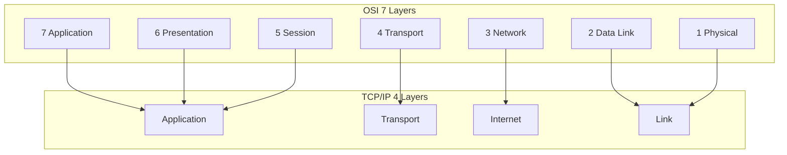


OSI 7계층은 네트워크 통신 기능을 계층별로 분리한 참조 모델이다. 물리 계층부터 응용 계층까지 책임을 나누어 설계하면, 각 계층이 독립적으로 발전하고 문제를 분리해 진단하기 쉬워진다. 실무에서 모든 장비가 OSI를 그대로 구현하는 것은 아니지만, 장애 분석 프레임으로 매우 유용하다.

계층은 아래에서 위로 Physical, Data Link, Network, Transport, Session, Presentation, Application 순서다. 예를 들어 웹 요청이 실패했을 때 "DNS 해석 문제(응용/네트워크)", "TCP 연결 실패(전송)", "링크 다운(물리/데이터링크)"처럼 원인 층위를 구분할 수 있다.

각 계층의 역할과 대표 프로토콜:
- **L1 Physical**: 비트 전송. 전기 신호, 광 신호, 주파수(RF). 케이블 규격(Cat5e/6/7), 커넥터(RJ-45, SFP+), 인코딩(NRZ, Manchester, 8b/10b)
- **L2 Data Link**: 프레임 전달. MAC 주소 기반 로컬 전송. 오류 검출(CRC/FCS). Ethernet, Wi-Fi(802.11), PPP
- **L3 Network**: 패킷 라우팅. 논리 주소(IP) 기반 경로 선택. IP, ICMP, ARP, OSPF, BGP
- **L4 Transport**: 종단 간 데이터 전송. 포트 기반 다중화. TCP, UDP, QUIC, SCTP
- **L5 Session**: 세션 관리. 연결 설정/유지/종료. TLS 세션, RPC 세션 (실무에서 L7에 통합되는 경우가 많음)
- **L6 Presentation**: 데이터 표현. 인코딩/디코딩, 암호화/복호화, 압축. SSL/TLS, JPEG, ASCII/UTF-8 (실제로 L7과 구분이 모호)
- **L7 Application**: 사용자 서비스. HTTP, FTP, SMTP, DNS, MQTT, gRPC

계층 간 독립성이 핵심이다. 예를 들어 TCP(L4)는 아래 계층이 Ethernet이든 Wi-Fi이든 PPP이든 동일하게 동작한다. 이 추상화 덕분에 각 계층의 기술이 독립적으로 발전할 수 있다.

### TCP/IP 4 Layer

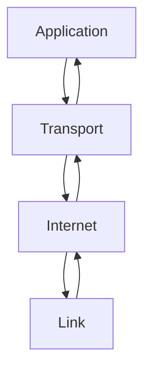


TCP/IP 모델은 인터넷 실전 구현 중심으로 단순화된 4계층(링크, 인터넷, 전송, 응용) 구조다. 운영체제 네트워크 스택과 실제 프로토콜은 대부분 TCP/IP 모델에 맞춰 설명된다. OSI는 이론적 분해, TCP/IP는 실전 표준에 가깝다고 보면 된다.

| TCP/IP 계층 | OSI 대응 | 주요 프로토콜 | 데이터 단위 |
|-------------|---------|-------------|-----------|
| Application | L5~L7 | HTTP, DNS, SMTP, SSH | Message |
| Transport | L4 | TCP, UDP | Segment/Datagram |
| Internet | L3 | IP, ICMP, ARP | Packet |
| Link | L1~L2 | Ethernet, Wi-Fi, PPP | Frame |

OSI와 TCP/IP의 실질적 차이: OSI L5(Session)과 L6(Presentation)은 TCP/IP에서 Application 계층으로 통합된다. 실무에서 세션 관리(TLS 세션, HTTP keep-alive)와 데이터 표현(JSON 직렬화, gzip 압축)은 애플리케이션 프로토콜 내에서 처리되는 경우가 대부분이다.

Linux 커널 네트워크 스택은 TCP/IP 모델을 따른다: NIC 드라이버(Link) → IP 라우팅/포워딩(Internet) → TCP/UDP 소켓(Transport) → 사용자 공간 애플리케이션(Application). `netfilter`/`iptables`는 각 계층에 훅(hook)을 걸어 패킹 필터링/변환을 수행한다.

### Encapsulation

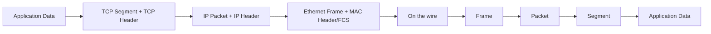


캡슐화는 상위 계층 데이터가 하위 계층으로 내려갈 때 헤더(필요 시 트레일러)를 덧붙이는 과정이다. 반대로 수신 측에서는 디캡슐화로 헤더를 벗겨 원본 데이터를 복원한다. 이때 각 헤더에는 라우팅, 포트 식별, 오류 검출 등 계층별 제어 정보가 담긴다.

```text
Application Data (예: HTTP 요청 본문)
 → [TCP Header(20B) + Data] = Segment
 → [IP Header(20B) + Segment] = Packet
 → [Ethernet Header(14B) + Packet + FCS(4B)] = Frame
```

각 헤더의 핵심 정보:
- **TCP Header (20~60B)**: 출발지/목적지 포트, 시퀀스 번호, ACK 번호, 플래그(SYN/ACK/FIN/RST), 윈도우 크기, 체크섬, 옵션(MSS, 윈도우 스케일링, SACK, 타임스탬프)
- **IP Header (20~60B)**: 버전, 헤더 길이, ToS/DSCP(QoS), 패킷 전체 길이, 식별자/플래그/오프셋(단편화), TTL, 프로토콜 번호, 헤더 체크섬, 출발지/목적지 IP
- **Ethernet Header (14B)**: 목적지 MAC(6B), 출발지 MAC(6B), EtherType(2B, 예: 0x0800=IPv4, 0x0806=ARP, 0x86DD=IPv6)

최종 프레임 크기: HTTP 데이터 100B → Segment 120B → Packet 140B → Frame 158B. 프로토콜 오버헤드가 약 58B 추가된다. 이 오버헤드 비율은 작은 패킷(예: ACK-only)에서 특히 비효율적으로 작용한다.

캡슐화 개념을 이해하면 패킷 캡처(Wireshark) 분석이 쉬워진다. 어느 계층에서 정보가 손상되거나 누락됐는지 정확히 짚을 수 있기 때문이다.

### MTU

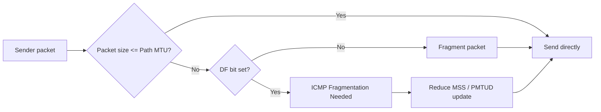


MTU(Maximum Transmission Unit)는 한 번에 전송 가능한 최대 프레임 payload 크기다. Ethernet 기본 MTU는 보통 1500바이트다. 패킷이 MTU보다 크면 분할(fragmentation)되거나 PMTUD(Path MTU Discovery)로 더 작은 크기에 맞춰 전송한다.

MTU 불일치가 있으면 성능 저하 또는 연결 장애(특히 VPN/터널 환경)로 이어질 수 있다. 실무에서는 `ping`의 DF(Don't Fragment) 옵션으로 경로 MTU를 추정해 문제를 진단한다.

MTU와 관련된 주요 크기값:
- **Ethernet MTU**: 1500B (payload)
- **MSS (Maximum Segment Size)**: MTU - IP Header(20B) - TCP Header(20B) = 1460B. TCP 핸드셰이크 시 양측이 MSS를 교환해 최소값에 맞춘다
- **Jumbo Frame**: MTU 9000B. 데이터센터 내부 통신에서 사용하며, 대용량 전송 효율을 높이고 CPU 인터럽트 횟수를 줄인다. 그러나 경로상 모든 장비가 지원해야 한다

IP 단편화 문제: 경로 중간에 MTU가 작은 구간이 있으면 패킷이 분할된다. 분할된 조각 중 하나라도 손실되면 전체 패킷을 재전송해야 하므로 효율이 떨어진다. IPv6에서는 중간 라우터의 단편화를 금지하고, 출발지에서만 단편화를 허용한다(Path MTU Discovery 의무화).

**PMTUD**: 출발지가 DF(Don't Fragment) 플래그를 설정한 패킷을 전송하고, 경로상 MTU 초과 시 ICMP "Fragmentation Needed" 메시지를 받아 MTU를 줄여 재전송한다. 단, 방화벽이 ICMP를 차단하면 PMTUD가 실패해 "블랙홀" 현상(패킷이 사라짐)이 발생한다. 이 경우 TCP MSS clamping으로 우회한다.

---

## 2. Physical & Data Link Layer

### Ethernet

```mermaid
flowchart LR
  P["Preamble+SFD"] --> H[Dst MAC | Src MAC | EtherType]
  H --> PL[Payload 46~1500B]
  PL --> F[FCS CRC32]
```


Ethernet은 LAN에서 가장 널리 쓰이는 데이터 링크 기술이다. 프레임 기반 통신을 하며 목적지/출발지 MAC 주소를 포함한다. 과거 허브 기반 충돌 도메인 환경에서 CSMA/CD가 중요했지만, 현재는 스위치 기반 full duplex가 일반적이라 충돌 개념의 비중이 줄었다.

Ethernet 프레임 구조 상세:
```
Preamble(7B) | SFD(1B) | Dst MAC(6B) | Src MAC(6B) | EtherType(2B) | Payload(46~1500B) | FCS(4B)
```
- **Preamble**: 클록 동기화를 위한 10101010 반복 패턴
- **SFD(Start Frame Delimiter)**: 10101011. 프레임 시작 표시
- **EtherType**: 상위 프로토콜 식별 (0x0800=IPv4, 0x86DD=IPv6, 0x0806=ARP, 0x8100=802.1Q VLAN)
- **FCS(Frame Check Sequence)**: CRC-32 기반 오류 검출. 수신 측이 계산한 CRC와 불일치하면 프레임 폐기 (재전송은 상위 계층 책임)
- **최소 프레임 크기**: 64B (헤더+페이로드+FCS). 페이로드가 46B 미만이면 패딩 추가. 이는 CSMA/CD 충돌 감지를 위한 최소 전송 시간 확보 목적

Ethernet 속도 발전: 10Mbps(1983) → 100Mbps Fast Ethernet(1995) → 1Gbps GbE(1999) → 10Gbps(2002) → 25/40/100Gbps(2010s) → 400Gbps(2020s). 물리 매체도 동축(10BASE5) → UTP(100BASE-TX) → 광섬유(10GBASE-SR/LR)로 진화했다.

### MAC Address

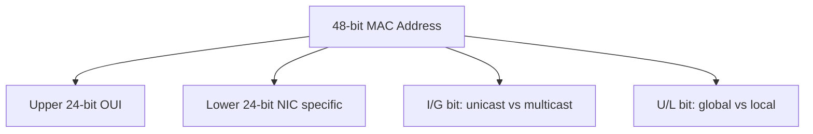


MAC 주소는 네트워크 인터페이스 카드(NIC)에 할당된 48비트 식별자다. 같은 브로드캐스트 도메인 내에서 프레임 전달 대상을 식별하는 데 사용된다. IP가 논리 주소라면 MAC은 링크 로컬 물리 주소라고 볼 수 있다.

일반적으로 앞 24비트는 제조사 OUI, 뒤 24비트는 장치 고유값이다. 가상화/컨테이너 환경에서는 소프트웨어적으로 생성된 MAC도 광범위하게 사용된다.

MAC 주소 구조 (예: `00:1A:2B:3C:4D:5E`):
- **비트 0 (I/G bit)**: 0=유니캐스트, 1=멀티캐스트. 브로드캐스트 주소 `FF:FF:FF:FF:FF:FF`는 모든 비트가 1이므로 멀티캐스트의 특수 형태
- **비트 1 (U/L bit)**: 0=전역 유니크(OUI 기반), 1=로컬 관리(소프트웨어 할당). 가상화 환경에서 생성되는 MAC은 이 비트가 1

MAC 주소와 프라이버시: 고정 MAC은 사용자 추적에 악용될 수 있다. 이에 대응해 iOS/Android는 Wi-Fi 접속 시 랜덤 MAC(MAC randomization)을 사용한다. 이는 네트워크 관리(DHCP 예약, 접근 제어)에 복잡성을 추가한다.

### ARP

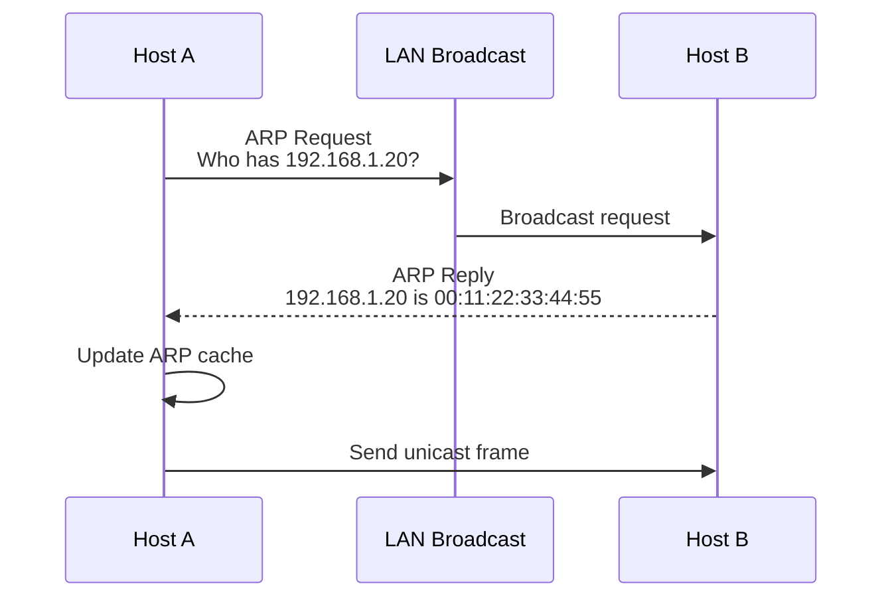

ARP(Address Resolution Protocol)는 "같은 네트워크에서 IP → MAC" 매핑을 알아내는 프로토콜이다. 송신자는 ARP Request를 브로드캐스트로 뿌리고, 대상 IP를 가진 호스트가 ARP Reply로 MAC을 반환한다.

ARP 동작 상세:
1. 호스트 A가 호스트 B(같은 서브넷)로 패킷을 보내려 한다
2. A는 ARP 캐시에서 B의 MAC을 조회한다. 없으면:
3. ARP Request 브로드캐스트: "IP 192.168.1.5의 MAC은?" (Dst MAC=FF:FF:FF:FF:FF:FF)
4. 같은 브로드캐스트 도메인의 모든 호스트가 수신하지만, B만 응답
5. B가 ARP Reply 유니캐스트: "내 MAC은 00:1A:2B:3C:4D:5E" (직접 A에게)
6. A가 ARP 캐시에 (IP → MAC) 엔트리를 저장 (일정 시간 유지, Linux 기본 60초)

**Gratuitous ARP**: 자기 자신의 IP에 대해 ARP Request를 보내는 것. 목적은 ① IP 충돌 감지 ② ARP 캐시 갱신 알림 (IP 변경/failover 시). VRRP/HSRP 같은 게이트웨이 이중화에서 가상 IP 이전 시 필수적으로 사용된다.

**Proxy ARP**: 라우터가 다른 서브넷에 있는 호스트 대신 ARP에 응답하는 기법. 서브넷 구성 없이 다른 네트워크의 호스트와 통신할 수 있게 하지만, 보안/관리 복잡성 때문에 권장되지 않는다.

ARP 캐시는 일정 시간 유지되며, 만료되면 다시 질의한다. ARP 스푸핑 같은 공격 벡터가 존재하므로 보안 민감 구간에서는 동적 ARP 검사(DAI), 정적 ARP, 네트워크 분리 정책이 중요하다. ARP 스푸핑은 공격자가 위조된 ARP Reply를 보내 트래픽을 가로채는 중간자 공격(MITM)의 기초 기법이다.

### Switch

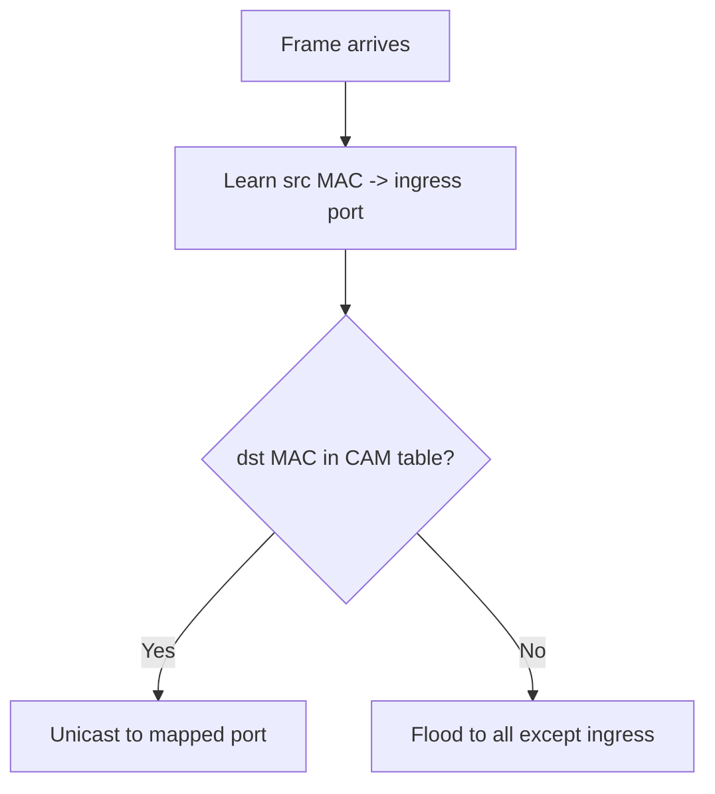


스위치는 데이터 링크 계층 장비로, MAC 주소 테이블(CAM table)을 학습해 프레임을 필요한 포트로만 전달한다. 허브 대비 불필요한 트래픽을 줄이고 충돌 도메인을 분리해 성능을 높인다.

MAC 학습 과정:
1. 프레임 수신 시 출발지 MAC과 수신 포트를 CAM 테이블에 기록
2. 목적지 MAC이 테이블에 있으면 해당 포트로만 전송(unicast forwarding)
3. 테이블에 없으면 수신 포트를 제외한 모든 포트로 전송(flooding)
4. 대상 호스트가 응답하면 그때 MAC이 학습됨

스위치 전달 방식:
- **Store-and-Forward**: 프레임 전체를 수신 후 FCS 검증 후 전달. 오류 프레임을 걸러내지만 지연이 상대적으로 큼
- **Cut-Through**: 목적지 MAC(첫 6B)만 읽고 바로 전달 시작. 지연이 짧지만 오류 프레임도 통과
- **Fragment-Free**: 첫 64B(최소 프레임 크기)까지만 확인 후 전달. 절충안

스위치 루프가 생기면 브로드캐스트 폭주가 발생할 수 있으므로 STP(Spanning Tree Protocol) 계열로 루프를 제어한다. STP는 루프가 있는 토폴로지에서 일부 포트를 블로킹 상태로 두어 논리적 트리 구조를 만든다. 수렴 시간이 30~50초로 긴 것이 단점이다. RSTP(Rapid STP)는 수렴 시간을 수 초로 단축하고, MSTP(Multiple STP)는 VLAN별로 독립적인 스패닝 트리를 구성해 대역폭 활용률을 높인다.

### VLAN

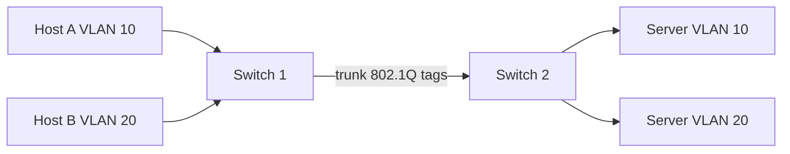


VLAN은 하나의 물리 스위치를 여러 논리 브로드캐스트 도메인으로 분리하는 기술이다. 부서/서비스별 네트워크 격리, 보안 경계 설정, 브로드캐스트 억제에 효과적이다.

트렁크 링크에서는 802.1Q 태그로 VLAN ID를 전달한다. 인터-VLAN 통신은 L3 스위치/라우터가 필요하며, ACL로 통신 정책을 세밀하게 제어한다.

802.1Q 태그 구조 (4B가 Ethernet 헤더에 삽입):
```
TPID(2B, 0x8100) | PCP(3bit) | DEI(1bit) | VID(12bit)
```
- **TPID**: 태그 프로토콜 식별자. 0x8100이면 VLAN 태그 존재
- **PCP(Priority Code Point)**: QoS 우선순위 (0~7). 음성/영상 트래픽 우선처리에 활용
- **VID(VLAN ID)**: 0~4095. 0과 4095는 예약. 실제 사용 가능 범위 1~4094

VLAN 운용 실무:
- **Access 포트**: 단일 VLAN에 속한 엔드 호스트 연결. 태그 없이 전송
- **Trunk 포트**: 스위치 간 연결. 모든 VLAN 트래픽이 태그와 함께 전달
- **Native VLAN**: 트렁크에서 태그 없이 전달되는 VLAN. 보안 이슈(VLAN hopping)가 있으므로 사용하지 않는 VLAN으로 설정하는 것이 권장됨

대규모 데이터센터에서는 VLAN 4094개 제한이 문제가 된다. 이를 해결하기 위해 VXLAN(Virtual Extensible LAN)이 등장했다. VXLAN은 L2 프레임을 UDP로 터널링하며 24비트 VNI(VLAN Network Identifier)로 약 1600만 개의 논리 네트워크를 지원한다.

---

## 3. Network Layer

### IP

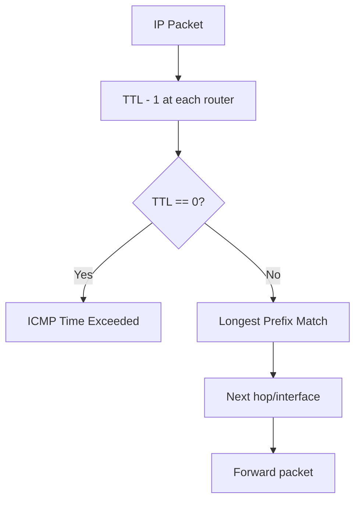


IP는 비연결형(best-effort) 패킷 전달 프로토콜이다. 송신지에서 수신지까지 패킷이 반드시 도달하거나 순서가 보장되진 않는다. 이런 특성 위에서 전송 계층(TCP)이 신뢰성을 보완한다.

IP 헤더 주요 필드 (IPv4, 20B 기본):
- **Version(4bit)**: 4=IPv4, 6=IPv6
- **IHL(4bit)**: 헤더 길이 (32bit 워드 단위)
- **ToS/DSCP(8bit)**: 서비스 품질 분류. DSCP 코드포인트(6bit)로 QoS 정책 적용
- **Total Length(16bit)**: 패킷 전체 길이. 최대 65535B
- **TTL(8bit)**: 라우터를 거칠 때마다 1 감소. 0이 되면 패킷 폐기 + ICMP Time Exceeded 반환. 라우팅 루프 방지 목적. `traceroute`는 TTL을 1부터 증가시키며 ICMP 응답으로 경로를 추적한다
- **Protocol(8bit)**: 상위 프로토콜 식별 (6=TCP, 17=UDP, 1=ICMP, 47=GRE, 50=ESP)
- **Header Checksum(16bit)**: 헤더 무결성만 검증 (페이로드는 상위 계층 책임)
- **Source/Destination IP(32bit each)**: 출발지/목적지 논리 주소

라우터는 목적지 IP의 네트워크 부분을 라우팅 테이블과 비교해 최장 접두사 매칭(Longest Prefix Match)으로 다음 홉을 결정한다.

### IPv4 vs IPv6

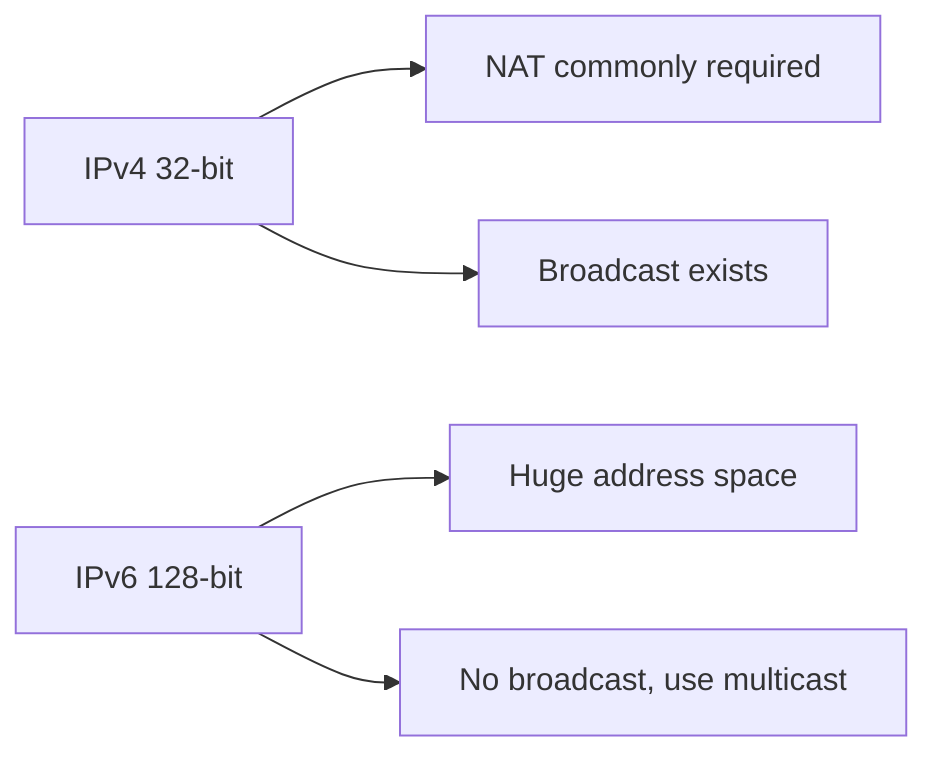


IPv4는 32비트 주소 체계로 주소 고갈 문제가 오래전부터 제기됐다. IPv6는 128비트로 사실상 매우 큰 주소 공간을 제공하며, 자동 설정(SLAAC), 확장 헤더, 단순화된 기본 헤더 구조를 제공한다.

| 비교 | IPv4 | IPv6 |
|------|------|------|
| 주소 크기 | 32bit (~43억) | 128bit (~3.4×10³⁸) |
| 헤더 크기 | 20~60B (가변) | 40B (고정) + 확장 헤더 |
| 단편화 | 라우터도 가능 | 출발지만 가능 |
| 브로드캐스트 | 지원 | 없음 (멀티캐스트로 대체) |
| 주소 자동 설정 | DHCP | SLAAC + DHCPv6 |
| 체크섬 | 헤더 체크섬 있음 | 없음 (L2/L4에 위임) |
| NAT 필요성 | 일반적 | 불필요 (충분한 주소) |

IPv6 주소 유형:
- **Link-Local** (`fe80::/10`): 같은 링크 내에서만 유효. 자동 생성. 라우터 디스커버리에 필수
- **Global Unicast** (`2000::/3`): 인터넷 라우팅 가능한 전역 주소
- **Unique Local** (`fc00::/7`): IPv4의 사설 주소에 해당
- **Multicast** (`ff00::/8`): 그룹 통신. `ff02::1`=모든 노드, `ff02::2`=모든 라우터

전환 기술: 듀얼스택(두 프로토콜 동시 운용), 터널링(IPv6 패킷을 IPv4로 감싸 전달, 6in4/6to4/ISATAP), NAT64/DNS64(IPv6 전용 호스트가 IPv4 서비스에 접근).

### Subnetting

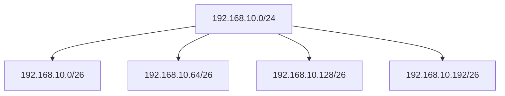


서브네팅은 하나의 IP 주소 공간을 여러 작은 네트워크로 나누는 기법이다. 네트워크/호스트 비트 분리(CIDR)를 통해 주소 효율과 라우팅 관리 효율을 높인다.

CIDR(Classless Inter-Domain Routing) 계산:
```
192.168.10.0/24 → 서브넷 마스크: 255.255.255.0
  네트워크 주소: 192.168.10.0
  브로드캐스트: 192.168.10.255
  사용 가능 호스트: 192.168.10.1 ~ 192.168.10.254 (254개)

/26으로 서브네팅 → 4개 서브넷:
  192.168.10.0/26   (호스트: .1~.62, 62개)
  192.168.10.64/26  (호스트: .65~.126)
  192.168.10.128/26 (호스트: .129~.190)
  192.168.10.192/26 (호스트: .193~.254)
```

과거 Classful 주소 체계(A/B/C 클래스)는 비효율적이었다. Class B는 65534개 호스트를 제공하는데, 대부분의 조직은 그보다 적게 필요해 주소 낭비가 심했다. CIDR은 임의의 접두사 길이를 허용해 이 문제를 해결했다.

VLSM(Variable Length Subnet Masking)은 서브넷마다 다른 마스크 길이를 적용하는 기법이다. 예를 들어 서버 팜에는 /24(254호스트), 관리 네트워크에는 /28(14호스트), 포인트-투-포인트 링크에는 /30(2호스트)을 할당해 주소 효율을 극대화한다.

### Routing

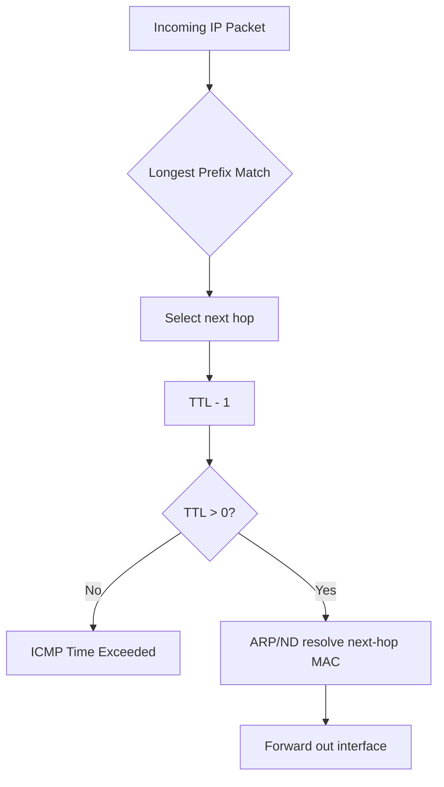


라우팅은 패킷을 목적지까지 전달하기 위한 경로 선택 과정이다. 정적 라우팅은 단순/예측 가능하지만 확장성에 한계가 있다. 동적 라우팅(OSPF, BGP, IS-IS)은 토폴로지 변화에 자동 대응해 대규모 환경에 적합하다.

동적 라우팅 프로토콜 분류:
- **IGP (Interior Gateway Protocol)**: 단일 AS(자율 시스템) 내부
  - **OSPF**: Link-State 알고리즘. 전체 토폴로지 정보를 각 라우터가 보유하고 SPF(Dijkstra) 알고리즘으로 최단 경로 계산. 수렴이 빠르고 루프 없는 경로를 보장. Area 분할로 확장성 확보
  - **IS-IS**: OSPF와 유사한 Link-State. 대규모 ISP 환경에서 선호. IPv4/IPv6 동시 지원이 상대적으로 용이
  - **RIP** (Distance Vector): 홉 수 기반. 최대 15홉 제한. 소규모 네트워크 전용. 현재는 거의 사용하지 않음
- **EGP (Exterior Gateway Protocol)**:
  - **BGP**: AS 간 경로 교환. Path Vector 알고리즘. 인터넷 라우팅의 근간. 정책 기반으로 경로 선택(최단 경로가 아닌 비즈니스 관계, 비용, SLA 기반). Full table은 약 100만+ 경로

데이터센터/클라우드에서는 ECMP(동일 비용 다중 경로)와 정책 기반 라우팅을 결합해 고가용성과 처리량을 확보한다. 최근에는 Leaf-Spine 토폴로지에서 BGP를 IGP처럼 사용하는 추세(BGP in the DC)가 확산 중이다.

### NAT

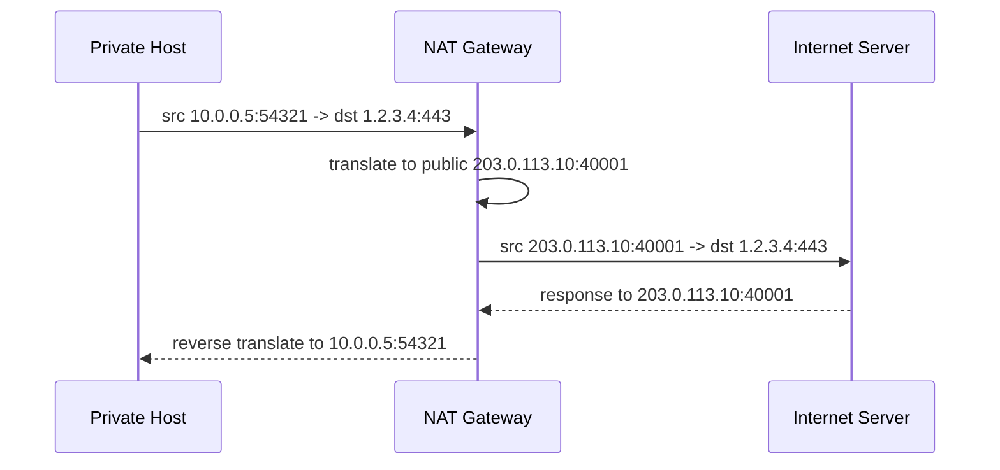


NAT(Network Address Translation)는 사설 IP를 공인 IP로 변환해 인터넷 통신을 가능하게 한다. IPv4 주소 부족 대응에 크게 기여했지만, 종단 간 연결성(End-to-End) 단순성을 약화시킨다.

NAT 유형:
- **Static NAT**: 1:1 고정 매핑. 외부에서 접근 가능한 서버에 사용
- **Dynamic NAT**: 사설 IP를 공인 IP 풀에서 동적 매핑
- **PAT (Port Address Translation / NAPT)**: 다수 사설 IP를 하나의 공인 IP + 포트 조합으로 매핑. 가정/사무실 라우터의 기본 방식
  ```
  내부 192.168.1.10:5000 → 외부 203.0.113.1:40001
  내부 192.168.1.20:5000 → 외부 203.0.113.1:40002
  ```

NAT의 문제점:
- **End-to-End 원칙 위반**: 외부에서 내부 호스트로 직접 연결 불가. 서버 호스팅, P2P에 제약
- **프로토콜 제약**: IP 페이로드에 주소를 포함하는 프로토콜(FTP active mode, SIP)은 NAT ALG(Application Level Gateway)가 필요
- **NAT Traversal**: STUN(NAT 유형 파악 + 외부 주소 확인), TURN(릴레이 서버 경유), ICE(STUN/TURN 조합으로 최적 경로 선택). WebRTC 통신에서 필수

CGNAT(Carrier-Grade NAT): ISP가 고객에게 사설 IP를 할당하고 대규모 NAT를 운영하는 방식. IPv4 고갈 대응이지만, 이중 NAT로 인한 포트 부족, 지오로케이션 정확도 저하, 로깅 복잡성 등의 문제가 있다.

---

## 4. Transport Layer

### TCP

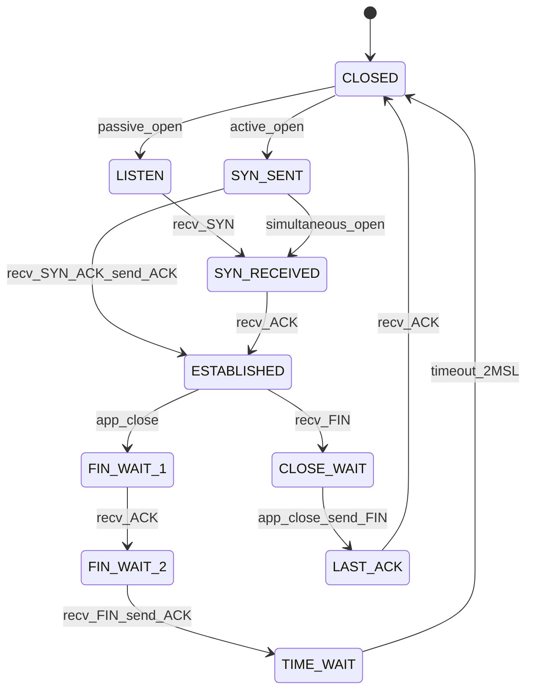

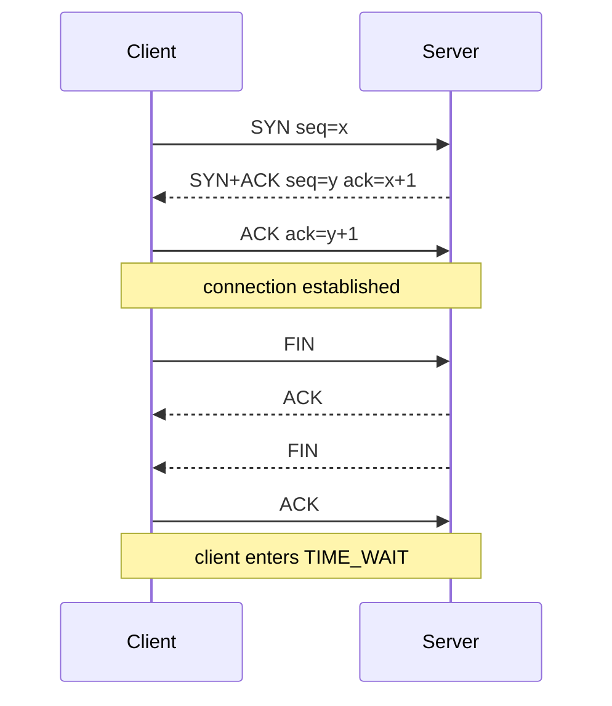


TCP는 연결지향, 신뢰성 보장, 순서 보장, 흐름/혼잡 제어를 제공하는 전송 프로토콜이다. 바이트 스트림 기반으로 동작하며 수신 측에서 ACK를 보내고, 송신 측은 재전송/윈도우 조절을 수행한다.

#### 3-Way Handshake
연결 시작 시 `SYN → SYN/ACK → ACK` 과정을 거쳐 양쪽의 초기 시퀀스 번호를 동기화한다.

상세 과정:
1. **Client → Server: SYN** (seq=x). 클라이언트가 ISN(Initial Sequence Number)을 생성. ISN은 보안을 위해 예측 불가능한 랜덤/시간 기반 값
2. **Server → Client: SYN+ACK** (seq=y, ack=x+1). 서버도 자신의 ISN을 생성하고, 클라이언트의 SYN을 확인
3. **Client → Server: ACK** (ack=y+1). 연결 확립. 이 ACK에 데이터를 포함할 수도 있다

SYN Flood 공격: 공격자가 대량의 SYN을 보내고 ACK를 보내지 않으면, 서버의 SYN 큐(backlog)가 가득 차 정상 연결이 불가능해진다. 방어책으로 **SYN Cookie**가 있다: 서버가 SYN 큐에 상태를 저장하지 않고, ISN에 암호학적으로 인코딩된 연결 정보를 넣어 ACK가 돌아왔을 때 복원한다.

TCP Fast Open(TFO): 첫 번째 연결에서 발급받은 쿠키를 이후 SYN 패킷에 포함시켜, 핸드셰이크 완료 전에 데이터를 전송할 수 있다. 1-RTT를 절약해 웹 성능을 개선한다.

#### 4-Way Termination
연결 종료는 일반적으로 `FIN → ACK → FIN → ACK` 흐름을 거친다. 송신/수신 종료가 독립적이라 4단계가 필요하다(Half-Close 지원).

`TIME_WAIT` 상태: 마지막 ACK를 보낸 후 2×MSL(Maximum Segment Lifetime, 보통 60초) 동안 유지한다. 이유는 ① 지연된 패킷이 새 연결에 혼입되는 것을 방지 ② 상대방이 마지막 ACK를 못 받았을 때 FIN 재전송에 응답하기 위함이다. 서버에 TIME_WAIT 소켓이 대량 누적되면 포트 고갈이 발생할 수 있으며, `SO_REUSEADDR`, `tcp_tw_reuse` 설정으로 완화한다.

#### Flow Control
흐름 제어는 수신 버퍼 과부하를 막기 위한 메커니즘이다. 수신 측이 광고 윈도우(rwnd)로 처리 가능한 데이터량을 알려주면, 송신 측은 그 범위를 넘지 않게 전송한다.

TCP 윈도우 크기는 원래 16비트(최대 65535B)로 제한되었지만, **Window Scaling 옵션**(RFC 7323)으로 최대 1GB까지 확장 가능하다. 이는 핸드셰이크 시 협상되며, 고대역폭·고지연(BDP가 큰) 경로에서 파이프라인 효율을 극대화한다.

**Zero Window**: 수신 버퍼가 가득 차면 rwnd=0을 광고한다. 송신 측은 전송을 중단하고, 주기적으로 **Window Probe** 패킷(1B 데이터)을 보내 수신 측의 버퍼 상태를 확인한다. 이 상태가 오래 지속되면 연결 교착이 된다.

#### Congestion Control
혼잡 제어는 네트워크 전체 혼잡을 완화하기 위한 정책이다.

주요 알고리즘 단계:
1. **Slow Start**: cwnd를 1 MSS에서 시작해 ACK마다 2배로 증가(지수적). ssthresh(임계치)에 도달하면 Congestion Avoidance로 전환
2. **Congestion Avoidance**: cwnd를 RTT당 1 MSS씩 선형 증가 (additive increase)
3. **손실 감지 시**:
   - **3 Duplicate ACK** (Fast Retransmit): ssthresh = cwnd/2, cwnd = ssthresh + 3 MSS → Fast Recovery 진입
   - **Timeout**: ssthresh = cwnd/2, cwnd = 1 MSS → Slow Start 재시작 (더 보수적)
4. **Fast Recovery**: 중복 ACK 수신 시 cwnd를 1씩 증가. 새 ACK 수신 시 cwnd = ssthresh로 설정하고 Congestion Avoidance로 전환

현대 혼잡 제어 알고리즘:
- **CUBIC** (Linux 기본): cwnd 증가가 3차 함수를 따른다. 손실 지점 근처에서 보수적으로, 멀어질수록 공격적으로 증가. 고대역폭 환경에 적합
- **BBR** (Google): 손실이 아닌 RTT와 대역폭 측정에 기반. 버퍼블로트 환경에서도 높은 처리량과 낮은 지연을 동시에 추구. YouTube, Google Cloud에서 사용

**SACK (Selective ACK)**: 기본 TCP는 누적 ACK만 지원해, 중간 패킷 손실 시 비효율적 재전송이 발생한다. SACK 옵션을 사용하면 수신 측이 "어떤 범위를 받았는지"를 구체적으로 알려줘, 손실 패킷만 정확히 재전송할 수 있다.

### UDP

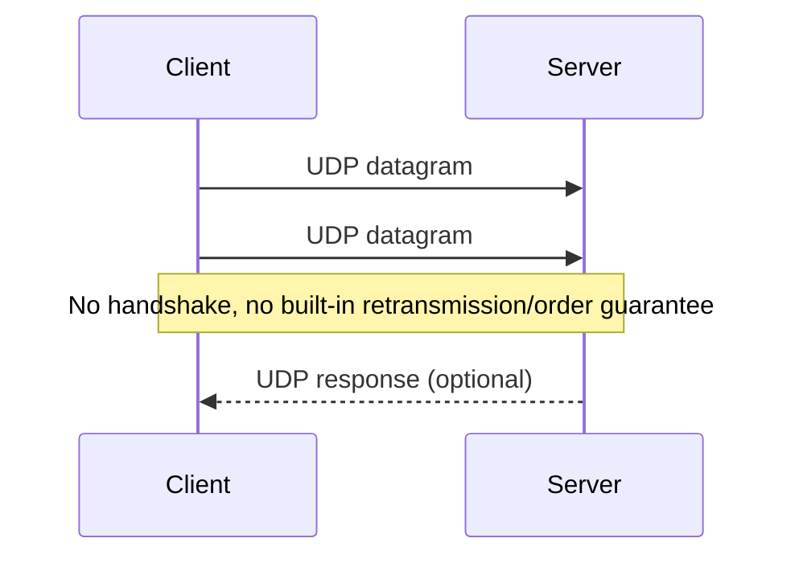


UDP는 비연결형, 비신뢰성(재전송/순서보장 없음) 전송 프로토콜이다. 헤더가 작고 지연이 낮아 실시간 미디어, 온라인 게임, DNS 질의 등에 적합하다. 필요한 신뢰성/순서 보장은 애플리케이션 계층에서 직접 구현한다.

UDP 헤더 구조 (8B 고정):
```
Source Port(2B) | Destination Port(2B) | Length(2B) | Checksum(2B)
```

TCP 대비 장점: 연결 설정 오버헤드 없음(0-RTT), 헤더 오버헤드 최소(8B vs 20B+), HOL(Head-of-Line) 블로킹 없음, 멀티캐스트/브로드캐스트 지원.

UDP 기반 상위 프로토콜:
- **QUIC** (HTTP/3 기반): UDP 위에 TLS 1.3 통합, 독립적 스트림 다중화, 0-RTT 연결 재개, 연결 마이그레이션(IP 변경 시 연결 유지)을 구현. TCP의 HOL 블로킹과 핸드셰이크 지연 문제를 해결
- **DTLS**: UDP 위의 TLS. VPN(OpenVPN), WebRTC 데이터 채널에 사용
- **RTP/RTCP**: 실시간 미디어 전송. 시퀀스 번호와 타임스탬프로 순서/타이밍 정보를 제공하지만 재전송은 하지 않음

---

## 5. Application Layer

### HTTP

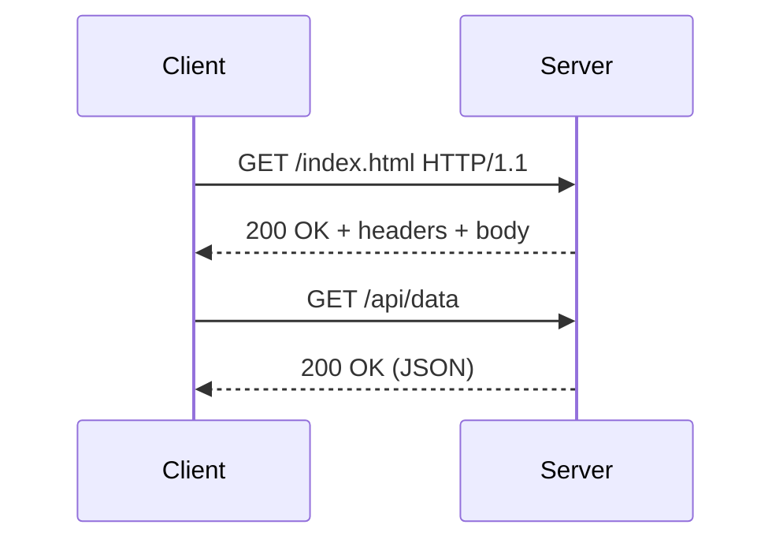


HTTP는 웹의 기본 애플리케이션 프로토콜이다. 요청/응답 모델을 사용하며 메서드(GET/POST/PUT/DELETE), 상태 코드(2xx/4xx/5xx), 헤더 기반으로 동작한다. 본질적으로 무상태(stateless)이므로 세션 상태는 쿠키/토큰/스토리지로 외부화한다.

HTTP 메서드의 의미론(Semantics):
- **GET**: 리소스 조회. 안전(safe) + 멱등(idempotent). 캐시 가능
- **POST**: 리소스 생성/처리. 비안전 + 비멱등. 서버 상태 변경
- **PUT**: 리소스 전체 교체. 비안전 + 멱등. 같은 요청 반복 시 결과 동일
- **PATCH**: 리소스 부분 수정. 비안전 + 비멱등(구현에 따라 멱등 가능)
- **DELETE**: 리소스 삭제. 비안전 + 멱등
- **HEAD**: GET과 동일하지만 응답 본문 없음. 리소스 존재/크기 확인에 사용
- **OPTIONS**: 허용 메서드 조회. CORS preflight에 사용

상태 코드 주요 분류:
- **1xx**: 정보성 (100 Continue, 101 Switching Protocols)
- **2xx**: 성공 (200 OK, 201 Created, 204 No Content)
- **3xx**: 리다이렉션 (301 Moved Permanently, 302 Found, 304 Not Modified)
- **4xx**: 클라이언트 오류 (400 Bad Request, 401 Unauthorized, 403 Forbidden, 404 Not Found, 429 Too Many Requests)
- **5xx**: 서버 오류 (500 Internal Server Error, 502 Bad Gateway, 503 Service Unavailable, 504 Gateway Timeout)

#### HTTP 1.1 / 2 / 3
HTTP/1.1은 텍스트 기반, keep-alive를 통해 연결 재사용이 가능하다. HTTP/2는 바이너리 프레이밍, 멀티플렉싱, 헤더 압축(HPACK)으로 지연을 개선한다. HTTP/3는 TCP 대신 QUIC(UDP 기반)을 사용해 핸드셰이크/손실 복구 지연을 줄인다.

| 비교 | HTTP/1.1 | HTTP/2 | HTTP/3 |
|------|----------|--------|--------|
| 전송 | TCP | TCP | QUIC (UDP) |
| 다중화 | 파이프라이닝(한계) | 스트림 멀티플렉싱 | 독립적 스트림 |
| 헤더 | 텍스트, 중복 전송 | HPACK 압축 | QPACK 압축 |
| HOL 블로킹 | 연결 수준 | TCP 수준 (L4) | 없음 (스트림 독립) |
| 핸드셰이크 | TCP 1-RTT + TLS 2-RTT | TCP 1-RTT + TLS 1-RTT | 1-RTT (0-RTT 가능) |
| Server Push | 없음 | 지원 | 스펙상 가능하나 브라우저/실무 채택은 제한적 |

HTTP/2의 핵심 혁신: 하나의 TCP 연결에서 여러 요청/응답을 동시에 처리(멀티플렉싱). HTTP/1.1에서 필요하던 도메인 샤딩(여러 연결 병렬화)이 불필요해졌다. 그러나 TCP 수준의 HOL 블로킹(패킷 손실 시 모든 스트림이 대기)은 여전히 존재한다.

HTTP/3의 핵심 혁신: QUIC은 각 스트림이 독립적으로 손실 복구를 수행하므로, 한 스트림의 패킷 손실이 다른 스트림에 영향을 주지 않는다. 또한 연결 ID 기반이므로 Wi-Fi → LTE 전환 시에도 연결이 유지된다(Connection Migration).

### HTTPS

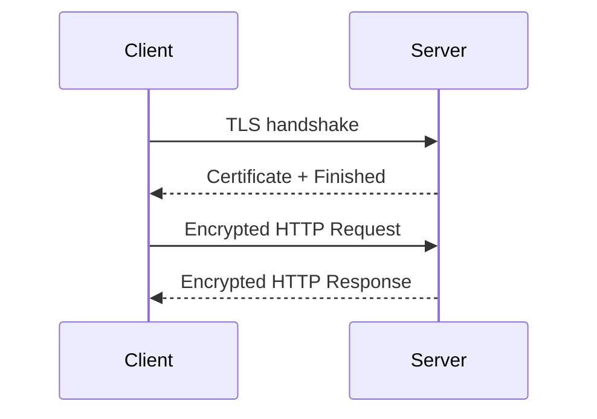


HTTPS는 HTTP 위에 TLS 암호화 계층을 얹어 기밀성, 무결성, 서버 인증을 제공한다. 현대 웹에서 사실상 기본이며, 브라우저 보안 정책(HSTS, Secure cookie)도 HTTPS를 전제로 강화된다.

HTTPS가 제공하는 보안 속성:
- **기밀성(Confidentiality)**: 대칭키 암호화(AES-GCM, ChaCha20-Poly1305)로 데이터를 암호화. 도청 방지
- **무결성(Integrity)**: MAC(Message Authentication Code)으로 변조 감지
- **인증(Authentication)**: X.509 인증서 체인으로 서버 신원 확인. 인증서는 CA(Certificate Authority)가 발급하며, 브라우저/OS의 Root CA 목록과 대조해 신뢰성을 검증

**HSTS (HTTP Strict Transport Security)**: 서버가 `Strict-Transport-Security` 헤더를 보내면, 브라우저는 이후 해당 도메인에 항상 HTTPS로만 접속한다. HTTPS → HTTP 다운그레이드 공격(SSL Stripping) 방지. `includeSubDomains`, `preload` 옵션을 함께 사용하는 것이 권장된다.

**인증서 투명성(Certificate Transparency)**: CA의 오발급을 감시하기 위해, 모든 인증서를 공개 로그에 기록하도록 요구하는 프레임워크. Chrome은 CT 준수를 강제한다.

### TLS Handshake

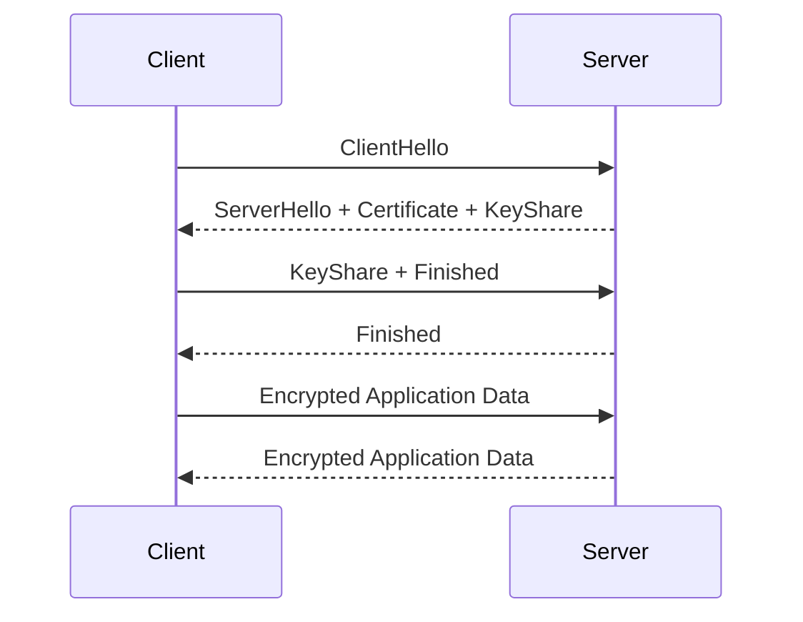


TLS 핸드셰이크는 암호 스위트 협상, 키 교환, 인증서 검증을 수행하는 절차다. TLS 1.3은 핸드셰이크 단계를 줄여 지연을 낮추고 취약한 구식 알고리즘을 제거했다.

TLS 1.2 핸드셰이크 (2-RTT):
1. **ClientHello**: 지원 TLS 버전, 암호 스위트 목록, 클라이언트 랜덤 값
2. **ServerHello**: 선택된 암호 스위트, 서버 랜덤 값 + **Certificate** (서버 인증서) + **ServerKeyExchange** (DH 파라미터) + **ServerHelloDone**
3. **ClientKeyExchange**: DH 공개값 + **ChangeCipherSpec** + **Finished** (암호화된 검증 메시지)
4. **ChangeCipherSpec** + **Finished** (서버)

TLS 1.3 핸드셰이크 (1-RTT):
1. **ClientHello**: 지원 암호 스위트 + 키 공유 파라미터(DH/ECDH 공개값)를 함께 전송
2. **ServerHello**: 선택된 암호 스위트 + 서버 키 공유 + {EncryptedExtensions} + {Certificate} + {CertificateVerify} + {Finished}
3. **{Finished}** (클라이언트)
- "1-RTT"만에 암호화 통신 시작. 키 교환과 인증을 동시에 수행

TLS 1.3의 주요 개선:
- **0-RTT Resumption (Early Data)**: 이전 세션의 PSK(Pre-Shared Key)로 첫 ClientHello에 데이터를 포함. 반복 방문 시 지연 최소화. 단, replay 공격에 취약하므로 멱등 요청에만 사용 권장
- **취약 알고리즘 제거**: RSA 키 교환(Forward Secrecy 없음), CBC 모드 암호, SHA-1, RC4, 3DES 완전 제거. AEAD(Authenticated Encryption with Associated Data) 알고리즘만 허용
- **Forward Secrecy 필수**: 모든 키 교환이 (EC)DHE 기반. 서버 개인키가 유출되어도 과거 통신은 복호화 불가

### DNS

```mermaid
sequenceDiagram
  participant U as User Stub Resolver
  participant R as Recursive Resolver
  participant Root as Root NS
  participant TLD as TLD NS
  participant Auth as Authoritative NS
  U->>R: query www.example.com A
  R->>Root: ask .com delegation
  Root-->>R: .com NS referral
  R->>TLD: ask example.com NS
  TLD-->>R: authoritative NS referral
  R->>Auth: ask A record
  Auth-->>R: A = 93.184.216.34
  R-->>U: cached answer
```


DNS는 도메인 이름을 IP 주소로 매핑하는 분산 계층형 시스템이다. 루트 → TLD → 권한(authoritative) 서버 순으로 질의가 진행된다. 캐싱 TTL이 성능과 일관성(전파 지연) 사이의 균형점을 만든다.

DNS 질의 과정 상세:
1. 클라이언트가 `www.example.com`의 IP를 요청
2. **로컬 DNS 리졸버**(ISP 또는 8.8.8.8)에 질의 (recursive query)
3. 리졸버의 캐시에 없으면 **루트 네임서버** (13개 논리 서버, anycast로 수백 인스턴스)에 질의
4. 루트가 `.com` TLD 네임서버 주소를 반환
5. **TLD 네임서버**에 질의 → `example.com`의 권한 네임서버(NS 레코드) 반환
6. **권한 네임서버**에 질의 → `www.example.com`의 A 레코드(IP 주소) 반환
7. 리졸버가 결과를 캐싱(TTL 동안)하고 클라이언트에 반환

DNS 레코드 유형:
- **A / AAAA**: 도메인 → IPv4/IPv6 주소
- **CNAME**: 별칭 → 정규 이름 (예: `www.example.com` → `example.com`)
- **MX**: 메일 교환 서버 (우선순위 포함)
- **NS**: 네임서버 위임
- **TXT**: 임의 텍스트 (SPF, DKIM, 도메인 검증에 활용)
- **SRV**: 서비스 위치 (포트, 프로토콜, 가중치 포함)
- **SOA**: 존(zone) 기본 정보 (시리얼 번호, 새로고침 간격 등)

DNS 보안:
- **DNSSEC**: 응답에 디지털 서명을 추가해 위조/변조 방지. 기밀성은 제공하지 않음
- **DNS over HTTPS (DoH)**: DNS 질의를 HTTPS로 암호화. 프라이버시 보호, 검열 우회 가능
- **DNS over TLS (DoT)**: 전용 포트(853)에서 TLS로 암호화

운영에서 DNS 장애는 서비스 전체 장애로 직결된다. 다중 네임서버, 헬스체크 기반 failover, 짧은 TTL 전략을 상황에 맞게 설계해야 한다. TTL이 너무 짧으면 캐시 효율 저하와 네임서버 부하 증가, 너무 길면 변경 사항 전파가 느려져 failover 지연이 발생한다.

### WebSocket

```mermaid
sequenceDiagram
  participant C as Client
  participant S as Server
  C->>S: HTTP Upgrade: websocket
  S-->>C: 101 Switching Protocols
  C->>S: WebSocket Frame
  S-->>C: WebSocket Frame
```


WebSocket은 단일 TCP 연결 위에서 양방향 풀-듀플렉스 통신을 제공한다. 실시간 채팅, 협업 편집, 시세 스트리밍 같은 푸시 중심 워크로드에 적합하다.

초기에는 HTTP 업그레이드로 시작한 뒤 프레임 기반 지속 연결로 전환된다:
```http
GET /chat HTTP/1.1
Upgrade: websocket
Connection: Upgrade
Sec-WebSocket-Key: dGhlIHNhbXBsZSBub25jZQ==
Sec-WebSocket-Version: 13

HTTP/1.1 101 Switching Protocols
Upgrade: websocket
Connection: Upgrade
Sec-WebSocket-Accept: s3pPLMBiTxaQ9kYGzzhZRbK+xOo=
```

WebSocket 프레임 구조: FIN(1bit) + Opcode(4bit, 텍스트/바이너리/close/ping/pong) + MASK(1bit) + Payload Length(7/16/64bit) + Masking Key(4B, 클라이언트→서버만) + Payload.

HTTP 폴링/롱폴링 대비 장점: 연결 설정 오버헤드 제거, HTTP 헤더 반복 전송 없음, 진정한 서버 푸시. 단점: HTTP 인프라(캐시, CDN, 프록시)와의 호환성이 제한적, 연결 상태 유지 비용.

SSE(Server-Sent Events)와의 비교: SSE는 서버→클라이언트 단방향 스트림만 지원하지만, HTTP 기반이라 인프라 호환성이 좋고 자동 재연결을 내장한다. 알림/피드 같은 서버 푸시 전용 워크로드에서는 SSE가 더 적합할 수 있다.

연결 수가 많아질수록 커넥션 관리, 백프레셔, 브로드캐스트 비용 최적화가 중요하다. 대규모 시스템에서는 Redis Pub/Sub이나 Kafka를 백엔드로 사용해 서버 인스턴스 간 메시지를 분산한다.

### MQTT

```mermaid
sequenceDiagram
  participant Pub as Publisher
  participant Br as Broker
  participant Sub as Subscriber
  Sub->>Br: SUBSCRIBE sensors/temp
  Pub->>Br: PUBLISH sensors/temp=23
  Br-->>Sub: MESSAGE sensors/temp=23
```


MQTT는 경량 pub/sub 프로토콜로 IoT 저전력 환경에 최적화되어 있다. 브로커 중심 토픽 모델과 QoS(0/1/2) 레벨을 제공하며, 불안정 네트워크에서도 비교적 효율적으로 메시지를 전달한다.

MQTT QoS 레벨:
- **QoS 0 (At most once)**: Fire-and-forget. 전달 보장 없음. 가장 빠르고 가볍다. 센서 데이터 주기적 전송에 적합
- **QoS 1 (At least once)**: PUBACK 확인. 최소 1회 전달 보장하지만 중복 가능. 중복 처리가 가능한 워크로드에 적합
- **QoS 2 (Exactly once)**: 4단계 핸드셰이크(PUBLISH→PUBREC→PUBREL→PUBCOMP). 정확히 1회 전달. 비용이 가장 높지만 결제/명령 같은 정확성 필수 시나리오에 사용

MQTT 특수 기능:
- **Retained Message**: 브로커가 토픽의 마지막 메시지를 저장해, 새 구독자에게 즉시 전달
- **Last Will and Testament (LWT)**: 클라이언트가 비정상 종료되면 브로커가 미리 등록된 "유언" 메시지를 다른 구독자에게 전송. 장치 오프라인 감지에 활용
- **Clean Session**: false로 설정하면 브로커가 구독 정보와 미전달 메시지를 유지. 간헐적 연결 환경에서 메시지 유실 방지

MQTT 5.0 주요 추가사항: 공유 구독(여러 클라이언트가 토픽을 분산 처리), 메시지 만료, 사용자 속성, 요청/응답 패턴 지원.

---

## 6. Performance

### Latency vs Throughput

```mermaid
flowchart LR
  W[Workload] --> Q[Queue depth]
  Q --> L[Latency]
  Q --> T[Throughput]
  T --> SAT[Saturation point]
  SAT --> L2[Latency increases sharply]
```


Latency는 단일 요청이 완료되기까지 걸리는 시간이고, Throughput은 단위 시간당 처리량이다. 둘은 종종 트레이드오프 관계에 있다. 예를 들어 배치 처리 크기를 늘리면 처리량은 증가할 수 있지만 개별 요청 지연은 늘어날 수 있다.

성능 목표를 정의할 때는 평균값보다 p95/p99 지연과 최대 처리량을 함께 봐야 실제 사용자 경험을 반영할 수 있다.

**BDP(Bandwidth-Delay Product)**: 대역폭(bps) × RTT(초) = 전송 중인 데이터 양(비트). 이 값이 TCP 윈도우 크기보다 크면 파이프가 완전히 활용되지 않는다. 예: 1Gbps 링크, RTT 100ms → BDP = 12.5MB. 윈도우 크기가 이보다 작으면 대역폭을 다 활용하지 못한다.

**Little's Law**: $L = \lambda \times W$ (시스템 내 평균 요청 수 = 도착률 × 평균 체류 시간). 네트워크 큐잉, 서버 용량 산정에 유용하다. 예: 평균 응답 500ms, 초당 100 요청이면 동시에 50개 요청이 시스템에 존재한다.

지연 분해 분석: 전체 지연 = DNS 해석 + TCP 핸드셰이크(1 RTT) + TLS 핸드셰이크(1~2 RTT) + 요청 전송 + 서버 처리 + 응답 전송. 어느 구간이 지배적인지 파악하면 최적화 포인트가 명확해진다.

### RTT

```mermaid
sequenceDiagram
  participant C as Client
  participant S as Server
  C->>S: request at t0
  S-->>C: response at t1
  Note over C,S: RTT = t1 - t0
```


RTT(Round-Trip Time)는 왕복 지연 시간이다. TCP 핸드셰이크, TLS 협상, API 왕복 비용에 직접적인 영향을 준다. 원거리 리전 간 통신은 RTT가 크므로 캐싱, CDN, 리전 분산 배치가 중요하다.

RTT의 구성 요소:
- **전파 지연(Propagation delay)**: 빛/전기 신호가 매체를 통과하는 시간. 광섬유 1km ≈ 5μs → 서울-LA(약 9000km) ≈ 90ms 왕복
- **전송 지연(Transmission delay)**: 패킷을 링크에 올리는 시간. packet_size / bandwidth
- **큐잉 지연(Queueing delay)**: 라우터/스위치 큐에서 대기하는 시간. 혼잡 시 급격히 증가
- **처리 지연(Processing delay)**: 라우터의 헤더 검사, 포워딩 결정 시간

RTT 최적화 전략:
- **CDN**: 콘텐츠를 사용자 근처 엣지 서버에 캐싱. DNS 기반 또는 Anycast 기반으로 가장 가까운 서버로 라우팅
- **Connection reuse**: HTTP keep-alive, 연결 풀링으로 핸드셰이크 RTT 절약
- **요청 병합**: 여러 작은 요청을 하나로 묶어 왕복 횟수 감소
- **예측적 프리페치**: 사용자 행동을 예측해 미리 데이터를 가져옴

### Packet Loss

```mermaid
flowchart TD
  TX[Sender transmits packets] --> LOSS{Packet lost?}
  LOSS -->|No| ACK[ACK received]
  LOSS -->|Yes| DETECT["Timeout / duplicate ACK"]
  DETECT --> RETX[Retransmit]
  RETX --> CWND[Reduce congestion window]
```


패킷 손실은 재전송을 유발하고 TCP 혼잡 윈도우를 축소시켜 체감 성능을 크게 떨어뜨린다. 무선 환경, 과부하 링크, 큐 버퍼 관리 미흡 시 빈번하다. 손실률과 지연 편차(jitter)를 함께 모니터링해야 원인을 정확히 찾을 수 있다.

패킷 손실의 영향 (TCP):
- **1% 손실**: 처리량이 이론 최대의 약 30% 수준으로 하락 (CUBIC 기준, BDP에 따라 다름)
- **5% 손실**: 대부분의 TCP 기반 서비스가 체감적으로 매우 느려짐
- 손실 시 cwnd가 절반으로 축소되고 복구에 여러 RTT가 필요하므로 고지연 환경에서 영향이 더 크다

버퍼 관리 정책:
- **Tail Drop**: 큐가 가득 차면 새 패킷을 드롭. 단순하지만 글로벌 동기화(여러 TCP 플로우가 동시에 cwnd 축소) 유발
- **RED (Random Early Detection)**: 큐가 임계치에 도달하기 전에 확률적으로 패킷을 드롭. 글로벌 동기화를 완화하고 큐 지연을 낮춤
- **CoDel / FQ-CoDel**: 큐 체류 시간 기반 드롭. 버퍼블로트(과도한 큐잉으로 지연 증가) 해결에 효과적

### Bandwidth

```mermaid
flowchart LR
  PIPE["Link capacity (Mbps/Gbps)"] --> BDP["Bandwidth-Delay Product"]
  BDP --> WIN[Required send window size]
  WIN --> UTIL[Link utilization]
```


대역폭은 이론적 최대 전송 용량이다. 하지만 실제 성능은 RTT, 손실률, 프로토콜 오버헤드, 종단 CPU 처리 능력에 의해 제한된다. "대역폭이 충분한데 느리다"는 상황은 대부분 지연/손실/애플리케이션 병목 문제다.

**Shannon's Theorem**: $C = B \cdot \log_2(1 + \frac{S}{N})$. 채널 용량(C)은 대역폭(B)과 SNR(신호 대 잡음비)에 의해 결정된다. 대역폭을 늘려도 잡음이 크면 한계가 있다.

대역폭 vs Goodput: 대역폭은 물리적 최대치이고, Goodput은 애플리케이션이 실제로 사용할 수 있는 유효 처리량이다. 프로토콜 헤더, 재전송, 제어 패킷, 암호화 오버헤드 등을 빼면 goodput은 대역폭의 70~95% 수준이 일반적이다.

---

## 7. Network Programming

### Socket

```mermaid
flowchart TD
  A["socket()"] --> B["bind()"]
  B --> C["listen()"]
  C --> D["accept()"]
  D --> E["recv()/send()"]
  E --> F["close()"]
```


소켓은 애플리케이션이 네트워크 통신을 수행하는 OS 추상화다. 서버는 보통 `socket → bind → listen → accept` 순서로 연결을 받고, 클라이언트는 `socket → connect`로 연결을 맺는다.

```python
import socket

# TCP 서버
with socket.socket(socket.AF_INET, socket.SOCK_STREAM) as s:
    s.setsockopt(socket.SOL_SOCKET, socket.SO_REUSEADDR, 1)
    s.bind(("0.0.0.0", 8080))
    s.listen(128)  # backlog: SYN 큐 + accept 큐 크기
    conn, addr = s.accept()
    with conn:
        data = conn.recv(1024)
        conn.sendall(b"OK\n")
```

소켓 옵션 주요 설정:
- **SO_REUSEADDR**: TIME_WAIT 상태인 주소에 바인딩 허용. 서버 재시작 시 필수
- **TCP_NODELAY**: Nagle 알고리즘 비활성화. 작은 패킷을 즉시 전송. 실시간 애플리케이션에서 지연 감소
- **SO_KEEPALIVE**: 유휴 연결에 keepalive probe를 보내 끊어진 연결 감지
- **SO_RCVBUF / SO_SNDBUF**: 수신/송신 버퍼 크기 설정. BDP에 맞게 조정하면 처리량 향상
- **TCP_CORK**: 여러 작은 write를 모아서 한 번에 전송. HTTP 응답 헤더+본문을 하나의 패킷으로 묶을 때 유용

`listen(backlog)`: backlog 파라미터는 완료된 연결(accept 큐)의 최대 대기 수를 결정한다. Linux에서는 `net.core.somaxconn` 시스템 파라미터와 min을 취한다. 트래픽이 많은 서버에서 backlog가 너무 작으면 SYN이 드롭되어 연결 실패가 발생한다.

### Blocking vs Non-blocking

```mermaid
flowchart LR
  B1[Blocking socket] --> B2["read() waits thread"]
  N1["Non-blocking socket"] --> N2["read() returns EAGAIN"]
  N2 --> N3["wait by epoll/select"]
  N3 --> N4[handle when ready]
```


블로킹 I/O는 호출이 완료될 때까지 스레드가 대기한다. 구현은 단순하지만 동시 연결이 많아지면 스레드 자원 사용량이 커진다. 논블로킹 I/O는 이벤트 준비 여부를 확인하며 진행해 대규모 동시성에 유리하다.

I/O 모델 비교:
- **동기 블로킹**: 1 연결 = 1 스레드. 10K 연결 = 10K 스레드 → 메모리/스케줄링 오버헤드 폭발 (C10K 문제)
- **동기 논블로킹**: `read()`가 EAGAIN을 반환하면 나중에 재시도. 단독으로는 비효율적(polling loop)
- **I/O 멀티플렉싱**: `select/poll/epoll/kqueue`로 여러 fd를 감시. 이벤트가 준비된 fd만 처리. 하나의 스레드로 수천~수만 연결 관리 가능
- **비동기 I/O (AIO)**: 커널에 I/O를 요청하고 완료 시 콜백/시그널로 통지. Linux에서는 io_uring이 현대적 AIO 구현

```python
# 논블로킹 소켓 예시
import select

sock.setblocking(False)
readable, _, _ = select.select([sock], [], [], timeout=1.0)
if readable:
    data = sock.recv(1024)  # 준비된 경우에만 읽기
```

**C10K 문제**: 10,000개 동시 연결 처리의 한계. 전통적 "스레드 per 연결" 모델에서는 컨텍스트 스위칭, 스택 메모리(기본 8MB/스레드), 스케줄러 부하로 수천 연결 이상에서 성능이 급락한다. 이벤트 기반 아키텍처(Node.js, Nginx, Netty)가 이를 해결했고, 현재는 C10M(천만 연결)까지 논의된다.

### epoll / kqueue

```mermaid
flowchart TD
  A[Register FDs once] --> B[Event loop wait]
  B --> C{Ready events?}
  C -->|No| B
  C -->|Yes| D["Handle readable/writable sockets"]
  D --> E["Non-blocking read/write until EAGAIN"]
  E --> B
```


`epoll`(Linux), `kqueue`(BSD/macOS)는 대량 소켓 이벤트를 효율적으로 감시하는 커널 인터페이스다. O(N) 폴링 방식보다 확장성이 훨씬 좋다. 현대 고성능 서버(Nginx, Redis 일부 경로, Netty 등)는 이벤트 루프 기반 구조를 채택한다.

`select/poll`의 한계:
- `select`: fd_set 크기가 FD_SETSIZE(보통 1024)로 제한. 매 호출마다 전체 fd 집합을 커널에 복사
- `poll`: fd 수 제한은 없지만 매 호출마다 O(N)으로 전체 대상 스캔

`epoll`의 개선 (Linux):
```c
int epfd = epoll_create1(0);              // epoll 인스턴스 생성
epoll_ctl(epfd, EPOLL_CTL_ADD, fd, &ev);  // fd 등록 (한 번만)
int n = epoll_wait(epfd, events, MAX, -1); // 준비된 fd만 반환 O(active)
```
- 관심 fd를 커널에 한 번 등록하면, 이후 호출마다 복사가 불필요
- 반환값은 *준비된 fd만* 포함하므로, 활성 연결 수에 비례하는 O(active connections) 성능

트리거 모드:
- **Level Triggered (LT, 기본)**: 데이터가 있으면 계속 알림. 안전하지만 불필요한 호출 가능
- **Edge Triggered (ET)**: 상태 변화 시에만 알림. 효율적이지만 한 번에 모든 데이터를 읽지 않으면 놓칠 수 있어 논블로킹 + 반복 읽기 필수

### Reverse Proxy

```mermaid
flowchart TD
  C[Client] --> RP[Reverse Proxy]
  RP --> TLS[TLS Termination]
  TLS --> LB["Routing/Load Balance"]
  LB --> A1[App 1]
  LB --> A2[App 2]
  LB --> A3[App 3]
```


리버스 프록시는 클라이언트 앞단에서 요청을 받아 내부 서버로 전달한다. TLS 종료, 캐싱, 압축, 라우팅, 인증 연계 등 게이트웨이 기능을 수행한다. 내부 토폴로지를 외부에 노출하지 않아 보안/운영 유연성이 높아진다.

리버스 프록시의 기능:
- **TLS Termination**: 암복호화를 프록시에서 처리해 백엔드 서버 부하 감소. 인증서 관리를 중앙화
- **캐싱**: 정적 자원, API 응답을 캐싱해 백엔드 부하 감소
- **압축**: gzip/Brotli 압축을 프록시에서 수행
- **라우팅**: URL 경로, 호스트 헤더 기반으로 서로 다른 백엔드로 분배
- **Rate Limiting**: 클라이언트별 요청 빈도 제한
- **WAF(Web Application Firewall)**: SQL Injection, XSS 등 공격 패턴 필터링
- **요청/응답 변환**: 헤더 추가/수정, 리다이렉트, URL 재작성

대표 구현체: Nginx (C, 이벤트 기반), HAProxy (C, 고성능 TCP/HTTP), Envoy (C++, 서비스 메시 사이드카), Cloudflare/AWS CloudFront (CDN 통합).

포워드 프록시 vs 리버스 프록시: 포워드 프록시는 클라이언트를 대리해 외부 서버에 요청하고(클라이언트 익명화, 콘텐츠 필터링), 리버스 프록시는 서버를 대리해 클라이언트 요청을 받는다(서버 보호, 부하분산).

### Load Balancer

```mermaid
flowchart TD
  C1[Client 1] --> LB[Load Balancer]
  C2[Client 2] --> LB
  C3[Client 3] --> LB
  LB --> S1[App Server A]
  LB --> S2[App Server B]
  LB --> S3[App Server C]
  LB -. health check .-> S1
  LB -. health check .-> S2
  LB -. health check .-> S3
```


로드 밸런서는 트래픽을 여러 서버 인스턴스로 분산해 가용성과 확장성을 높인다. 라운드로빈, 최소 연결, 해시 기반 분배 등 알고리즘이 있으며, 헬스체크 실패 노드 제외가 핵심 기능이다.

분배 알고리즘:
- **Round Robin**: 순서대로 분배. 서버 성능이 균일할 때 적합
- **Weighted Round Robin**: 서버 용량에 따라 가중치 부여
- **Least Connections**: 활성 연결이 가장 적은 서버에 분배. 요청 처리 시간이 다양할 때 효과적
- **IP Hash / Consistent Hashing**: 클라이언트 IP(또는 쿠키)를 해시해 동일 서버에 분배. 세션 어피니티(sticky session) 구현. Consistent Hashing은 서버 추가/제거 시 최소한의 재분배만 발생
- **Least Response Time**: 응답 시간이 가장 짧은 서버 선택

L4 LB vs L7 LB:
- **L4 (Transport)**: TCP/UDP 수준에서 분배. 패킷 내용을 해석하지 않아 빠르고 확장성이 높다. DSR(Direct Server Return) 구성 가능. 용도: 범용 TCP 서비스
- **L7 (Application)**: HTTP 헤더, 경로, 쿠키, 메서드를 분석해 정교한 라우팅. URL 기반 분배, A/B 테스트, 카나리 배포에 활용. 용도: 웹 애플리케이션

헬스체크 유형:
- **TCP 연결 확인**: 포트가 열려있는지만 확인. 가장 간단
- **HTTP 상태 코드**: 특정 경로(예: `/health`)에 GET 요청 후 200 OK 확인
- **내용 검증**: 응답 본문에 특정 문자열 포함 여부 확인 (깊은 헬스체크)

---

## 8. Distributed System Concepts

### Consistency

```mermaid
flowchart LR
  W[Write on Node A] --> S[Replication]
  S --> B[Node B visible state]
  S --> C[Node C visible state]
  W --> STRONG["Strong: immediate global visibility"]
  W --> EVENT["Eventual: temporary divergence then converge"]
```


분산 시스템의 일관성은 "모든 노드가 동일한 상태를 관찰하는 정도"를 의미한다. 강한 일관성은 읽기 결과 예측 가능성이 높지만 지연/가용성 비용이 커질 수 있다. 최종 일관성은 확장성과 가용성에 유리하지만, 짧은 시간 동안 상태 불일치를 허용한다.

일관성 모델 스펙트럼:
- **Linearizability (Strong Consistency)**: 모든 연산이 실시간 순서를 따르는 것처럼 보인다. "쓰기 후 모든 곳에서 즉시 읽기 가능". 구현 비용이 가장 높다 (Raft/Paxos 기반 합의)
- **Sequential Consistency**: 모든 프로세스가 동일한 연산 순서를 관찰하지만, 실시간 순서와는 다를 수 있다
- **Causal Consistency**: 인과 관계가 있는 연산 간에만 순서를 보장한다. 인과 관계가 없는 연산은 서로 다른 순서로 관찰될 수 있다
- **Eventual Consistency**: 모든 쓰기가 결국 모든 노드에 전파된다. 일시적 불일치는 허용하지만, 수렴은 보장. DynamoDB, Cassandra의 기본 모델. 반 엔트로피(anti-entropy) 프로토콜, 읽기 수리(read repair)로 수렴을 가속

**PACELC 정리** (CAP 확장): 분할(P) 시 가용성(A)과 일관성(C) 중 선택. 정상(E) 시 지연(L)과 일관성(C) 중 선택. 분할이 없을 때에도 트레이드오프가 존재함을 강조한다. 예: DynamoDB는 PA/EL (분할 시 가용성, 정상 시 낮은 지연 우선), ZooKeeper는 PC/EC (분할 시 일관성, 정상 시에도 일관성 우선).

### Consensus (Raft)

```mermaid
stateDiagram-v2
  [*] --> Follower
  Follower --> Candidate: election timeout
  Candidate --> Leader: majority vote
  Candidate --> Follower: higher term seen
  Leader --> Follower: higher term seen
  Leader --> Leader: AppendEntries heartbeats/log replication
```


합의(Consensus)는 여러 노드가 하나의 값/로그 순서에 동의하는 문제다. Raft는 이해하기 쉬운 리더 기반 합의 알고리즘으로, 로그 복제와 리더 선출을 명확히 분리한다. etcd, Consul 같은 시스템이 Raft 계열 아이디어를 활용한다.

Raft의 핵심 메커니즘:
1. **리더 선출**: 팔로워가 heartbeat 타임아웃 내에 리더로부터 메시지를 받지 못하면, candidate로 전환해 투표를 요청한다. 과반수 투표를 받으면 리더가 된다. 랜덤화된 선출 타임아웃으로 split vote를 최소화한다
2. **로그 복제**: 클라이언트 요청이 리더에 도착하면, 리더가 로그 엔트리를 생성하고 팔로워에 AppendEntries RPC로 전파한다. 과반수가 확인(acknowledge)하면 엔트리를 커밋하고 상태 머신에 적용한다
3. **안전성**: 리더의 로그가 항상 가장 최신임을 보장하기 위해, 투표 시 후보의 로그가 자신보다 최신인 경우에만 투표한다

Raft의 Term(임기): 논리적 시간 단위. 각 term은 리더 선출로 시작한다. term이 높은 메시지만 유효하므로, 오래된 리더가 뒤늦게 복귀해도 자동으로 비활성화된다.

Paxos vs Raft: Paxos(Lamport)가 이론적 원조이지만 구현이 매우 어렵다. Raft는 "이해 가능성"을 설계 목표로 두었고, 리더 선출/로그 복제/안전성을 명확히 분리해 구현과 검증이 용이하다. Multi-Paxos/Raft 모두 실전에서는 리더 기반으로 운용된다.

핵심은 과반수(quorum) 승인과 로그 일관성 보장이다. 네트워크 분할 상황에서도 안전성(safety)을 우선시하며, 분할된 소수 쪽은 쓰기를 수행할 수 없다.

### Leader Election

```mermaid
stateDiagram-v2
  [*] --> Follower
  Follower --> Candidate: timeout
  Candidate --> Leader: majority votes
  Candidate --> Follower: higher term observed
  Leader --> Follower: partition/higher term
```


리더 선출은 클러스터에서 조정 역할을 담당할 단일 노드를 정하는 절차다. 리더가 장애나 분할로 불능이 되면 새 리더를 빠르게 선출해야 서비스 중단 시간을 줄일 수 있다.

리더 선출 방식:
- **Raft/Paxos 기반**: 합의 알고리즘의 일부로 리더를 선출. 안전성이 보장됨
- **ZooKeeper ephemeral node**: 리더가 특정 경로에 임시(ephemeral) 노드를 생성. 리더 장애 시 노드 자동 삭제 → 다른 후보가 새 노드를 생성해 리더가 됨
- **Bully Algorithm**: 가장 높은 ID를 가진 노드가 리더. 단순하지만 네트워크 분할에 취약
- **Lease 기반**: 리더가 일정 기간(lease) 동안만 유효한 권한을 획득. lease 만료 전에 갱신하지 않으면 자동 해제

선출 타임아웃/하트비트 파라미터가 잘못되면 불필요한 리더 변경(flapping)이 발생해 시스템 전체 안정성이 나빠진다. 절대값은 시스템 RTT와 장애 감지 목표에 따라 달라지며, 보통 heartbeat는 수백 ms\~수 초, 선출 타임아웃은 heartbeat보다 충분히 크게(예: 3\~10배) 설정해 split vote와 오탐을 줄인다.

**Split-Brain 방지**: 네트워크 분할로 두 파티션이 각각 리더를 선출하면 데이터 불일치가 발생한다. Quorum(과반수) 기반 선출은 하나의 파티션만 과반수를 가질 수 있으므로 split-brain을 방지한다. 추가로 **fencing token**(단조 증가하는 번호)을 사용해 구 리더의 연산을 거부할 수 있다.

### Gossip Protocol

```mermaid
flowchart LR
  N1[Node 1] -->|rumor| N4[Node 4]
  N4 -->|rumor| N2[Node 2]
  N2 -->|rumor| N5[Node 5]
  N5 -->|rumor| N3[Node 3]
  N3 -->|rumor| N6[Node 6]
```


가십 프로토콜은 노드들이 무작위로 상태를 교환하며 정보가 전체로 확산되는 방식이다. 중앙 집중식 디렉터리 없이도 확장성과 장애 내성이 높다. 멤버십 관리, 장애 감지, 분산 캐시 메타데이터 전파에 자주 쓰인다.

가십 동작 원리:
1. 각 노드는 주기적으로(예: 1초마다) 무작위로 다른 노드를 선택
2. 선택된 노드와 상태 정보를 교환 (push, pull, 또는 push-pull)
3. 새로운 정보를 받으면 자신의 상태를 갱신

정보 확산 속도: N개 노드에서 정보가 전체에 퍼지는 데 $O(\log N)$ 라운드가 필요하다. 1000개 노드에서 약 10라운드(10초)면 전파 완료. 이 로그 확산 성질이 가십의 확장성 핵심이다.

장애 감지 (SWIM 프로토콜):
1. 노드 A가 노드 B에 ping
2. B가 응답하지 않으면, A가 무작위 노드 C에 "B에 대리 ping 해달라"(indirect ping)고 요청
3. C도 B 응답을 못 받으면, A가 B를 "의심(suspect)" 상태로 전환
4. B가 일정 시간 내 자신의 생존을 증명하지 못하면 "사망(dead)" 처리

대표 구현:
- **Consul/Serf**: HashiCorp의 멤버십/서비스 디스커버리. SWIM 기반
- **Cassandra**: 가십으로 클러스터 토폴로지, 스키마 변경, 토큰 범위를 전파
- **Redis Cluster**: 노드 상태와 슬롯 할당을 가십으로 공유

정확한 즉시 동기화보다 "확률적 빠른 전파"를 목표로 하므로, eventual consistency와 잘 결합된다.

### Raft Membership Change & Log Compaction

```mermaid
flowchart TD
  C1[Current config C_old] --> J["Joint config C_old,new"]
  J --> C2[New config C_new]
  C2 --> L[Log grows]
  L --> S[Create snapshot]
  S --> T[Truncate old log entries]
```


실제 운영에서 Raft 클러스터의 노드 추가/제거와 로그 비대화 관리는 필수적이다.

#### Membership Change (Configuration Change)

클러스터 멤버십 변경 시 가장 위험한 상황은 **두 개의 과반수(disjoint majority)** 가 동시에 존재하는 것이다. 예를 들어 3노드→5노드 전환 중, 구 설정(3)과 신 설정(5)에서 각각 과반이 성립할 수 있다.

**Joint Consensus (원래 Raft 논문)**:
1. 리더가 $C_{old,new}$ (조인트 설정) 로그 엔트리를 생성
2. $C_{old,new}$ 기간: 결정에 구 설정과 신 설정 **모두**의 과반이 필요
3. $C_{old,new}$가 커밋되면, 리더가 $C_{new}$ 엔트리를 생성
4. $C_{new}$가 커밋되면 전환 완료. 구 설정에만 속한 노드는 자동 은퇴

**Single-Server Change (실전 권장)**:
- 한 번에 노드를 **하나씩만** 추가/제거. 이 경우 구·신 설정의 과반이 반드시 겹치므로 joint consensus 불필요
- etcd, HashiCorp Raft 등 대부분의 프로덕션 구현이 이 방식 채택
- 여러 노드 변경 시 순차적으로 한 번씩 수행

리더 교체 시나리오: 리더 자신이 제거되는 경우, $C_{new}$ 커밋까지만 리더로 남고 이후 자동 퇴임. 새 설정의 노드들이 새 리더를 선출한다.

#### Log Compaction & Snapshot

Raft 로그가 무한 증가하면 디스크 소모와 새 노드 합류 시 전체 replay 비용이 문제된다.

**Snapshot (스냅샷)**:
- 현재 상태 머신의 전체 상태를 특정 시점에 직렬화
- 스냅샷 이전의 모든 로그 엔트리를 삭제 가능
- 스냅샷 메타데이터: last included index, last included term, 클러스터 설정 포함

스냅샷 전송 (**InstallSnapshot RPC**):
- 팔로워가 너무 뒤처져 리더의 로그에 해당 엔트리가 이미 삭제되었으면, 리더가 스냅샷 전체를 전송
- 대용량 스냅샷은 청크(chunk) 분할 전송
- 팔로워는 수신 완료 후 로컬 로그를 스냅샷 시점까지 교체

스냅샷 전략:
- **크기 기반**: 로그가 N바이트 이상 누적되면 트리거 (etcd 기본: `--snapshot-count=100000`)
- **시간 기반**: 주기적 스냅샷
- **Copy-on-Write**: fork()로 자식 프로세스에서 스냅샷 생성(Redis RDB와 유사). 메인 스레드 블로킹 최소화

### CRDT (Conflict-Free Replicated Data Type)

```mermaid
flowchart LR
  N1[Replica A update] --> M["Commutative/associative merge"]
  N2[Replica B update] --> M
  M --> C[Converged state]
  C --> E["No central lock/consensus for each write"]
```


CRDT는 동시 수정이 발생해도 **별도의 합의 프로토콜 없이** 자동으로 수렴하는 자료구조다. Eventual Consistency를 수학적으로 보장한다.

CRDT의 두 가지 형태:
- **State-based CRDT (CvRDT)**: 노드 간 전체 상태를 교환하고 **merge** 함수로 합침. merge는 교환법칙·결합법칙·멱등법칙을 만족해야 함 (= join-semilattice)
- **Operation-based CRDT (CmRDT)**: 변경 연산을 브로드캐스트. 연산이 교환법칙을 만족하면 순서 무관하게 동일 결과. 정확히 한 번(exactly-once) 전달이 필요

주요 CRDT 타입:

| CRDT | 설명 | 사용 사례 |
|------|------|----------|
| **G-Counter** | 증가만 가능한 카운터. 노드별 카운터 맵, 최종 합산 | 분산 페이지뷰 카운트 |
| **PN-Counter** | G-Counter 2개: 증가용 P + 감소용 N. 값 = P - N | 좋아요/싫어요, 재고 수량 |
| **LWW-Register** | Last-Writer-Wins. 타임스탬프가 큰 쓰기가 승리 | Cassandra 셀 값 |
| **OR-Set** | Observed-Remove Set. 추가/삭제가 동시에 발생해도 안전 | 태그/집합 관리 |
| **LWW-Element-Set** | 원소별 타임스탬프로 추가/삭제 판정 | 소셜 친구 목록 |
| **Merkle-CRDT** | Merkle DAG + CRDT. IPFS/OrbitDB에서 사용 | 분산 데이터베이스 |

G-Counter 동작 예시:
```text
Node A: {A:3, B:0, C:0}  → 로컬 값 = 3
Node B: {A:0, B:5, C:0}  → 로컬 값 = 5
Node C: {A:0, B:0, C:2}  → 로컬 값 = 2

Merge: {A:max(3,0,0), B:max(0,5,0), C:max(0,0,2)} = {A:3, B:5, C:2}
전체 카운터 값 = 3 + 5 + 2 = 10
```

CRDT의 한계:
- 삭제가 어렵다 (tombstone 필요, 메모리 누적)
- 복잡한 데이터 관계 표현이 어렵다 (예: 외래 키 제약)
- 의미적 충돌은 자동 해결 불가 (예: 두 사용자가 동시에 문서 제목을 다르게 변경)

실전 채택: Redis CRDT (Redis Enterprise), Riak, Automerge (공동 편집), Figma (실시간 디자인 협업), Apple Notes/iCloud (동기화 충돌 해결)

### Leaderless Replication

```mermaid
flowchart TD
  W[Client write] --> N1[Replica A]
  W --> N2[Replica B]
  W --> N3[Replica C]
  N1 --> QW[W quorum reached]
  N2 --> QW
  R[Client read] --> N1
  R --> N2
  R --> N3
  N1 --> QR[R quorum merge]
  N2 --> QR
```


리더리스 복제는 특정 리더 없이 모든 노드가 읽기/쓰기를 직접 처리하는 방식이다. 리더 장애에 의한 failover가 불필요하고 쓰기 가용성이 높다.

#### Quorum 읽기/쓰기

N개의 복제본에서:
- **W**: 쓰기가 성공으로 간주되려면 확인받아야 하는 노드 수
- **R**: 읽기 시 응답을 받아야 하는 노드 수
- **$W + R > N$** 이면 최소 하나의 노드가 최신 쓰기를 포함 → 읽기 일관성 보장

일반적인 설정: N=3, W=2, R=2 — 하나의 노드 장애를 허용하면서 일관성 유지.

| 설정 | W | R | 특성 |
|------|---|---|------|
| 강한 일관성 | N | 1 | 모든 노드에 쓰기, 하나에서 읽기 |
| 읽기 최적화 | 1 | N | 빠른 쓰기, 모든 노드에서 읽기 |
| 균형 | ⌈(N+1)/2⌉ | ⌈(N+1)/2⌉ | 읽기/쓰기 균형 |

#### Anti-Entropy & Read Repair

오래된 복제본을 최신으로 수렴시키는 메커니즘:
- **Read Repair**: 읽기 시 여러 노드의 응답을 비교해, 오래된 노드에 최신 값을 비동기로 전파. 자주 읽히는 데이터에 효과적
- **Anti-Entropy**: 백그라운드 프로세스가 주기적으로 Merkle Tree를 비교해 불일치 데이터를 동기화. Cassandra가 이 방식 사용
- **Hinted Handoff**: 대상 노드 장애 시 다른 노드가 임시로 쓰기를 보관(hint)하고, 복구 후 전달. 쓰기 가용성 유지

#### Sloppy Quorum & Hinted Handoff

엄격한 Quorum은 N개의 지정된 노드 중 W/R개를 요구하지만, **Sloppy Quorum**은 원래 노드가 불가하면 다른 노드로 대체해 가용성을 유지한다. 일관성은 약화되지만 쓰기가 거부되지 않는다.

Dynamo-style DB 비교:

| 특성 | Cassandra | Riak | DynamoDB |
|------|-----------|------|----------|
| 쿼럼 | 튜닝 가능 (CL) | 튜닝 가능 | 내부 관리 |
| 충돌 해결 | LWW (기본) | Vector Clock / CRDT | LWW |
| Anti-Entropy | Merkle Tree | AAE (Active Anti-Entropy) | 내부 |
| Hinted Handoff | 지원 | 지원 | 지원 |
| 일관성 레벨 | ONE/QUORUM/ALL 등 | 요청 시 지정 | Eventually / Strong |

**Vector Clock**: 각 노드가 논리적 시계 벡터를 유지해 인과 관계를 추적한다. 벡터 비교로 동시(concurrent) 수정을 정확히 판별하고, 애플리케이션이 충돌을 해결하도록 위임한다. 단, 벡터 크기가 노드 수에 비례해 메타데이터 오버헤드가 커질 수 있어, dotted version vector 등 컴팩트한 변형이 연구되고 있다.
