---
title: CS단권화 - OS
date: 2026-02-27
category: CS
tags: [cs, os]
---

## 1. OS Overview

### Kernel

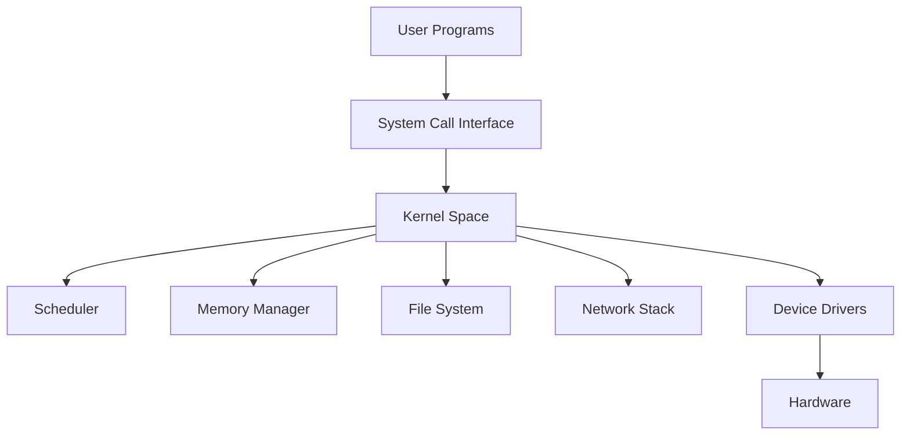


운영체제의 커널(Kernel)은 하드웨어와 소프트웨어 사이에서 자원 관리의 중심 역할을 수행하는 핵심 계층이다. CPU 스케줄링, 메모리 할당, 파일 시스템, 네트워크 스택, 디바이스 제어 같은 기능은 대부분 커널 내부에서 동작한다. 사용자 프로그램은 직접 하드웨어를 제어하지 않고 커널이 제공하는 인터페이스를 통해 간접적으로 접근한다.

커널 설계 방식은 크게 모놀리식 커널(기능을 하나의 커널 공간에 통합), 마이크로커널(핵심 최소 기능만 커널에 두고 나머지는 사용자 공간 서비스로 분리), 하이브리드 커널(둘의 절충)로 나뉜다. Linux는 모놀리식 기반에 모듈화를 적극 도입한 형태이고, Windows NT 계열은 하이브리드 성격이 강하다.

모놀리식 커널은 파일시스템, 네트워크 드라이버, 프로세스 관리 등 모든 서비스가 하나의 주소 공간에서 실행되므로, 서비스 간 함수 호출이 직접적이라 오버헤드가 낮다. 반면 드라이버 버그 하나가 커널 전체를 크래시시킬 수 있는 위험이 있다. Linux는 이 문제를 완화하기 위해 LKM(Loadable Kernel Module) 방식으로 모듈을 동적으로 적재/해제할 수 있게 했다. `insmod`, `rmmod`, `modprobe` 명령으로 런타임에 기능을 추가/제거할 수 있어 모놀리식의 성능 이점을 유지하면서 유연성을 확보한다.

마이크로커널(Mach, MINIX, QNX 등)은 IPC(프로세스 간 통신), 기본 스케줄링, 메모리 관리만 커널에 두고, 파일 시스템과 디바이스 드라이버를 사용자 공간 서버로 분리한다. 격리성이 뛰어나 하나의 서비스 장애가 전체 시스템을 망가뜨리지 않지만, 서비스 간 IPC(메시지 패싱) 오버헤드가 성능 병목이 된다. 실시간 시스템(QNX)이나 고신뢰 환경에서 주로 선택된다.

하이브리드 커널은 두 접근법을 절충한다. Windows NT는 커널 모드에 Executive(메모리 관리자, I/O 관리자, 객체 관리자 등)를 포함시키면서도 서브시스템(Win32, POSIX)은 사용자 공간에서 실행한다. macOS의 XNU도 Mach 마이크로커널 위에 BSD 계층을 커널 공간에 통합한 하이브리드 구조다.

### User Mode vs Kernel Mode

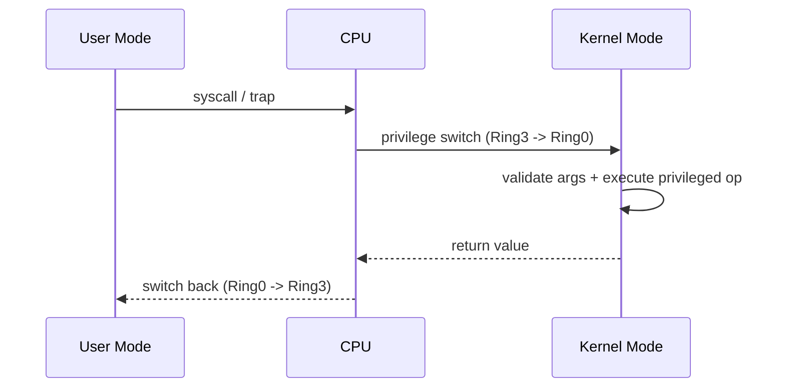


CPU는 보호 모드에서 권한 수준을 구분한다. 일반 애플리케이션은 User Mode(비특권 모드)에서 실행되고, 커널 코드는 Kernel Mode(특권 모드)에서 실행된다. User Mode에서는 I/O 포트 접근, 페이지 테이블 직접 수정, 인터럽트 제어와 같은 민감 연산이 금지된다.

이 분리는 안정성과 보안을 위한 핵심 장치다. 사용자 코드 버그가 전체 시스템을 즉시 망가뜨리지 않도록 격리하고, 커널이 모든 민감 자원 접근을 중재한다. 권한 전환은 시스템 콜 또는 인터럽트/예외 트랩을 통해 발생한다.

x86 아키텍처에서는 Ring 0(커널)부터 Ring 3(사용자)까지 4단계 보호 링을 제공하지만, 대부분의 OS는 Ring 0(Kernel Mode)과 Ring 3(User Mode)만 사용한다. ARM에서는 EL0(유저)/EL1(커널)/EL2(하이퍼바이저)/EL3(보안 모니터)로 구분된다.

모드 전환 비용은 무시할 수 없다. User → Kernel 전환 시 CPU 레지스터 저장, 커널 스택 설정, TLB 플러시(KPTI 환경), 보안 검증이 수행된다. Spectre/Meltdown 대응으로 KPTI(Kernel Page Table Isolation)가 도입되면서 커널/사용자 페이지 테이블을 분리해 전환 비용이 더 증가했다. 이는 시스템 콜 집약적 워크로드에서 체감 성능 저하로 이어질 수 있다.

`vDSO`(virtual Dynamic Shared Object)는 이런 전환 비용을 줄이기 위한 최적화다. `gettimeofday` 같은 읽기 전용 커널 데이터 접근은 실제 모드 전환 없이 사용자 공간에 매핑된 커널 데이터를 직접 읽어 성능을 높인다.

### System Call

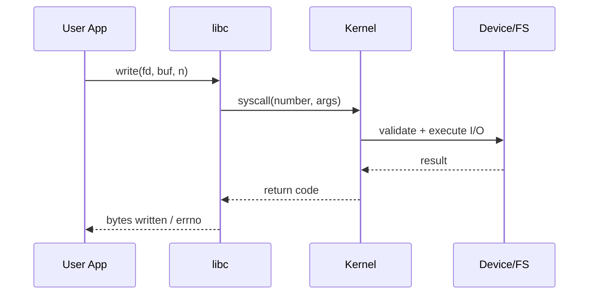


시스템 콜은 사용자 프로그램이 커널 기능을 요청하는 표준 진입점이다. 파일 열기(`open`), 읽기/쓰기(`read`, `write`), 프로세스 생성(`fork`), 소켓 통신(`socket`) 등이 대표적이다. 시스템 콜 호출 시 사용자 공간에서 커널 공간으로 컨텍스트가 전환되며, 이 전환 비용은 성능 최적화에서 중요한 고려사항이다.

시스템 콜의 내부 동작 과정:
1. 사용자 프로그램이 libc 래퍼 함수를 호출한다 (예: `write()`)
2. 래퍼는 시스템 콜 번호를 레지스터에 설정하고 `syscall` 명령(x86-64) 또는 `svc` 명령(ARM)을 실행한다
3. CPU가 Kernel Mode로 전환하고, 시스템 콜 테이블에서 해당 번호의 핸들러를 찾아 실행한다
4. 핸들러가 작업을 완료하면 결과를 레지스터에 담고 `sysret`/`eret`으로 User Mode에 복귀한다

Linux에서 시스템 콜 번호는 아키텍처별로 고정되어 있다. x86-64에서 `write`는 1번, `open`은 2번, `fork`는 57번이다. `strace` 도구를 사용하면 프로세스가 호출하는 모든 시스템 콜을 추적할 수 있어, 성능 병목이나 에러 원인 분석에 강력하다.

```c
// 개념 예시: 파일을 열고 읽는 전형적인 시스템 콜 흐름
int fd = open("data.txt", O_RDONLY);   // sys_open → 커널: 파일 탐색, inode 로드, fd 할당
ssize_t n = read(fd, buf, sizeof(buf)); // sys_read → 커널: 페이지 캐시 확인, 디스크 I/O, 버퍼 복사
close(fd);                              // sys_close → 커널: fd 테이블 정리, inode 참조 감소
```

시스템 콜 최적화 기법으로는 `io_uring`(Linux 5.1+)이 주목받는다. 커널과 사용자 공간이 공유하는 링 버퍼를 통해 배치 I/O를 수행하므로, 시스템 콜 횟수를 크게 줄이고 비동기 I/O 성능을 극대화한다. 기존 `epoll` + `read`/`write` 조합 대비 고부하 환경에서 현저한 성능 향상을 보여준다.

---

## 2. Process & Thread

### Process Control Block

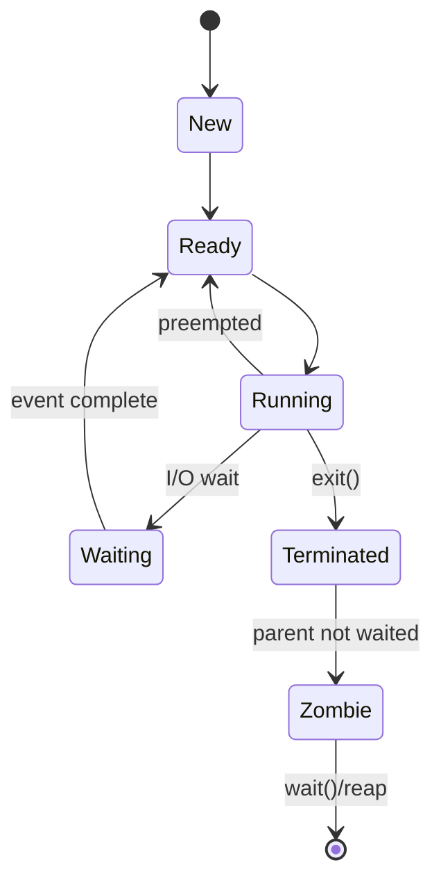


PCB(Process Control Block)는 프로세스의 메타데이터를 담는 커널 자료구조다. 프로세스 ID, 실행 상태, 레지스터 저장 영역, 메모리 매핑 정보, 열린 파일 디스크립터, 스케줄링 우선순위 등이 포함된다. 컨텍스트 스위칭 시 커널은 현재 실행 중인 프로세스의 CPU 상태를 PCB에 저장하고, 다음 프로세스의 PCB에서 상태를 복원한다.

Linux에서 PCB는 `task_struct` 구조체로 구현되며, 그 크기는 수 KB에 달한다. 주요 필드:
- **프로세스 식별**: `pid`, `tgid`(Thread Group ID), `ppid`(부모 PID), `uid`/`gid`(소유자/그룹)
- **실행 상태**: `TASK_RUNNING`, `TASK_INTERRUPTIBLE`(대기 중, 시그널 수신 가능), `TASK_UNINTERRUPTIBLE`(대기 중, 시그널 무시), `TASK_STOPPED`, `TASK_ZOMBIE`
- **CPU 상태**: 범용 레지스터, 프로그램 카운터(IP), 스택 포인터(SP), 플래그 레지스터, FPU/SIMD 레지스터
- **메모리 관리**: `mm_struct` 포인터(VMA 목록, 페이지 테이블 루트 `pgd`)
- **파일 시스템**: `files_struct`(열린 파일 디스크립터 테이블), `fs_struct`(현재/루트 디렉터리)
- **스케줄링**: 우선순위(`prio`, `static_prio`, `normal_prio`), `vruntime`(CFS), 스케줄링 정책
- **시그널**: 대기 시그널 마스크, 핸들러 테이블

프로세스 상태 전이: `New → Ready → Running → (Waiting/Blocked) → Ready → Running → Terminated`. `Zombie` 상태는 프로세스가 종료되었지만 부모가 아직 `wait()`으로 종료 상태를 수거하지 않은 상태로, `task_struct`가 남아 PID를 점유한다. 대량 좀비 누적은 PID 고갈로 이어질 수 있으므로, 부모 프로세스는 반드시 자식의 종료를 처리해야 한다. 부모가 먼저 종료되면 `init`(PID 1)이 고아 프로세스를 입양해 좀비를 수거한다.

### Context Switching

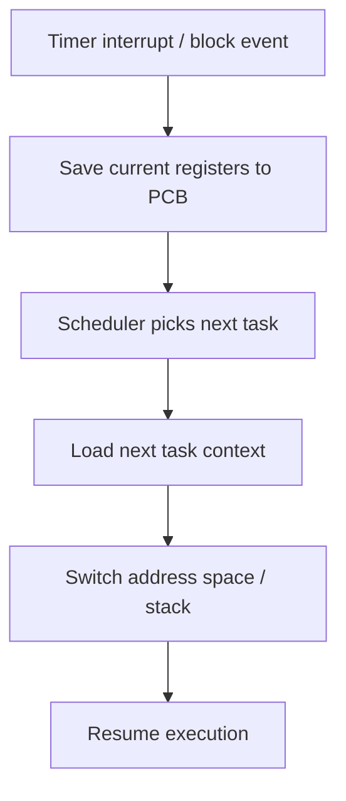


컨텍스트 스위칭은 CPU가 한 실행 흐름(프로세스/스레드)에서 다른 실행 흐름으로 전환되는 과정이다. 레지스터 저장/복원, 스케줄러 결정, 메모리 문맥 전환(TLB/캐시 영향)이 수반되며 순수 계산 작업이 아닌 오버헤드로 작용한다. 따라서 스위칭 빈도를 줄이고 locality를 살리는 것이 시스템 성능에 유리하다.

컨텍스트 스위칭의 세부 단계:
1. **현재 프로세스 상태 저장**: 범용 레지스터, PC, SP, 플래그, FPU/SIMD 상태를 PCB(또는 커널 스택)에 저장
2. **스케줄러 실행**: 런큐에서 다음 실행할 태스크를 선택 (CFS: vruntime 최소 노드)
3. **메모리 컨텍스트 전환**: `cr3`(x86) 레지스터에 새 프로세스의 페이지 테이블 주소 적재. 이때 TLB가 플러시되어 이후 메모리 접근 시 TLB miss가 증가
4. **새 프로세스 상태 복원**: PCB에서 레지스터 값을 CPU에 로드하고 실행 재개

직접 비용(레지스터 저장/복원)은 수 μs 수준이지만, 간접 비용이 훨씬 크다:
- **TLB 플러시**: 프로세스 간 전환 시 TLB 엔트리가 무효화되어 이후 접근마다 페이지 테이블 워크가 발생. PCID(Process Context ID) 지원 시 TLB 엔트리에 태그를 붙여 플러시를 최소화할 수 있다
- **캐시 오염(Cache Pollution)**: 새 프로세스의 워킹셋이 기존 캐시를 밀어내 cold start가 발생
- **파이프라인 플러시**: 분기 예측 히스토리, 프리페치 큐가 초기화

스레드 간 컨텍스트 스위칭은 같은 주소 공간을 공유하므로 `cr3` 전환과 TLB 플러시가 불필요해 프로세스 간 전환보다 비용이 낮다. `vmstat`, `pidstat -w`, `perf sched` 도구로 컨텍스트 스위칭 빈도를 모니터링할 수 있다. `voluntary`(자발적: I/O 대기 등)와 `involuntary`(비자발적: 타임슬라이스 만료) 스위칭을 구분해 분석하면 병목 원인을 더 정확히 파악할 수 있다.

### Multi-threading

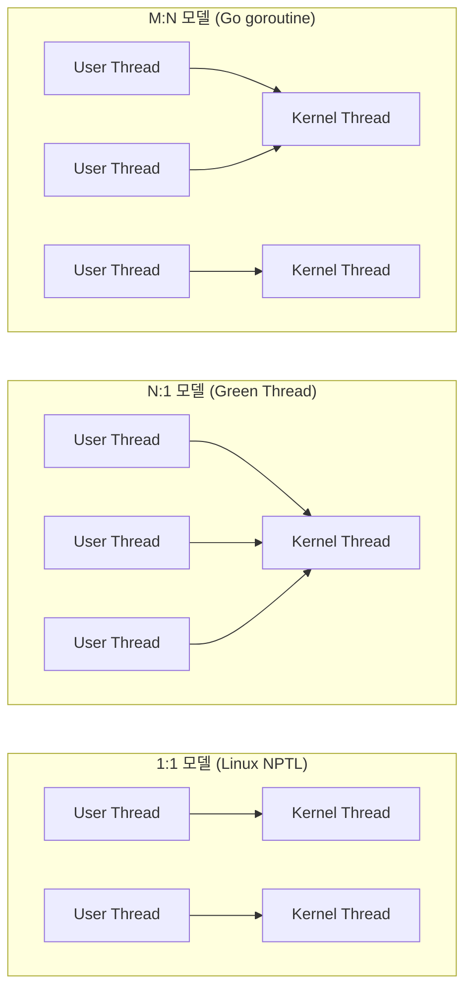


멀티스레딩은 하나의 프로세스 주소 공간을 공유하는 여러 실행 단위를 병렬(또는 동시)로 운용하는 모델이다. 스레드 간 데이터 공유가 쉬워 협업 작업에 유리하지만, 공유 자원 경쟁과 동기화 복잡성이 커진다. CPU 코어 수가 늘수록 병렬 처리 이점이 커지지만, 락 경합이 심하면 오히려 성능이 저하될 수 있다.

스레드 모델은 구현 수준에 따라 세 가지로 나뉜다:
- **1:1 모델** (커널 레벨 스레드): 사용자 스레드 하나가 커널 스레드 하나에 직접 매핑. Linux NPTL이 이 방식이다. 커널이 각 스레드를 개별 스케줄링하므로 멀티코어 활용이 자연스럽지만, 스레드 생성/전환에 커널 개입이 필요
- **N:1 모델** (유저 레벨 스레드): 여러 사용자 스레드가 하나의 커널 스레드에 매핑. 전환이 빠르지만 하나의 스레드가 블로킹 시스콜을 하면 전체가 멈추고, 멀티코어 활용 불가
- **M:N 모델** (하이브리드): M개 사용자 스레드를 N개 커널 스레드에 매핑. Go의 goroutine(G-M-P 모델)이 대표적이다. 유저 레벨 스케줄러가 goroutine을 OS 스레드에 분배하고, 블로킹 콜 시 다른 goroutine으로 전환해 코어 활용률을 높인다

Amdahl's Law는 병렬화의 한계를 표현한다: 프로그램에서 직렬 실행이 필요한 비율이 `s`이면, 코어 수를 아무리 늘려도 최대 속도 향상은 `1/s`다. 직렬 구간이 5%면 최대 20배가 한계다. 이는 멀티스레딩 설계 시 직렬 병목(락 경합, 순차 의존성) 최소화가 핵심임을 보여준다.

False sharing 문제도 주의해야 한다. 서로 다른 스레드가 같은 캐시 라인에 있는 서로 다른 변수를 수정하면, 논리적으로 공유하지 않음에도 캐시 라인 무효화(cache line bouncing)가 발생해 성능이 급락한다. 패딩이나 `alignas(64)` 같은 캐시 라인 정렬 기법으로 방지한다.

### Thread vs Process

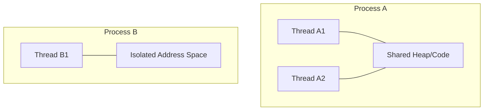


프로세스는 주소 공간이 분리되어 격리가 강하지만 생성/전환 비용이 상대적으로 크다. 스레드는 같은 주소 공간을 공유하므로 생성과 통신 비용이 낮지만 메모리 안전성 측면에서 사고 반경이 넓다. 실무에서는 장애 격리가 중요한 경계(서비스 단위)는 프로세스로 분리하고, 내부 병렬 처리(워크풀)는 스레드로 구성하는 전략을 자주 사용한다.

| 비교 항목 | Process | Thread |
|-----------|---------|--------|
| 주소 공간 | 독립 (격리) | 공유 (코드, 데이터, 힙) |
| 생성 비용 | 높음 (`fork` → COW 최적화) | 낮음 (`pthread_create`) |
| 통신 | IPC 필요 (pipe, socket, shm) | 공유 메모리 직접 접근 |
| 컨텍스트 스위칭 | 비쌈 (TLB flush, cr3 전환) | 상대적 저렴 |
| 장애 격리 | 강함 (한 프로세스 크래시 무관) | 약함 (한 스레드 오류가 전체 영향) |

`fork()`는 부모 프로세스를 복제하지만, 현대 OS는 Copy-on-Write(COW) 최적화를 적용한다. `fork()` 직후에는 부모/자식이 같은 물리 페이지를 공유하고, 둘 중 하나가 쓰기를 시도할 때만 해당 페이지를 복사한다. `fork()` 후 곧바로 `exec()`을 호출하는 패턴에서는 `vfork()`나 `posix_spawn()`이 더 효율적이다.

IPC(Inter-Process Communication) 메커니즘:
- **Pipe/Named Pipe**: 단방향 바이트 스트림. 부모-자식 간 통신에 주로 사용
- **Message Queue**: 구조화된 메시지 교환. 커널이 큐를 관리
- **Shared Memory**: 가장 빠른 IPC. 동기화는 세마포어/뮤텍스로 별도 처리 필요
- **Socket**: 네트워크 투명성을 제공. 로컬(Unix Domain Socket)도 가능
- **Memory-Mapped File**: `mmap`으로 파일을 메모리에 매핑해 프로세스 간 공유

---

## 3. Scheduling

### FCFS

```mermaid
gantt
  title FCFS Example
  dateFormat  X
  axisFormat %L
  section CPU
  P1 :a1, 0, 24
  P2 :a2, 24, 3
  P3 :a3, 27, 3
```


FCFS(First-Come, First-Served)는 도착 순서대로 CPU를 할당한다. 구현이 단순하고 예측 가능하지만, 긴 작업이 앞에 오면 짧은 작업들이 오래 대기하는 Convoy 효과가 발생한다. 인터랙티브 시스템에서는 응답성이 떨어질 수 있다.

FCFS는 비선점형(Non-preemptive) 스케줄링이다. 한번 CPU를 할당받으면 작업이 완료되거나 I/O 대기에 들어갈 때까지 CPU를 유지한다.

```text
예시: 작업 도착 순서 P1(24ms), P2(3ms), P3(3ms)
FCFS: P1(0~24) → P2(24~27) → P3(27~30)
평균 대기 시간: (0 + 24 + 27) / 3 = 17ms

SJF로 실행 시: P2(0~3) → P3(3~6) → P1(6~30)
평균 대기 시간: (0 + 3 + 6) / 3 = 3ms
```

Convoy 효과의 실무 영향: 배치 처리 시스템에서 대용량 ETL 작업이 큐에 먼저 들어오면, 이후 실시간 성격의 작은 작업들이 전부 밀린다. 이를 방지하려면 최소한 우선순위 분리 또는 선점형 스케줄링이 필요하다.

### SJF

```mermaid
gantt
  title SJF Example
  dateFormat  X
  axisFormat %L
  section CPU
  P2 :b1, 0, 3
  P3 :b2, 3, 3
  P1 :b3, 6, 24
```


SJF(Shortest Job First)는 실행 시간이 짧은 작업을 먼저 선택해 평균 대기 시간을 줄인다. 이론적으로 평균 대기 시간 최적에 가깝지만, 실제로는 작업 길이를 정확히 예측하기 어렵다. 긴 작업이 계속 밀릴 수 있어 starvation 가능성도 있다.

SJF의 수학적 최적성은 증명 가능하다. 비선점형 스케줄링 시 평균 대기 시간을 최소화하는 최적 전략이 바로 SJF다. 실행 시간 예측은 보통 과거 CPU burst 기록을 이용한 지수 평균(Exponential Averaging)으로 수행한다:

$$\tau_{n+1} = \alpha \cdot t_n + (1-\alpha) \cdot \tau_n$$

여기서 $t_n$은 실제 n번째 burst 시간, $\tau_n$은 예측값, $\alpha$는 가중치(0~1)다. $\alpha$가 크면 최근 값에, 작으면 과거 히스토리에 더 비중을 둔다.

선점형 변형인 SRTF(Shortest Remaining Time First)는 새 작업이 도착할 때마다 잔여 시간이 가장 짧은 작업으로 전환한다. 평균 대기 시간을 더 줄이지만 컨텍스트 스위칭 빈도가 증가하고, 긴 작업의 starvation이 더 심해질 수 있다.

### Round Robin

```mermaid
gantt
  title Round Robin (q=4)
  dateFormat  X
  axisFormat %L
  section CPU
  P1 :c1, 0, 4
  P2 :c2, 4, 4
  P3 :c3, 8, 4
  P1 :c4, 12, 4
  P2 :c5, 16, 2
  P3 :c6, 18, 1
```


Round Robin은 고정된 시간 할당량(quantum)만큼 번갈아 실행한다. 시분할 환경에서 공정성과 응답성을 확보하기 좋다. 단, quantum이 너무 짧으면 컨텍스트 스위칭 오버헤드가 커지고, 너무 길면 FCFS처럼 동작해 대화형 응답성이 떨어진다.

quantum 크기 결정은 시스템 설계의 핵심 파라미터다:
- **일반적 기준**: quantum은 컨텍스트 스위칭 비용의 최소 10배 이상이어야 한다
- **대화형 시스템**: 10~100ms 범위 (사용자 체감 응답 200ms 이내 유지)
- **배치 시스템**: 100ms~1s 이상 (처리량 우선)

RR의 응답 시간(Response Time) 특성은 양호하지만, 처리량(Turnaround Time)은 SJF보다 불리한 경우가 많다.

MLFQ(Multi-Level Feedback Queue)는 RR을 확장한 실전 스케줄링이다. 여러 우선순위 큐를 두고 각 큐마다 다른 quantum 크기를 적용한다. 높은 우선순위 큐(짧은 quantum)에서 시작하고, 타임슬라이스를 소진하면 낮은 우선순위 큐(긴 quantum)로 내려간다. I/O-bound 작업(짧은 burst)은 높은 우선순위를 유지하고, CPU-bound 작업은 자연스럽게 낮은 우선순위로 이동해 공정성과 응답성을 동시에 확보한다. 주기적으로 모든 작업을 최상위 큐로 boost해 starvation을 방지하는 기법도 적용한다.

### Priority Scheduling

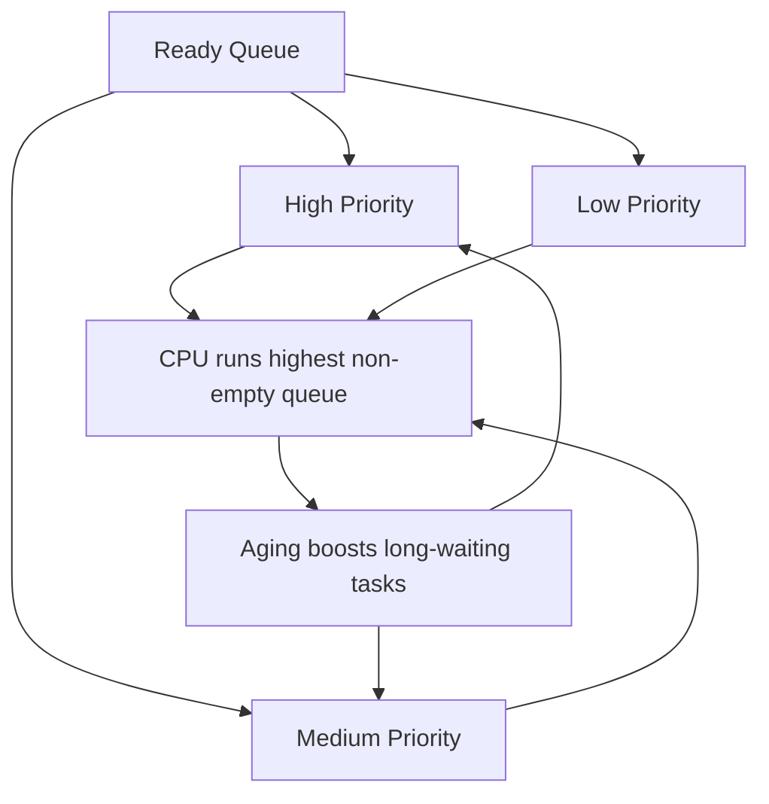


우선순위 기반 스케줄링은 높은 우선순위 작업을 먼저 실행한다. 실시간 성격의 태스크를 빠르게 처리하기 유리하지만, 낮은 우선순위 작업 기아가 생길 수 있다. 이를 완화하기 위해 대기 시간이 길수록 우선순위를 올려주는 aging 기법을 적용한다.

우선순위는 정적(static) 또는 동적(dynamic)으로 설정된다:
- **정적 우선순위**: 프로세스 생성 시 결정되며 변경 불가. 실시간 태스크(SCHED_FIFO, SCHED_RR)에서 사용
- **동적 우선순위**: 실행 상태/대기 시간에 따라 런타임에 조정. CFS의 vruntime 기반 우선순위가 대표적

Priority Inversion(우선순위 역전) 문제: 낮은 우선순위 태스크가 자원(락)을 보유한 상태에서, 중간 우선순위 태스크가 CPU를 선점하면, 높은 우선순위 태스크가 간접적으로 차단된다. 1997년 Mars Pathfinder 탐사선에서 실제 발생해 시스템 리셋이 반복된 사례가 유명하다. 해결책:
- **Priority Inheritance**: 락을 보유한 저우선순위 태스크의 우선순위를 대기 중인 고우선순위 수준으로 일시 상승
- **Priority Ceiling**: 락에 최대 우선순위를 미리 부여

Linux에서 `nice` 값(-20~19)은 일반 태스크 우선순위를 조정한다. 실시간 태스크는 `chrt` 명령이나 `sched_setscheduler()`로 SCHED_FIFO/SCHED_RR 정책과 우선순위(1~99)를 설정하며, 항상 일반(SCHED_NORMAL) 태스크보다 먼저 스케줄링된다.

### CFS (Completely Fair Scheduler)

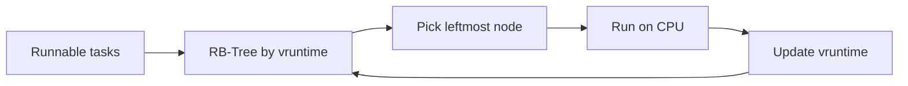


Linux의 CFS는 가상 실행 시간(vruntime)을 기준으로 "가장 덜 실행된" 태스크를 선택해 공정성을 추구한다. Red-Black Tree로 런큐를 관리하여 삽입/삭제/선택의 균형을 유지한다. 단순한 고정 우선순위보다 일반 목적 워크로드에서 일관된 체감 성능을 제공한다.

CFS의 핵심 개념:
- **vruntime**: 태스크가 소비한 가중 CPU 시간. `vruntime += 실제시간 × (NICE_0_LOAD / 태스크_weight)`로 계산. nice 값이 낮은(고우선순위) 태스크는 weight가 크므로 vruntime이 느리게 증가
- **Ideal fair scheduling 근사**: CFS는 "모든 태스크가 동시에 1/N의 CPU를 사용"하는 이상적 상태를 근사한다
- **Scheduling Period**: 태스크 수(N)가 적으면 각 태스크에 더 긴 시간을 할당하고, 많으면 최소 granularity(보통 1ms)를 보장

Red-Black Tree 운용: CFS 런큐는 vruntime을 키로 하는 RB-Tree로 관리된다. 가장 왼쪽 노드(최소 vruntime)가 다음 실행 태스크다. 이 노드는 `rb_leftmost` 포인터로 캐싱되어 O(1)에 접근 가능하다. 삽입/삭제는 O(log N)이다.

CFS의 nice 가중치 체계: nice 0의 weight는 1024이고, nice 1 차이마다 weight가 약 1.25배 변한다. 이는 "nice 1 차이 ≈ CPU 시간 약 10% 차이"를 의미하도록 설계되었다.

Linux 6.6부터는 EEVDF(Earliest Eligible Virtual Deadline First)가 CFS를 대체하기 시작했다. EEVDF는 각 태스크에 가상 데드라인을 부여해 지연(latency)에 더 민감한 스케줄링을 제공하며, CFS에서 발생하던 인터랙티브 태스크의 불공정 문제를 개선한다.

---

## 4. Memory Management

### Paging

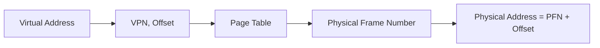

페이징은 가상 주소 공간과 물리 메모리를 고정 크기 블록(페이지/프레임)으로 분할해 매핑한다. 외부 단편화를 줄이고, 가상 메모리 관리가 단순해진다. 대신 페이지 테이블 메모리 오버헤드와 주소 변환 비용이 발생한다.

가상 주소에서 물리 주소로의 변환 과정:
1. 가상 주소를 페이지 번호(VPN)와 오프셋으로 분리
2. 페이지 테이블에서 VPN에 대응하는 프레임 번호(PFN)를 조회
3. PFN + 오프셋 = 물리 주소

x86-64에서는 4단계 페이지 테이블(PML4 → PDPT → PD → PT)을 사용한다. 48비트 가상 주소를 9-9-9-9-12 비트로 분할해 각 레벨을 탐색한다.

```text
가상 주소(48비트):
[PML4 index(9)] [PDPT index(9)] [PD index(9)] [PT index(9)] [Offset(12)]
```

**내부 단편화**: 페이지 크기가 4KB일 때, 5KB 데이터는 2페이지를 사용하므로 3KB가 낭비된다. 페이지 크기가 클수록 내부 단편화가 커지지만 페이지 테이블 엔트리 수는 줄어든다.

**Huge Page**: 기본 4KB 외에 2MB 또는 1GB 대형 페이지를 사용할 수 있다. TLB 엔트리 하나가 더 넓은 영역을 커버하므로 TLB miss가 감소한다. 데이터베이스나 JVM 힙에서 Huge Page 설정이 성능에 큰 영향을 준다. Linux의 Transparent Huge Pages(THP)는 자동으로 대형 페이지를 적용하지만, 할당/해제 시 레이턴시 스파이크를 유발할 수 있어 Redis 같은 지연 민감 워크로드에서는 비활성화가 권장된다.

### Segmentation

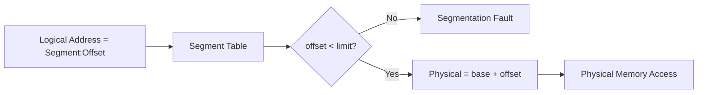


세그멘테이션은 코드/데이터/스택처럼 논리 단위로 메모리를 나눠 관리한다. 개발자 관점에서 의미 있는 경계를 반영하기 좋지만, 가변 크기 할당으로 외부 단편화가 생기기 쉽다. 현대 시스템은 주로 페이징 기반이며, 세그멘테이션 개념은 보호/권한 모델 설명에 자주 등장한다.

세그멘테이션에서 가상 주소는 `(세그먼트 번호, 오프셋)` 쌍으로 구성된다. Segment Table에서 세그먼트 번호로 base 주소와 limit(크기)를 조회한다. `오프셋 < limit` 검증 후 `base + 오프셋`으로 물리 주소를 계산한다. limit 초과 접근은 Segmentation Fault를 발생시킨다.

x86의 역사적 세그멘테이션: 초기 x86(리얼 모드)에서는 16비트 세그먼트 레지스터(CS, DS, SS, ES)로 메모리를 20비트까지 확장했다. 보호 모드에서는 GDT/LDT(Global/Local Descriptor Table)가 세그먼트별 권한(읽기/쓰기/실행), 특권 레벨(DPL), base/limit을 관리한다. x86-64에서는 세그멘테이션이 사실상 비활성화(flat model)되어 페이징만으로 메모리를 관리하지만, FS/GS 세그먼트는 TLS(Thread Local Storage) 등 특수 목적으로 여전히 사용된다.

### Virtual Memory

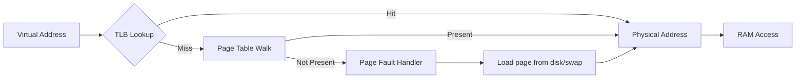


가상 메모리는 실제 RAM보다 큰 주소 공간을 프로세스에 제공한다. 사용 빈도가 낮은 페이지는 디스크(스왑)로 내리고 필요한 시점에 다시 로드한다(demand paging). 이로써 메모리 효율과 프로세스 격리가 향상되지만, 페이지 폴트가 과도하면 심각한 성능 저하(Thrashing)가 발생한다.

Demand Paging은 "필요할 때 적재"하는 전략이다. 프로세스가 처음 시작될 때 모든 페이지를 메모리에 올리지 않고, 접근이 발생하면 페이지 폴트를 통해 로드한다. 페이지 폴트 처리 과정:
1. CPU가 페이지 테이블에서 valid bit가 0인 엔트리를 발견 → 페이지 폴트 예외 발생
2. 커널이 폴트 원인을 판별: 유효한 접근인지(lazy allocation, 스왑 아웃) vs 무효 접근(segfault)
3. 유효한 경우: 빈 프레임 확보(없으면 페이지 교체), 디스크에서 로드, 페이지 테이블 갱신
4. 프로세스 재개 (폴트를 일으킨 명령어를 다시 실행)

**Thrashing**: 물리 메모리 부족으로 페이지 교체가 빈번하면, CPU 시간 대부분이 폴트 처리에 소비된다. CPU 사용률이 낮아지고 OS가 "CPU가 놀고 있다"고 판단해 프로세스를 더 적재하여 악순환이 발생한다.

Thrashing 대응:
- **Working Set Model**: 각 프로세스의 워킹셋 크기를 추적하고, 전체 합이 물리 메모리를 초과하면 일부 프로세스를 중단
- **PFF(Page Fault Frequency)**: 폴트 비율이 상한을 넘으면 프레임 추가 할당, 하한 아래면 프레임 회수
- **Linux OOM Killer**: 메모리가 극단적으로 부족하면 `oom_score`가 가장 높은 프로세스를 강제 종료

### Page Replacement

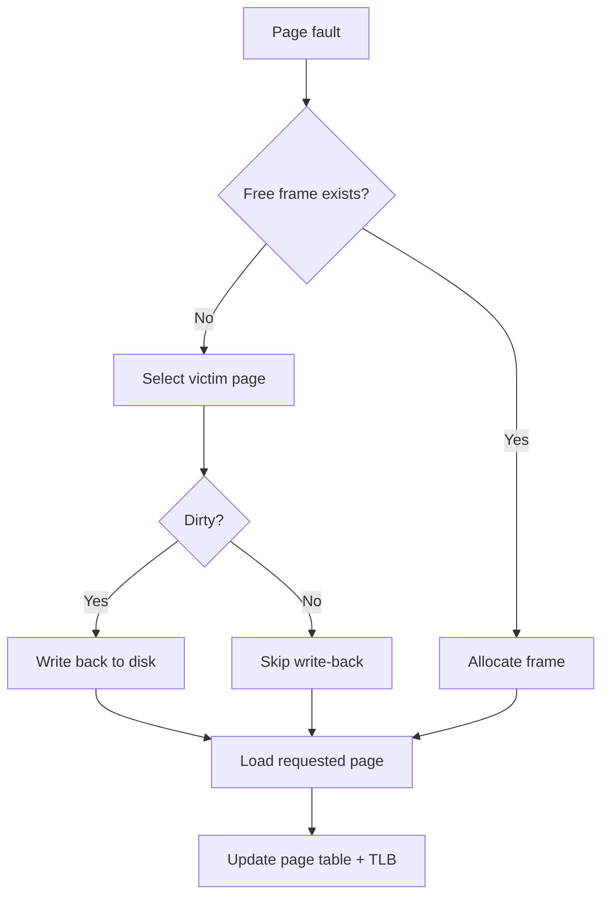


메모리가 가득 찼을 때 어떤 페이지를 내보낼지 결정하는 정책이다.

#### LRU
LRU(Least Recently Used)는 최근에 사용되지 않은 페이지를 교체한다. 시간 지역성(locality)을 잘 반영하지만, 정확한 LRU 구현은 비용이 커 근사 알고리즘(Clock 등)을 주로 사용한다.

정확한 LRU가 어려운 이유: 모든 메모리 접근마다 타임스탬프를 기록하는 것은 하드웨어 비용이 막대하다. 실제 OS에서는 근사 알고리즘을 사용한다:
- **Clock Algorithm (Second-Chance)**: 원형 큐 + 참조 비트(reference bit). 포인터가 가리키는 페이지의 참조 비트가 1이면 0으로 리셋하고 넘어가고, 0이면 교체 대상으로 선택
- **Enhanced Clock (NRU)**: 참조 비트 + 수정 비트(dirty bit) 조합. (참조=0, 수정=0)이 가장 먼저, (참조=1, 수정=1)이 가장 마지막에 교체

Linux의 페이지 교체: Active List와 Inactive List 두 개의 LRU 리스트를 운용한다. 새 페이지는 Inactive List에 삽입되고, 재참조되면 Active List로 승격된다. Active List가 가득 차면 가장 오래된 페이지가 Inactive List로 강등되고, Inactive List 끝의 페이지가 교체된다. 이 2단계 구조는 one-time access 패턴(풀 스캔 등)이 워킹셋을 밀어내는 것을 방지한다.

#### FIFO
FIFO(First In, First Out)는 가장 먼저 들어온 페이지를 내보낸다. 구현이 매우 단순하지만, 오래됐더라도 자주 쓰이는 페이지를 제거할 수 있어 비효율이 생긴다(Belady's anomaly 가능).

Belady's Anomaly: FIFO에서는 프레임 수를 늘려도 오히려 페이지 폴트가 증가하는 비직관적 현상이 발생할 수 있다. 이는 FIFO가 "스택 성질(stack property)"을 만족하지 않기 때문이다. LRU는 스택 성질을 만족하므로 이 anomaly가 발생하지 않는다.

**OPT(Optimal)**: 미래에 가장 오랫동안 사용되지 않을 페이지를 교체한다. 이론적 최적이지만 미래 접근 패턴을 알 수 없으므로 실제 구현 불가능하다. 다른 알고리즘의 성능 평가 벤치마크로 사용된다.

### TLB

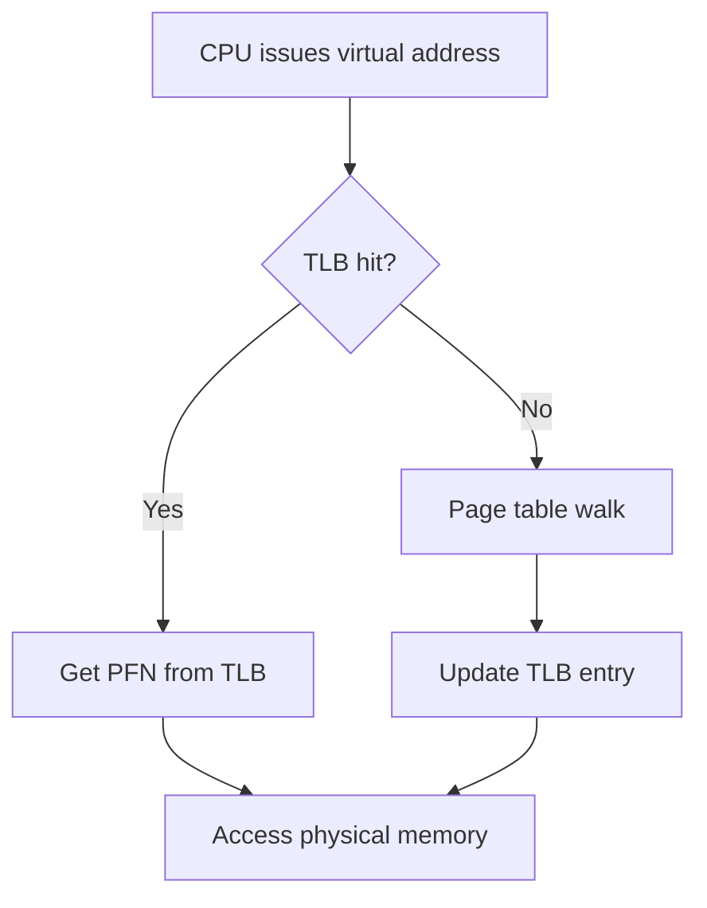


TLB(Translation Lookaside Buffer)는 페이지 테이블 변환 결과를 캐시하는 고속 하드웨어다. TLB hit 시 주소 변환이 매우 빠르고, miss 시 페이지 테이블 워크가 발생해 지연이 커진다. 성능 분석에서 TLB miss rate은 매우 중요한 지표다.

TLB 구조와 동작:
- **크기**: L1 dTLB 64\~128엔트리, L2 sTLB 512\~2048엔트리. 엔트리 수가 적으므로 fully-associative 또는 high-associative 방식
- **Hit latency**: 0~1 사이클 (파이프라인에서 병렬 처리)
- **Miss penalty**: 4단계 페이지 워크 = 4회 메모리 접근 → 수십~수백 사이클

TLB 관리 이슈:
- **TLB Flush**: 컨텍스트 스위칭 시 전체 플러시(비용 큼) 또는 PCID로 선택적 관리
- **TLB Shootdown**: 멀티코어에서 한 코어가 페이지 테이블을 변경하면, 다른 코어의 TLB에 캐시된 구 엔트리도 무효화해야 한다. IPI(Inter-Processor Interrupt)로 다른 코어에 삭제를 요청하며, 대규모 멀티코어 시스템에서 심각한 병목이 될 수 있다
- **ASID(Address Space ID, ARM)**: TLB 엔트리에 ASID 태그를 부여해 컨텍스트 스위칭 시 플러시 없이 엔트리를 구분

TLB 친화적 설계: Huge Page 사용(하나의 엔트리가 2MB~1GB 커버), 메모리 접근 패턴 최적화(순차 접근, 루프 타일링), 워킹셋을 TLB 커버리지 내로 유지하는 것이 중요하다.

---

## 5. Concurrency

### Race Condition

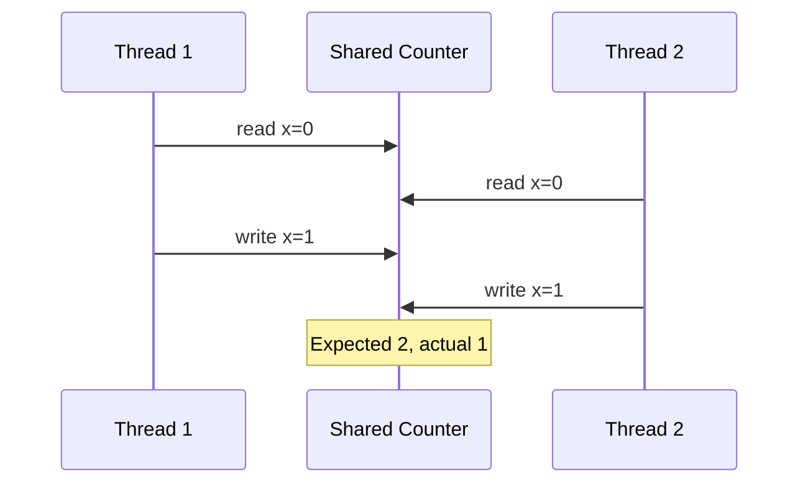


Race Condition은 여러 실행 흐름이 공유 상태를 동시 접근할 때, 실행 순서에 따라 결과가 달라지는 문제다. 테스트에서 재현이 어렵고 운영 환경에서 간헐적으로 나타나 디버깅 난도가 높다. 원자성 보장, 불변 구조 사용, 임계구역 최소화가 핵심 대응 전략이다.

Race Condition의 구체적 유형:
- **Check-then-Act**: 조건 확인과 행동 사이에 다른 스레드가 상태를 변경. 예: `if (map.containsKey(key)) map.get(key)` — 두 호출 사이에 키가 삭제 가능
- **Read-Modify-Write**: `count++`는 실제로 read → increment → write 3단계. 두 스레드가 동시에 같은 값을 읽어 각각 +1하면 결과는 +1 (Lost Update)
- **TOCTOU**: 파일 존재 확인 후 열기 사이에 다른 프로세스가 파일을 조작 가능. 보안 취약점으로 이어질 수 있다

```c
// Lost Update 예시 → 원자적 연산으로 해결
// 문제: 스레드 A, B가 동시에 counter=0을 읽어 각각 +1 → 결과 1 (기대: 2)
atomic_fetch_add(&counter, 1);  // 하드웨어 CAS 기반 원자적 증가
```

Memory Ordering 문제: 컴파일러 최적화(명령어 재배치)와 CPU의 out-of-order 실행으로, 기대하는 실행 순서와 실제 메모리 접근 순서가 다를 수 있다. Memory Barrier(fence)와 `std::atomic`(C++), `volatile`(Java) 같은 메커니즘으로 순서를 강제해야 한다.

### Mutex

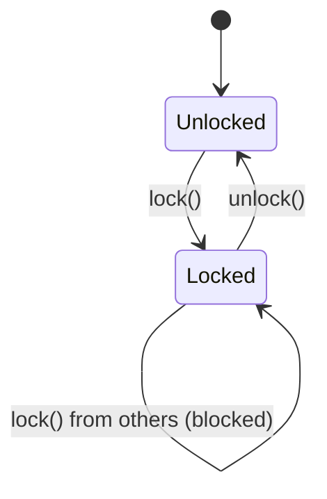


Mutex는 상호 배제를 제공해 한 시점에 하나의 스레드만 임계구역에 들어가게 한다. 사용이 직관적이지만 락 범위가 넓으면 병렬성이 감소한다. 락 획득/해제 순서 규칙을 정하지 않으면 데드락 위험이 커진다.

Mutex 구현 내부:
- **Futex (Linux)**: 비경합 경로에서는 사용자 공간 CAS만으로 처리하고, 경합 시에만 `futex()` 시스템 콜로 커널에 대기/깨움을 요청. 대부분의 락 획득이 비경합 상태이므로 시스콜 횟수가 크게 줄어든다
- **Adaptive Mutex**: 경합 시 짧은 스핀 후 슬립으로 전환. 락 보유자가 다른 CPU에서 실행 중이면 곧 해제될 가능성이 높으므로 스핀이 유리

```c
pthread_mutex_t lock = PTHREAD_MUTEX_INITIALIZER;
pthread_mutex_lock(&lock);    // 획득 (블로킹)
shared_count++;               // 임계구역
pthread_mutex_unlock(&lock);  // 해제

// trylock: 비블로킹 시도
if (pthread_mutex_trylock(&lock) == 0) {
    // 성공 → 임계구역
    pthread_mutex_unlock(&lock);
}
```

Recursive Mutex는 같은 스레드가 동일 뮤텍스를 여러 번 획득 가능(내부 카운터 관리). 재귀 함수에서 데드락을 방지하지만, 설계 결함을 숨길 수 있어 가급적 사용을 피하는 것이 권장된다.

### Semaphore

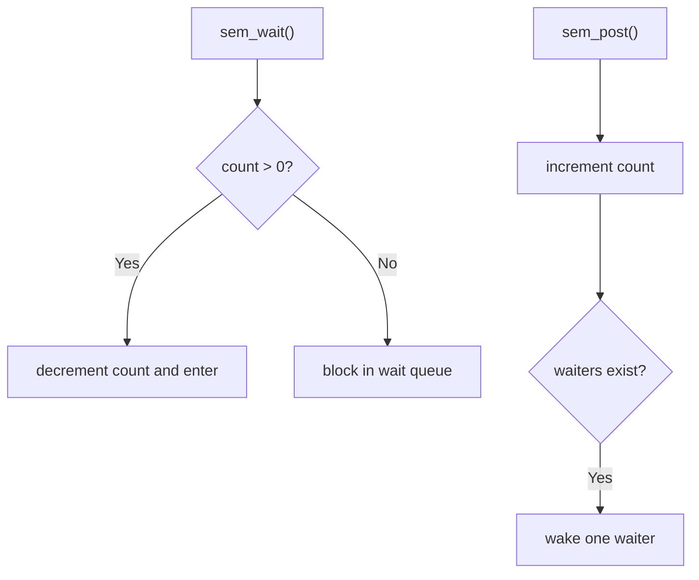


세마포어는 정수 카운터 기반 동기화 도구로, 동시에 접근 가능한 자원 수를 제어할 때 유용하다. binary semaphore는 mutex와 유사하게 쓸 수 있고, counting semaphore는 풀(pool) 자원 제한에 적합하다.

세마포어의 핵심 연산 (Dijkstra 정의):
- **P(wait/down)**: 카운터 > 0이면 1 감소하고 진행. 0이면 양수가 될 때까지 대기
- **V(signal/up)**: 카운터를 1 증가시키고, 대기 중인 스레드가 있으면 하나를 깨움

세마포어 vs 뮤텍스 핵심 차이:
- **소유권**: 뮤텍스는 획득한 스레드만 해제 가능. 세마포어는 다른 스레드가 signal 가능
- **시그널링**: 세마포어는 스레드 간 이벤트 통지에 사용 가능 (생산자가 signal, 소비자가 wait)
- **우선순위 상속**: 뮤텍스는 Priority Inheritance를 지원할 수 있지만, 세마포어는 소유 개념이 없어 지원이 어렵다

```c
// Counting Semaphore로 커넥션 풀 제한 (최대 10개)
sem_t pool;
sem_init(&pool, 0, 10);

void get_connection() {
    sem_wait(&pool);     // 카운터 감소. 0이면 대기 (풀 고갈)
    // 커넥션 사용
}
void release_connection() {
    sem_post(&pool);     // 카운터 증가. 대기 스레드 깨움
}
```

### Monitor

```mermaid
flowchart TD
  ENTER["thread enters monitor"] --> LOCK["implicit mutual-exclusion lock"]
  LOCK --> CS["execute critical section"]
  CS --> WAIT{"condition met?"}
  WAIT -->|No| CVWAIT["wait and release lock"]
  CVWAIT --> WAKE["notify waiting thread"]
  WAKE --> LOCK
  WAIT -->|Yes| EXIT["leave monitor"]
```


모니터는 락과 조건 변수를 추상화한 고수준 동기화 모델이다. 공유 상태 접근을 특정 모니터 내부 메서드로 제한해 안전성을 높인다. Java의 `synchronized` + `wait/notify` 조합이 전형적인 모니터 패턴이다.

모니터의 두 가지 시맨틱:
- **Hoare Monitor**: signal 호출 시 즉시 대기 스레드에 제어를 넘긴다. 깨어난 스레드는 조건이 반드시 참인 상태에서 실행 재개. 구현이 복잡
- **Mesa Monitor**: signal은 대기 스레드를 ready 상태로 옮기기만 한다. 실행 재개 시 다른 스레드가 조건을 변경할 수 있으므로, `while` 루프로 조건 재확인 필수. Java, POSIX의 표준 방식

```java
// Java Monitor 패턴 - Mesa 시맨틱
class BoundedBuffer<T> {
    private final Queue<T> queue = new LinkedList<>();
    private final int capacity;
    synchronized void put(T item) throws InterruptedException {
        while (queue.size() == capacity) wait(); // while 필수: spurious wakeup 대비
        queue.add(item);
        notifyAll();
    }
    synchronized T take() throws InterruptedException {
        while (queue.isEmpty()) wait();
        T item = queue.remove();
        notifyAll();
        return item;
    }
}
```

**Spurious Wakeup**: OS 구현 특성상 signal/notify 없이도 wait에서 깨어날 수 있다. 따라서 조건 확인은 반드시 `while` 루프로 감싸야 한다.

### Deadlock

```mermaid
graph LR
  P1((P1)) -->|holds| R1["R1 lock"]
  R1 -->|requested by| P2((P2))
  P2 -->|holds| R2["R2 lock"]
  R2 -->|requested by| P1
```


데드락은 서로가 상대 자원을 기다리며 영원히 진행하지 못하는 상태다. 예방(조건 제거), 회피(안전 상태 유지), 탐지/복구 전략으로 대응한다.

#### Coffman Condition
데드락이 발생하려면 보통 다음 4가지 조건이 동시에 성립한다: 상호 배제, 점유 대기, 비선점, 순환 대기. 따라서 실무에서는 자원 획득 순서를 전역 규칙으로 고정해 순환 대기를 깨는 방식이 가장 흔하다.

각 조건의 해제 전략:
- **상호 배제 제거**: 자원을 공유 가능하게 만든다 (예: read-only). 본질적으로 배타적 자원에는 적용 불가
- **점유 대기 제거**: 필요한 모든 자원을 한 번에 요청 (all-or-nothing). 자원 활용률 저하, starvation 가능
- **비선점 제거**: 자원을 강제로 빼앗기 허용. CPU에는 적합하나 프린터/파일에는 부적합
- **순환 대기 제거**: 자원에 전역 순서를 부여하고 항상 오름차순으로만 획득. 가장 실용적

**Banker's Algorithm (회피)**: 자원 요청 시 "안전 상태(safe state)"를 유지하는지 확인하고, 안전하다면 할당, 아니면 대기시킨다.

**탐지/복구**: 자원 할당 그래프에서 사이클이 존재하면 데드락. 비용이 가장 적은 트랜잭션/프로세스를 롤백해 해소한다. DB 시스템은 wait-for graph를 주기적으로 검사한다.

**Livelock**: 데드락과 달리 프로세스들이 상태를 계속 변경하지만 유용한 진전이 없는 상태. 랜덤 백오프로 완화 가능.

---

## 6. File System

### Inode

```mermaid
flowchart LR
  PATH["/home/user/a.txt"] --> DIR["Directory Entry<br/>name → inode#"]
  DIR --> INO["inode #12345"]
  INO --> META["metadata<br/>mode / uid / size / timestamps"]
  INO --> PTR["data block pointers"]
  PTR --> D1[(Block 1)]
  PTR --> D2[(Block 2)]
  PTR --> D3[(Block N)]
```


inode는 파일의 메타데이터(권한, 소유자, 크기, 타임스탬프, 데이터 블록 포인터 등)를 저장하는 구조다. 파일명은 디렉터리 엔트리에 있고, inode는 실제 데이터 위치를 가리킨다. 하드링크는 같은 inode를 여러 이름으로 참조하는 메커니즘이다.

inode의 상세 구조 (ext4 기준):
- **메타데이터**: 파일 타입(일반/디렉터리/심볼릭링크/소켓), 권한(rwx), uid/gid, 크기, 링크 카운트
- **타임스탬프**: atime(최근 접근), mtime(최근 수정), ctime(메타데이터 변경), crtime(생성 시간)
- **데이터 블록 포인터** (전통적 방식):
  - 직접 포인터 12개: 각각 하나의 데이터 블록을 가리킴
  - 단일 간접: 포인터 블록을 거쳐 데이터 블록으로 (4KB/4B = 1024개 추가 블록)
  - 이중 간접: 두 단계 포인터 (1024² ≈ 1M 추가 블록)
  - 삼중 간접: 세 단계 포인터 (1024³ ≈ 1G 추가 블록)

ext4에서는 전통적 블록 포인터 대신 **extent** 구조를 사용한다. extent는 `(시작 블록, 길이)` 쌍으로 연속 블록을 표현해, 대용량 파일을 적은 메타데이터로 효율적으로 관리한다.

하드링크 vs 심볼릭링크:
- **하드링크**: 동일 inode를 가리키는 또 다른 디렉터리 엔트리. 링크 카운트 0이 되어야 실제 삭제. 파일 시스템 경계를 넘을 수 없고, 디렉터리에는 적용 불가(루프 방지)
- **심볼릭링크**: 별도 inode를 가지며 원본 경로 문자열을 저장. 경계를 넘을 수 있지만, 원본 삭제 시 dangling link 발생

### Directory Structure

```mermaid
graph TD
  ROOT["/"]
  ROOT --> ETC["/etc"]
  ROOT --> HOME["/home"]
  HOME --> U1["/home/alice"]
  U1 --> DOC["~/docs"]
  U1 --> BIN["~/bin"]
  ROOT --> VAR["/var"]
  VAR --> LOG["/var/log"]
```


디렉터리는 "이름 -> inode 번호" 매핑 테이블로 볼 수 있다. 트리 구조를 통해 계층적 네임스페이스를 제공하고 경로 탐색 성능/무결성을 위해 다양한 인덱싱 기법이 사용된다.

디렉터리 구현 방식:
- **선형 리스트**: 단순하지만 파일 수가 많으면 탐색 O(n). 초기 Unix 방식
- **해시 테이블**: 이름을 해시해 O(1) 조회. 충돌 관리 필요
- **B-Tree/HTree**: ext3/ext4의 `dir_index`는 HTree(해시 기반 B-Tree)로 수만~수십만 파일에서도 빠른 조회 제공

경로 해석(Path Resolution): `/home/user/data.txt` 접근 시 커널은 루트 inode에서 시작해 각 디렉터리를 순차 탐색한다. 각 단계마다 권한 확인, 마운트 포인트 교차, 심볼릭링크 추적이 필요하다. dentry cache(dcache)가 이 과정을 가속한다.

VFS(Virtual File System): Linux는 VFS 추상 계층을 두어 다양한 파일 시스템(ext4, XFS, NFS, tmpfs 등)을 동일한 인터페이스로 접근할 수 있게 한다. `superblock`, `inode`, `dentry`, `file` 네 가지 객체가 VFS의 핵심 추상화다.

### Journaling

```mermaid
sequenceDiagram
  participant App
  participant FS as Filesystem
  participant J as Journal
  participant D as Data Area
  App->>FS: write metadata + data
  FS->>J: append intent/transaction
  FS->>J: commit record
  FS->>D: apply changes (checkpoint)
  Note over FS,J: Crash before checkpoint -> replay journal
```


저널링 파일시스템은 메타데이터(또는 데이터까지) 변경 로그를 먼저 기록한 후 실제 반영한다. 전원 장애 등 비정상 종료 후 복구 시간을 크게 줄이고 일관성을 개선한다. 다만 로그 기록 오버헤드가 존재한다.

저널링 모드:
- **Journal (Full)**: 메타데이터 + 데이터 모두 저널에 기록 후 실제 위치에 반영. 가장 안전하지만 쓰기 성능이 절반(이중 쓰기)
- **Ordered (ext4 기본)**: 데이터를 먼저 실제 위치에 쓴 후, 메타데이터를 저널에 기록. 순서 보장으로 데이터 일관성 유지
- **Writeback**: 메타데이터만 저널링하고 순서를 보장하지 않는다. 가장 빠르지만 크래시 후 stale data 노출 가능

저널 복구: 완료 표시(commit record)가 있는 트랜잭션은 redo(재반영), 없는 트랜잭션은 무시(자연 undo). 저널은 순환 버퍼로 운용되며 가득 차면 체크포인팅으로 공간을 확보한다.

### ext4 / NTFS 구조

```mermaid
flowchart LR
  EXT4[ext4] --> E1[Block Groups]
  EXT4 --> E2["inode table + journal"]
  EXT4 --> E3["extent-based allocation"]
  NTFS[NTFS] --> N1["MFT (Master File Table)"]
  NTFS --> N2["USN Journal + LogFile"]
  NTFS --> N3["attributes/streams"]
```


ext4는 inode 기반 + 저널링 + extent를 활용해 Linux 환경에서 범용적으로 사용된다. NTFS는 MFT(Master File Table) 중심 구조를 가지며 Windows 권한 모델, 저널링, 대용량 파일 처리에 강점을 가진다. 두 파일시스템 모두 메타데이터 중심 설계를 통해 장애 복구와 성능 균형을 맞춘다.

**ext4 상세**:
- **블록 그룹**: 파일 시스템을 여러 블록 그룹으로 분할해 관련 데이터/메타데이터를 물리적으로 근접 배치. 디스크 헤드 이동 감소
- **Delayed Allocation**: 쓰기 요청 시 즉시 블록을 할당하지 않고 flush 시점까지 지연. 연속 블록 할당 확률을 높이고 단편화 감소
- **최대 파일 크기**: 16TB (4KB 블록 기준), 최대 파일 시스템 크기: 1EB

**NTFS 상세**:
- **MFT**: 모든 파일/디렉터리 정보를 MFT 레코드(보통 1KB)에 저장. 작은 파일은 MFT 레코드 안에 데이터까지 포함(resident attribute)
- **$LogFile**: NTFS 저널. USN 저널로 변경 이력 추적도 지원
- **Alternate Data Streams**: 하나의 파일에 여러 데이터 스트림 부착 가능. 메타데이터 확장에 유용하나 보안 리스크 존재
- **ACL 기반 권한**: Unix rwx보다 세밀한 권한 제어 가능

---

## 7. I/O System

### Interrupt

```mermaid
sequenceDiagram
  participant Dev as Device
  participant ICU as APIC/Interrupt Ctrl
  participant CPU as CPU
  participant ISR as ISR (Top Half)
  participant BH as Bottom Half
  Dev->>ICU: interrupt signal
  ICU->>CPU: vector delivery
  CPU->>ISR: enter handler
  ISR->>BH: defer heavy work
  ISR-->>CPU: iret
  BH->>CPU: process queued work
```


인터럽트는 하드웨어/소프트웨어 이벤트가 CPU의 현재 흐름을 잠시 중단하고 인터럽트 핸들러를 실행하게 하는 메커니즘이다. 폴링보다 효율적이며, 네트워크 패킷 도착/디스크 I/O 완료 통지에 핵심적이다.

인터럽트 종류:
- **하드웨어 인터럽트(외부)**: 디바이스가 IRQ line으로 CPU에 이벤트 통지. 키보드, 네트워크, 타이머 등
- **소프트웨어 인터럽트(트랩)**: 프로그램이 의도적으로 발생. 시스템 콜(`syscall`), 디버그 브레이크포인트(`int 3`)
- **예외(Exception)**: CPU가 명령 실행 중 오류 감지. 페이지 폴트(#PF), 0으로 나누기(#DE), 보호 위반(#GP)

인터럽트 처리 흐름:
1. 디바이스가 인터럽트 컨트롤러(APIC)에 신호 전송
2. 컨트롤러가 우선순위 판단 후 CPU에 인터럽트 전달
3. CPU가 현재 상태를 스택에 저장하고 IDT(Interrupt Descriptor Table)에서 핸들러 주소 조회
4. 핸들러 실행 (Top-Half: 최소 작업만 빠르게 처리)
5. Bottom-Half로 무거운 처리를 지연 실행 (softirq, tasklet, workqueue)
6. 인터럽트 복귀(`iret`)

**Top-Half / Bottom-Half 분리**: 핸들러 내에서 오래 걸리는 작업을 수행하면 다른 인터럽트가 차단되어 응답성이 저하된다. 따라서 핸들러는 최소 작업만 수행하고 나머지를 Bottom-Half로 지연시킨다:
- **Softirq**: 정적 정의, 높은 우선순위. 네트워크 스택에 사용
- **Tasklet**: softirq 위에 구현. 동일 tasklet의 동시 실행 방지 보장
- **Workqueue**: 커널 스레드 컨텍스트 실행. 슬립 가능

**Interrupt Coalescing / NAPI**: 고속 네트워크에서 패킷마다 인터럽트를 발생시키면 CPU가 압도당한다. NAPI는 첫 패킷에서 인터럽트를 받은 후 폴링 모드로 전환해 배치 처리하고, 큐가 비면 인터럽트 모드로 돌아간다.

### DMA

```mermaid
sequenceDiagram
  participant CPU
  participant DMA
  participant DEV as Device
  participant RAM
  CPU->>DMA: setup src/dst/len
  DMA->>DEV: start transfer
  DEV->>RAM: direct data transfer
  DMA-->>CPU: interrupt on completion
```


DMA(Direct Memory Access)는 CPU 개입을 최소화하고 장치가 메모리에 직접 데이터를 전송하도록 한다. 대량 I/O에서 CPU 부하를 줄이고 처리량을 높이는 데 효과적이다.

DMA 전송 과정:
1. CPU가 DMA 컨트롤러에 전송 정보 설정 (소스/목적지 주소, 크기, 방향)
2. DMA 컨트롤러가 버스를 사용해 장치-메모리 간 직접 전송
3. 완료 후 인터럽트로 CPU에 통지
4. CPU는 전송 동안 다른 작업 수행 가능

DMA 모드:
- **Block Transfer**: 버스를 독점해 연속 전송. 빠르지만 CPU 버스 접근 차단
- **Cycle Stealing**: 한 워드만 전송 후 버스 반환. CPU와 번갈아 사용
- **Scatter-Gather DMA**: 물리적으로 불연속인 여러 메모리 영역을 하나의 DMA 연산으로 처리. 네트워크 패킷(헤더+페이로드), 파일 I/O에 유용

**IOMMU**: DMA의 물리 주소 직접 사용은 보안 위험. IOMMU는 장치 DMA 주소를 가상 주소로 변환해 허가된 영역만 접근하도록 제한한다. 가상화 환경의 장치 패스스루에도 필수적이다.

### Buffer Cache

```mermaid
flowchart TD
  R["read(fd)"] --> HIT{page cache hit?}
  HIT -->|Yes| RET[return cached data]
  HIT -->|No| IO[read from disk]
  IO --> FILL[fill page cache]
  FILL --> RET
  W["write(fd)"] --> DIRTY[mark dirty page]
  DIRTY --> WB[background writeback]
  WB --> DISK[(disk)]
```


버퍼 캐시는 디스크 블록을 메모리에 캐싱해 반복 I/O 지연을 줄인다. 파일 읽기 성능 체감에 큰 영향을 주며, write-back 정책에서는 지연 쓰기를 통해 성능을 높이되 내구성 보장을 위해 fsync 전략이 중요하다.

Linux Page Cache:
- `read()`: page cache에 있으면 즉시 반환(hit). 없으면 디스크에서 읽어 cache에 저장 후 반환(miss)
- `write()`: page cache의 해당 페이지를 수정하고 dirty로 표시. 실제 디스크 쓰기는 지연

Dirty Page Flush 정책:
- **주기적**: writeback 커널 스레드가 기본 30초 주기로 dirty page를 디스크에 기록
- **비율 기반**: dirty page 비율이 임계치(10%) 초과 시 background writeback 시작, 더 높은 임계치(20%) 도달 시 foreground 강제 기록
- **명시적**: `fsync(fd)`, `fdatasync(fd)`로 즉시 디스크 기록. DB WAL commit에서 필수

Read-Ahead: 커널이 순차 읽기 패턴을 감지하면 자동으로 후속 블록을 미리 적재. `fadvise(POSIX_FADV_SEQUENTIAL)` 힌트로 제어 가능.

`O_DIRECT`: page cache를 우회해 디스크에 직접 I/O. 자체 버퍼 관리를 하는 DB에서 이중 캐싱 방지에 사용한다.

---

## 8. Synchronization

### Spinlock

```mermaid
stateDiagram-v2
  [*] --> Unlocked
  Unlocked --> Locked: atomic CAS success
  Locked --> Spinning: CAS fail (busy-wait)
  Spinning --> Locked: lock released + CAS success
  Locked --> Unlocked: unlock()
```


스핀락은 락이 풀릴 때까지 스레드가 잠들지 않고 busy-wait하는 락이다. 대기 시간이 매우 짧고 컨텍스트 스위칭이 더 비쌀 때 유리하다. 커널의 짧은 임계구역에서 자주 쓰인다.

```c
// 단순 스핀락 (CAS 기반)
void spin_lock(spinlock_t *lock) {
    while (atomic_exchange(&lock->locked, 1) == 1) {
        __asm__ __volatile__("pause"); // CPU 파이프라인 힌트
    }
}
void spin_unlock(spinlock_t *lock) {
    atomic_store(&lock->locked, 0);
}
```

스핀락 사용 시 주의점:
- **단일 코어에서는 무의미**: 락 보유 스레드가 실행되지 않으므로 무한 스핀. 커널에서는 스핀락 획득 시 선점(preemption) 비활성화
- **임계구역 내에서 슬립 금지**: 다른 CPU가 오래 스핀하게 되어 성능 붕괴
- **인터럽트 핸들러와 공유 시**: 락 획득 전에 로컬 인터럽트 비활성화 필수 (`spin_lock_irqsave`)

고급 스핀락 변형:
- **Ticket Spinlock**: 순번 발급으로 FIFO 순서 보장. 불공정/starvation 해결
- **MCS/CLH Lock**: 각 스레드가 자기 노드에서 로컬 변수를 스핀. 캐시 라인 경합(cache line bouncing) 감소. Linux 커널은 `qspinlock`(MCS 기반) 사용

### RW Lock

```mermaid
flowchart TD
  IDLE[No holder] --> R1[Reader acquires]
  R1 --> Rn[Multiple readers allowed]
  IDLE --> W[Writer acquires exclusively]
  Rn --> WAITW[Writer waits]
  WAITW --> W
  W --> IDLE
  Rn --> IDLE
```


RW Lock(Read-Write Lock)은 읽기 다중 허용, 쓰기 단독 허용 정책을 제공한다. 읽기 비중이 압도적으로 높은 워크로드에서 처리량 개선 효과가 크다. 하지만 쓰기 기아를 막기 위한 정책(writer preference 등)을 반드시 고려해야 한다.

RW Lock 정책 변형:
- **Reader Preference**: 읽기 처리량 최대화. writer starvation 위험
- **Writer Preference**: 대기 writer가 있으면 새 reader 차단. writer starvation 방지, 읽기 지연 증가
- **Fair (Phase-Fair)**: 도착 순서 존중으로 공정성 보장

**SeqLock**: writer가 시퀀스 카운터를 증가시키고, reader는 락 없이 읽되 카운터 변경 여부로 유효성 확인. 실패 시 재시도. Linux의 `jiffies` 업데이트에 사용.

**RCU (Read-Copy-Update)**: Linux 커널의 핵심 동기화. 읽기 경로에서 락/원자적 연산을 전혀 사용하지 않아 극도로 빠르다. 수정 시 복사본을 만들어 수정 후 포인터를 원자적으로 교체하고, 모든 reader가 이전 버전 접근을 완료한 후(grace period) 기존 데이터를 해제한다. 읽기 99%+ 워크로드에서 최상의 확장성을 제공한다.

### Condition Variable

```mermaid
sequenceDiagram
  participant C as Consumer
  participant M as Mutex+CV
  participant P as Producer
  C->>M: lock + wait(not_empty)
  M-->>C: sleep (mutex released)
  P->>M: lock, push item
  P->>M: notify_one()
  M-->>C: wake + re-lock mutex
  C->>M: pop item and unlock
```


조건 변수는 특정 조건이 만족될 때까지 스레드를 효율적으로 대기시키는 동기화 도구다. 보통 mutex와 함께 사용하며, `wait` 시 락을 원자적으로 해제하고 신호 수신 후 다시 획득한다. 바쁜 대기 없이 생산자-소비자 패턴을 구현할 때 필수적이다.

조건 변수 핵심 속성:
- **원자적 해제+대기**: wait 호출 시 뮤텍스 해제와 슬립이 원자적으로 수행. 분리되면 해제 후 슬립 전에 signal을 놓치는 "lost wakeup" 발생
- **Spurious wakeup**: POSIX 표준은 signal 없이도 wait에서 반환될 수 있음을 명시. 조건 확인은 반드시 `while` 루프로 감싸야 한다
- **signal vs broadcast**: signal은 하나만, broadcast는 모든 대기 스레드를 깨운다. 잘못된 선택은 lost wakeup 또는 thundering herd 유발

```cpp
// 생산자-소비자 (크기 제한 포함)
std::mutex m;
std::condition_variable cv_not_full, cv_not_empty;
std::queue<int> q;
const int MAX_SIZE = 100;

void producer(int v) {
    std::unique_lock<std::mutex> lock(m);
    cv_not_full.wait(lock, [] { return q.size() < MAX_SIZE; });
    q.push(v);
    cv_not_empty.notify_one();
}

int consumer() {
    std::unique_lock<std::mutex> lock(m);
    cv_not_empty.wait(lock, [] { return !q.empty(); });
    int v = q.front(); q.pop();
    cv_not_full.notify_one();
    return v;
}
```

**Thundering Herd**: broadcast로 모든 스레드를 깨웠을 때 실제 조건을 만족하는 스레드가 하나뿐이면 나머지는 뮤텍스 경합 후 다시 대기한다. 가능하면 signal(하나만 깨움)을 사용하되, 복수 스레드가 동시에 진행할 수 있는 경우에만 broadcast를 사용한다.

---

## 9. Virtualization & Containers

### Hypervisor & VM

```mermaid
flowchart TD
  HW[Physical Hardware]
  HW --> HV[Hypervisor]
  HV --> VM1["VM 1: Guest OS + Apps"]
  HV --> VM2["VM 2: Guest OS + Apps"]
  HV --> VM3["VM 3: Guest OS + Apps"]
```


가상화는 물리 하드웨어 위에 여러 독립적인 실행 환경을 만드는 기술이다. 서버 통합, 격리, 이식성을 위해 사용한다.

하이퍼바이저 유형:
- **Type 1 (Bare-Metal)**: 하드웨어 위에 직접 실행. Xen, VMware ESXi, Microsoft Hyper-V, KVM. 성능이 좋고 프로덕션 서버에 사용
- **Type 2 (Hosted)**: 호스트 OS 위에서 애플리케이션으로 실행. VirtualBox, VMware Workstation, Parallels. 개발/테스트용

가상화 기법:
- **전가상화(Full Virtualization)**: 게스트 OS 수정 없이 실행. 특권 명령을 하이퍼바이저가 가로채서(trap-and-emulate) 에뮬레이션. CPU의 하드웨어 가상화 지원(Intel VT-x, AMD-V)이 핵심
- **반가상화(Paravirtualization)**: 게스트 OS 커널을 수정해 하이퍼바이저의 API(hypercall)를 직접 호출. 트랩 오버헤드 감소. Xen이 대표적
- **하드웨어 지원 가상화**: CPU가 게스트/호스트 모드를 하드웨어로 구분 (VMX root/non-root). VMCS(Virtual Machine Control Structure)로 컨텍스트 관리. 현대 가상화의 기반

메모리 가상화:
- **Shadow Page Table**: 하이퍼바이저가 게스트 페이지 테이블과 물리 매핑의 합성 테이블을 유지. 오버헤드 큼
- **EPT/NPT (Extended/Nested Page Tables)**: CPU가 2단계 주소 변환(GVA→GPA→HPA)을 하드웨어로 처리. TLB miss 비용은 증가하지만 전체 성능은 크게 개선. Intel EPT, AMD NPT
- **메모리 Ballooning**: 게스트 내부의 balloon driver가 사용하지 않는 메모리를 호스트에 반환. 가상 머신 간 동적 메모리 재분배

I/O 가상화:
- **에뮬레이션**: 하이퍼바이저가 가상 장치를 소프트웨어로 구현. 호환성 높지만 느림
- **Virtio (반가상화 I/O)**: 게스트가 가상 장치 드라이버를 사용해 하이퍼바이저와 효율적으로 통신. 공유 메모리 기반 vring으로 I/O 오버헤드 최소화
- **SR-IOV**: 물리 NIC가 여러 가상 기능(VF)을 하드웨어 수준에서 제공. 하이퍼바이저를 우회해 네이티브에 가까운 I/O 성능

### Linux Namespace

```mermaid
flowchart LR
  P[Container Process]
  P --> PID[PID Namespace]
  P --> NET[NET Namespace]
  P --> MNT[MNT Namespace]
  P --> UTS[UTS Namespace]
  P --> IPC[IPC Namespace]
  P --> USER[USER Namespace]
```


네임스페이스는 프로세스가 보는 시스템 리소스의 **범위(view)를 격리**하는 커널 기능이다. 컨테이너 기술의 핵심 빌딩 블록이다.

| 네임스페이스 | 격리 대상 | 플래그 | 설명 |
|------------|----------|--------|------|
| **PID** | 프로세스 ID | CLONE_NEWPID | 컨테이너 내부에서 PID 1부터 시작 |
| **NET** | 네트워크 스택 | CLONE_NEWNET | 독립된 네트워크 인터페이스, IP, 라우팅 |
| **MNT** | 파일 시스템 마운트 | CLONE_NEWNS | 독립된 마운트 트리 (chroot의 발전형) |
| **UTS** | 호스트명/도메인명 | CLONE_NEWUTS | 컨테이너별 독립 hostname |
| **IPC** | IPC 리소스 | CLONE_NEWIPC | 독립된 SysV IPC, POSIX 메시지 큐 |
| **USER** | UID/GID 매핑 | CLONE_NEWUSER | 컨테이너 내 root가 호스트에서는 일반 사용자 |
| **CGROUP** | cgroup 뷰 | CLONE_NEWCGROUP | /proc/self/cgroup에서 보이는 계층 격리 |
| **TIME** (5.6+) | 시스템 시간 | CLONE_NEWTIME | CLOCK_MONOTONIC/BOOTTIME 오프셋 |

네임스페이스 생성/참여:
- `clone()`: 새 프로세스 생성 시 네임스페이스 플래그 전달
- `unshare()`: 현재 프로세스를 새 네임스페이스로 분리
- `setns()`: 기존 네임스페이스에 참여 (컨테이너 진입)

```text
호스트에서 보면:      컨테이너 내부에서 보면:
PID 1 (init)         PID 1 (컨테이너의 init 프로세스)
├── PID 100          ├── PID 2 (nginx)
│   └── PID 101      └── PID 3 (worker)
│       PID 102
│       (= 컨테이너 PID 1)
```

### Linux Cgroup (Control Groups)

```mermaid
flowchart TD
  ROOT["/sys/fs/cgroup"]
  ROOT --> SVC["service.slice"]
  SVC --> CTR["container.scope"]
  CTR --> CPU["cpu.max"]
  CTR --> MEM["memory.max"]
  CTR --> IO["io.max"]
  CTR --> PIDS["pids.max"]
```


cgroup은 프로세스 그룹의 **리소스 사용량을 제한/모니터링/격리**하는 커널 기능이다. 네임스페이스가 "보이는 범위"를 격리한다면, cgroup은 "사용할 수 있는 양"을 제한한다.

cgroup v2 (통합 계층, Linux 4.5+):

| 컨트롤러 | 기능 | 설정 예시 |
|---------|------|----------|
| **cpu** | CPU 시간 제한/가중치 | `cpu.max "200000 100000"` → 200ms/100ms (200% = 2코어) |
| **memory** | 메모리 제한, OOM 관리 | `memory.max 536870912` → 512MB 제한 |
| **io** | 블록 I/O 대역폭/IOPS 제한 | `io.max "8:0 rbps=1048576"` |
| **pids** | 최대 프로세스 수 제한 | `pids.max 100` |
| **cpuset** | CPU/NUMA 핀닝 | `cpuset.cpus "0-3"` → CPU 0~3만 사용 |

cgroup v1 vs v2:
- **v1**: 컨트롤러별 독립 계층. 하나의 프로세스가 여러 계층에 다른 그룹으로 속할 수 있음. 복잡
- **v2**: 단일 통합 계층. 프로세스는 정확히 하나의 cgroup에만 속함. 위임(delegation)이 안전. systemd와의 통합이 자연스러움

OOM Killer와 메모리 cgroup:
- `memory.max` 초과 시 cgroup 내부에서만 OOM Kill 발생 (다른 컨테이너에 영향 없음)
- `memory.low`: 보호 임계값. 이 값 이하의 메모리는 전역 회수 대상에서 제외 (soft guarantee)
- `memory.high`: 조절 임계값. 초과 시 프로세스가 직접 메모리 회수를 수행하게 해 속도를 늦춤

### Container Runtime (Docker/OCI)

```mermaid
flowchart TD
  CLI[docker run] --> CD[containerd]
  CD --> SHIM["containerd-shim"]
  SHIM --> RUNC[runc]
  RUNC --> NS[namespaces setup]
  RUNC --> CG[cgroups setup]
  RUNC --> PROC[start container process]
```


컨테이너는 네임스페이스 + cgroup + 루트 파일시스템 격리의 조합이다. VM과 달리 커널을 공유해 시작 시간이 빠르고 오버헤드가 작다.

컨테이너 아키텍처 스택:
```text
┌─────────────────────────────────┐
│  User: docker run / kubectl     │
├─────────────────────────────────┤
│  High-level Runtime: containerd │ ← 이미지 관리, 컨테이너 라이프사이클
├─────────────────────────────────┤
│  Low-level Runtime: runc        │ ← OCI 스펙에 따라 네임스페이스/cgroup 설정
├─────────────────────────────────┤
│  Linux Kernel                   │ ← namespaces, cgroups, seccomp, capabilities
└─────────────────────────────────┘
```

**OCI (Open Container Initiative) 스펙**:
- **Runtime Spec**: 컨테이너 실행 환경 정의 (config.json: 네임스페이스, cgroup, 마운트, 프로세스)
- **Image Spec**: 컨테이너 이미지 포맷 (레이어 기반, content-addressable)
- **Distribution Spec**: 이미지 레지스트리 API

Union Filesystem (OverlayFS):
- 컨테이너 이미지를 읽기 전용 레이어들의 스택으로 구성
- 컨테이너 실행 시 최상위에 쓰기 가능 레이어 추가 (Copy-on-Write)
- 동일 이미지에서 여러 컨테이너를 실행해도 읽기 전용 레이어 공유 → 디스크/메모리 절약

VM vs Container:

| 비교 | VM | Container |
|------|------|-----------|
| 격리 수준 | 하드웨어 수준 (강함) | 프로세스 수준 (약함) |
| 부팅 시간 | 수십 초~분 | 밀리초~초 |
| 메모리 오버헤드 | 수백 MB (게스트 OS 커널) | 수 MB |
| 커널 | 각 VM 독립 커널 | 호스트 커널 공유 |
| 보안 | 강한 격리 | 커널 공유로 공격 표면 넓음 |
| 사용 사례 | 멀티 OS, 강한 격리 필요 | 마이크로서비스, CI/CD, 스케일링 |

컨테이너 보안 강화:
- **seccomp**: 컨테이너가 사용할 수 있는 시스템 콜을 제한 (기본: Docker의 seccomp 프로파일이 ~44개 syscall 차단)
- **AppArmor/SELinux**: 파일 접근, 네트워크 등 MAC(Mandatory Access Control) 정책
- **Rootless Container**: 호스트의 root 권한 없이 컨테이너 실행 (User Namespace 활용)
- **gVisor/Kata Containers**: 커널 공유의 보안 약점을 보완. gVisor는 사용자 공간 커널(Sentry), Kata는 경량 VM으로 컨테이너 실행

---

## 10. Boot Process

### UEFI & Boot Sequence

```mermaid
flowchart TD
  A[Power On] --> B[UEFI POST]
  B --> C["Bootloader (GRUB)"]
  C --> D["Kernel + initramfs"]
  D --> E[Kernel Init]
  E --> F["switch_root / mount rootfs"]
  F --> G[PID 1 systemd]
  G --> H["Services + Login"]
```


시스템 전원 투입부터 사용자 로그인까지의 부팅 과정은 면접에서 시스템 이해도를 평가하는 중요 주제다.

#### 전원 투입 → 펌웨어 (BIOS/UEFI)

1. **Power-On Self-Test (POST)**: CPU 리셋 벡터에서 펌웨어 코드 실행. 메모리(DRAM 초기화), 핵심 하드웨어 점검
2. **펌웨어 초기화**: UEFI 드라이버 로딩, PCIe 장치 열거, USB 컨트롤러 초기화

BIOS vs UEFI:

| 비교 | Legacy BIOS | UEFI |
|------|------------|------|
| 비트 모드 | 16-bit Real Mode 시작 | 32/64-bit Protected Mode |
| 디스크 지원 | MBR (최대 2TB, 4파티션) | GPT (최대 9.4ZB, 128파티션) |
| 부팅 방식 | MBR 부트 섹터 실행 | EFI System Partition의 .efi 파일 실행 |
| 보안 부팅 | 없음 | **Secure Boot** (서명 검증 체인) |
| 인터페이스 | 텍스트 기반 | GUI 가능, 마우스 지원 |
| 드라이버 | INT 13h (BIOS 인터럽트) | UEFI 드라이버 모델 (EFI Byte Code) |

**Secure Boot**: UEFI 펌웨어가 부트로더/커널의 디지털 서명을 검증. Microsoft의 UEFI CA 키가 기본 신뢰 체인. Linux 배포판은 별도의 shim 부트로더로 서명 체인을 구성한다.

#### 부트로더 (Bootloader)

UEFI가 EFI System Partition(ESP, FAT32)에서 부트로더를 로드한다.

**GRUB2** (Grand Unified Bootloader):
1. GRUB core 이미지 로드 (EFI stub 또는 MBR → core.img)
2. 파일 시스템 드라이버로 `/boot/grub/grub.cfg` 읽기
3. 부팅 메뉴 표시 (커널 선택, 커널 파라미터 편집 가능)
4. 선택한 커널 이미지(`vmlinuz`)와 초기 램디스크(`initramfs/initrd`) 로드
5. 커널에 제어 전달

커널 파라미터 예: `root=/dev/sda2 ro quiet splash init=/sbin/init`

#### 커널 초기화

1. **압축 해제 & 자기 재배치**: vmlinuz의 압축된 커널을 메모리에 풀어 실행
2. **아키텍처 초기화**: 페이징 설정, GDT/IDT 구성, CPU 감지 (마이크로아키텍처, 기능 플래그)
3. **메모리 관리 초기화**: 물리 메모리 맵(E820/UEFI Memory Map) 파싱, 버디 할당기/SLAB 할당기 초기화
4. **initramfs 마운트**: tmpfs에 initramfs를 풀어 임시 루트 파일시스템으로 사용. 실제 루트 파일시스템을 마운트하는 데 필요한 드라이버(RAID, LVM, 파일시스템, 암호화)를 여기서 로드
5. **실제 루트 마운트**: initramfs 내의 init 스크립트가 실제 루트 장치를 찾아 마운트하고, `pivot_root` 또는 `switch_root`로 전환
6. **PID 1 실행**: 커널이 `/sbin/init` (systemd, SysVinit 등)을 첫 사용자 공간 프로세스로 실행

#### systemd 초기화 (PID 1)

systemd는 현대 Linux의 표준 init 시스템이다:

```text
default.target
├── multi-user.target
│   ├── network.target
│   │   └── NetworkManager.service
│   ├── sshd.service
│   ├── docker.service
│   └── ...
└── graphical.target (데스크톱인 경우)
    └── display-manager.service
```

systemd 부팅 특성:
- **병렬 시작**: 유닛 간 의존성 그래프를 분석해 독립적인 서비스를 동시에 시작. SysVinit의 순차 시작 대비 부팅 시간 단축
- **소켓 활성화(Socket Activation)**: 소켓을 먼저 생성하고, 실제 접속이 오면 서비스를 시작. 의존성 순서 문제 해결
- **타겟(Target)**: SysVinit의 런레벨(runlevel) 대신 target 유닛으로 부팅 목표를 정의
- **cgroup 통합**: 각 서비스를 독립된 cgroup에 배치해 리소스 추적/제한

부팅 분석: `systemd-analyze blame` (서비스별 시작 시간), `systemd-analyze critical-chain` (크리티컬 경로), `systemd-analyze plot > boot.svg` (시각화)
